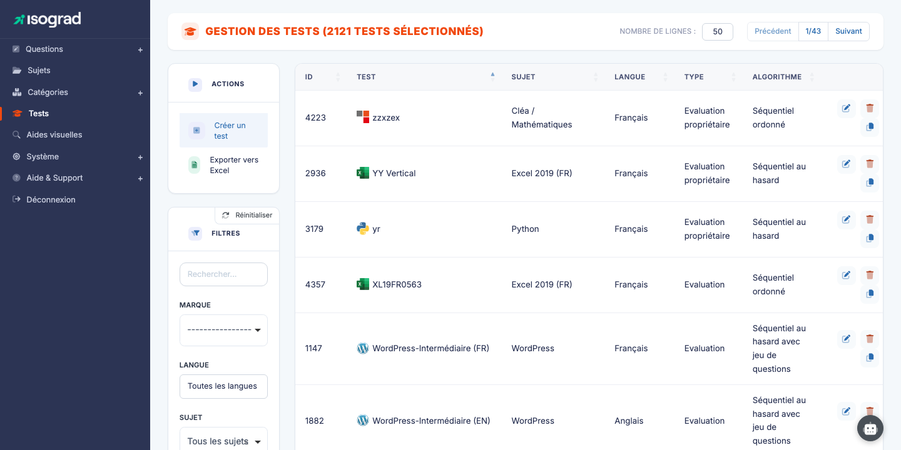
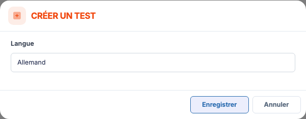
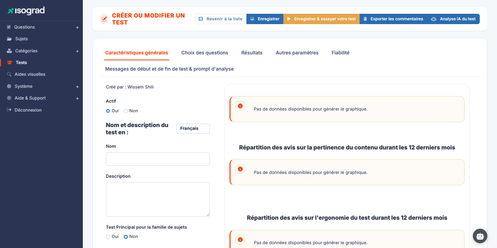

# Tests (formulaires de test)

Un **test** — appelé techniquement *« formulaire de test »* (`test_form`) dans le code et les rapports d'audit — est l'assemblage final qui devient passable par un candidat. C'est le point de jonction où vous prenez une **sélection de questions** d'un sujet, vous y appliquez un **algorithme de tirage**, vous fixez des **paramètres** (durée, nombre de questions, surveillance, etc.) et vous obtenez un livrable utilisable par un compte client.

Tout test inscrit à un candidat sur la plateforme — qu'il s'agisse d'une évaluation, d'une certification ou d'un positionnement — est défini par un de ces formulaires.

Accédez à la page via le menu **Module Questions → Tests & Examens**.

Le tableau (titre **GESTION DES TESTS**) liste tous les tests, avec leur **identifiant**, leur **nom**, leur **sujet**, leur **langue**, leur **type**, leur **algorithme** et leur **visibilité géographique** (Mondiale par défaut, ou restreinte à certains pays/régions).

## Concepts {#concepts}

### Types de formulaires

Chaque formulaire a un **type** (`typ_id`) qui détermine son usage :

| Type | Usage |
|---|---|
| **Évaluation propriétaire** | Test d'évaluation continue, sans valeur certifiante. C'est le format le plus courant. |
| **Formulaire** | Le questionnaire est un format destiné à recueillir des informations auprès des candidats : profil, expérience, motivations, préférences, contexte professionnel, etc. |
| **Série de tests** | Un enchaînement de plusieurs tests regroupés et proposés au candidat dans un ordre défini, au sein d'une seule et même session. |

Le type conditionne le comportement de la plateforme côté candidat (présentation, génération du diplôme) et côté administrateur (limitations sur le passage, options disponibles).

### Algorithme de tirage

Un formulaire ne contient pas directement la liste des questions à poser — il définit **un algorithme** qui sélectionne les questions au démarrage de chaque session. Les algorithmes courants :

- **Adaptatif** — l'algorithme ajuste la difficulté des questions en fonction des réponses du candidat (att: les questions doivent être calibrées avant).
- **Séquentiel** — N questions tirées dans l'ordre ou au hasard parmi un pool (une liste, un jeu de questions, un domaine...).

Chaque algorithme a ses propres paramètres (longueur, pool de domaines, distribution des niveaux) configurés sur l'onglet **Algorithme**.

## Créer un formulaire {#creer-un-formulaire}

La création se fait via un modal de pré-sélection (sujet, langue, type), suivi de la fiche d'édition.

1. Depuis la page **Gestion des formulaires de test**, cliquez sur **Créer un formulaire** dans la barre d'actions.

    

2. Choisissez :

    - **Sujet** — la matière que le formulaire évalue.
    - **Langue** — langue de présentation au candidat.
    - **Type** — Évaluation, formulaire, etc. (voir [Types de formulaires](#concepts)).

3. Validez. La plateforme crée le formulaire et vous amène sur sa fiche d'édition.

## Onglets création de tests {#onglets-mode-avance}

La fiche d'édition (titre **CRÉER OU MODIFIER UN TEST**) propose cinq onglets:

| Onglet | Contenu |
|---|---|
| **Caractéristiques générales** | Test actif (Oui/Non), nom, description, type de test, langue, niveau de difficulté, statistiques des tests (durant les 12 derniers mois de passage)  |
| **Choix des questions** | Algorithme, sujet |
| **Résultats** | Structure du rapport. |
| **Autres paramètres** | Durée du test, comportement en cas d'interruption, options techniques diverses. |
| **Messages de début et de fin de test visibles par le candidat** | Personnalisation des messages d'intro et de fin. |

> 💡 **Boutons d'action** — En plus du bouton **Enregistrer**, l'en-tête propose **Enregistrer & essayer votre test** (lance le test pour vous-même comme prévisualisation) et **Exporter les commentaires** (récupère les commentaires laissés par les candidats sur les questions de ce test).

> 💡 **Mode allégé** — Dans certains environnements (`is_cus_env`), l'onglet **Description** n'apparaît pas séparément : ses champs sont inlinés dans l'onglet **Caractéristiques générales**.

## Modifier un formulaire {#modifier-un-formulaire}

1. Sur la ligne du formulaire, cliquez sur l'icône **Modifier** (crayon).
2. Naviguez entre les onglets et ajustez les valeurs souhaitées.
3. Cliquez sur **Enregistrer** en haut à droite.

> ⚠️ **Formulaires en production** — Modifier un formulaire **déjà utilisé** par des candidats actifs peut affecter leur expérience. Pour les changements profonds (algorithme, structure), créez plutôt un **nouveau formulaire** ou **dupliquez** l'existant pour conserver une trace de la version utilisée historiquement.

## Dupliquer un formulaire {#dupliquer-un-formulaire}

La duplication est l'outil le plus rapide pour créer une variante d'un formulaire existant (autre langue, ajustement local, version « light »).

1. Sur la ligne du formulaire à dupliquer, cliquez sur l'icône **Dupliquer**.
2. La plateforme crée une copie avec le suffixe « (copie) » et vous amène sur sa fiche d'édition.
3. **Renommez** la copie pour éviter la confusion et adaptez les paramètres.

> 💡 **La duplication conserve** — la sélection d'algorithme, les paramètres de surveillance, les descriptions, les messages d'intro et de feedback. Elle ne duplique pas les **questions** elles-mêmes (les formulaires les référencent par filtre, pas par liste fixe).

## Supprimer un formulaire {#supprimer-un-formulaire}

1. Sur la ligne du formulaire, cliquez sur l'icône **Supprimer**.
2. Confirmez sur la page de confirmation.

> ⚠️ **Formulaire utilisé par des candidats** — Un formulaire référencé par des **inscriptions de tests** (terminées ou en cours) ne peut pas être supprimé. Préférez l'**archivage** via le statut sur l'onglet Général : le formulaire devient invisible pour les nouvelles inscriptions mais reste fonctionnel pour les tests historiques.

## Filtres {#filtres}

Le panneau **Filtres** propose :

- **Rechercher** — texte libre sur le nom ou l'ID.
- **Langue** — par langue du formulaire.
- **Sujet** — par sujet associé.

Le tri par colonne est disponible en cliquant sur les en-têtes.

## Exporter la liste {#exporter-la-liste}

Le bouton **Exporter vers Excel** dans la barre d'actions génère un fichier `.xlsx` listant tous les formulaires actuellement filtrés. Précieux pour les revues périodiques du catalogue de tests.
