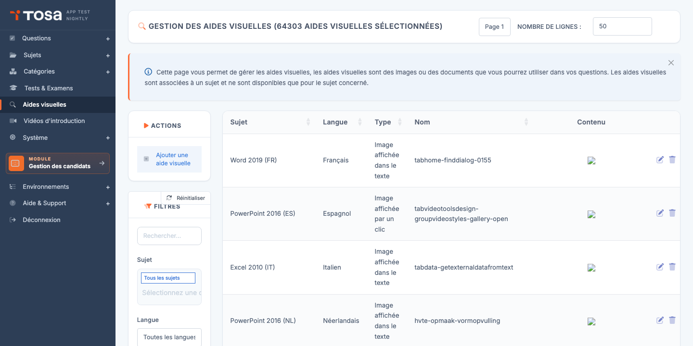
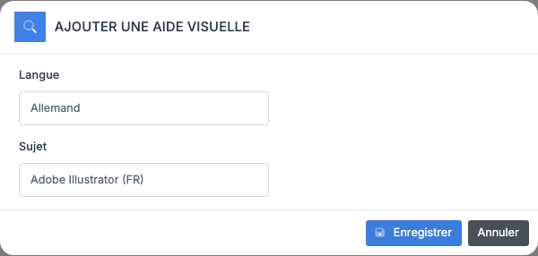
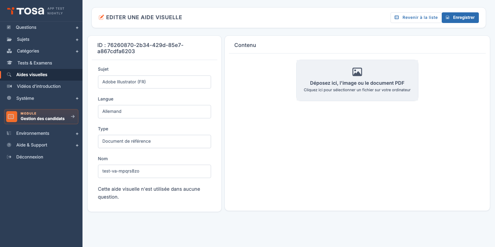

# Aides visuelles

Une **aide visuelle** est un **fichier d'illustration** (image, PDF, document Office, etc.) que l'on peut associer à une ou plusieurs questions pour fournir au candidat le matériel sur lequel répondre : un tableau Excel à analyser, un schéma à interpréter, un extrait de code à débugger, un texte à lire.

Les aides visuelles sont gérées de manière **centralisée** sur la plateforme : on les déclare une fois, on les téléverse, puis on les référence dans les questions par leur identifiant. Ce design permet :

- De **réutiliser** la même image dans plusieurs questions sans la dupliquer.
- De **mettre à jour** un fichier en un seul endroit, avec propagation immédiate à toutes les questions qui l'utilisent.
- De **garantir la cohérence** linguistique : une aide visuelle est rattachée à une langue, ce qui assure que la version française d'une question affiche le tableau en français et la version anglaise le tableau en anglais.

Accédez à la page via le menu **Module Questions → Aides visuelles**, ou directement à `/visualaid/AdminVisualAidsWithTable`.

Le tableau liste toutes les aides visuelles, avec leur **sujet**, leur **langue**, leur **type**, leur **nom** et un aperçu de l'**image** quand applicable.

## Formats de fichier acceptés {#formats-acceptes}

La plateforme accepte les extensions suivantes :

| Catégorie | Extensions |
|---|---|
| Images | `jpg`, `jpeg`, `png`, `gif`, `bmp`, `svg` |
| Documents Office | `doc`, `docx`, `xlsx` |
| PDF | `pdf` |
| Données | `yml`, `pbix` (Power BI) |
| Archive | `zip` |

Les fichiers dont l'extension n'est pas dans cette liste sont **rejetés côté navigateur**, avant même l'envoi au serveur.

> 💡 **Limite de taille** — La taille maximale par fichier dépend de la configuration de votre serveur (typiquement quelques mégaoctets). Pour les fichiers volumineux (Power BI, gros PDF), assurez-vous que l'utilisateur final pourra le télécharger dans des délais acceptables — un test surveillé n'attendra pas une connexion lente.

## Créer une aide visuelle {#creer-une-aide}

La création se fait en **deux étapes** : déclaration des métadonnées (langue + sujet), puis téléversement du fichier.

### Étape 1 — Déclaration

1. Depuis la page **Gestion des aides visuelles**, cliquez sur **Ajouter une aide visuelle** dans la barre d'actions.

    

2. Dans le modal, choisissez :

    - La **langue** de l'aide visuelle. Une aide visuelle est **mono-langue** : si vous avez besoin de la même illustration dans plusieurs langues, créez une aide visuelle par langue.
    - Le **sujet** auquel cette aide visuelle est rattachée. Permet de filtrer la liste et d'aiguiller les rédacteurs.

3. Validez. La plateforme crée un enregistrement et vous redirige sur sa fiche d'édition.

### Étape 2 — Métadonnées et téléversement

Sur la fiche d'édition (titre **EDITER UNE AIDE VISUELLE**), l'écran est divisé en deux colonnes :

**Colonne de gauche — Métadonnées** :

- L'**identifiant** (UUID) de l'aide visuelle, affiché en haut.
- **Sujet** — en lecture seule (défini à la création).
- **Langue** — en lecture seule (définie à la création).
- **Type** — catégorie de l'aide (Image, Document de référence, etc.). Modifiable.
- **Nom** — libellé interne. **Attention** : le nom est **slugifié** côté serveur (espaces → tirets, accents retirés, etc.) ; il devient aussi le **nom de fichier** stocké, ce qui le rend visible des candidats si jamais ils inspectent le HTML. Restez sobre.
- Une ligne d'information indique **où l'aide visuelle est utilisée** : *« Cette aide visuelle n'est utilisée dans aucune question. »* si vide, ou le nombre/la liste des questions qui la référencent.

> ⚠️ **Sujet et langue verrouillés** — Si vous vous êtes trompé de sujet ou de langue à la création, supprimez l'aide et recréez-la — vous ne pouvez plus les modifier ici.

**Colonne de droite — Contenu** :

Une zone de dépôt indique *« Déposez ici, l'image ou le document PDF »* / *« Cliquez ici pour sélectionner un fichier sur votre ordinateur »*.

- **Glissez-déposez** le fichier dans la zone, ou
- **Cliquez** sur la zone pour ouvrir le sélecteur de fichier de votre système.

Une fois le fichier choisi, l'upload démarre automatiquement. Si l'extension est valide, l'aperçu apparaît dans la zone :

- Pour une **image**, vous voyez la vignette.
- Pour un **PDF**, un aperçu intégré (iframe) ou un lien *« Ouvrir dans un nouvel onglet »*.
- Pour les autres formats (Office, archive…), seul un lien de téléchargement est affiché.

> 💡 **Remplacer un fichier** — Déposez simplement un nouveau fichier dans la zone : il remplace l'ancien. La nouvelle version est immédiatement disponible pour toutes les questions qui référencent cette aide.

## Utiliser une aide visuelle dans une question {#utiliser-dans-une-question}

Côté éditeur de questions, vous référencez une aide visuelle en l'insérant via le menu d'insertion. La question reçoit alors le **chemin du fichier** ou son **identifiant**, qui sera résolu à l'affichage côté candidat.

Une aide visuelle peut être référencée par :

- L'**énoncé** de la question (`question.txt`).
- Les **propositions de réponse** (`question.ans`).
- Les **paramètres spécifiques** de la question (`question.spe_det`, par exemple pour les questions de manipulation).

> 💡 **Vérifier l'utilisation** — La fiche d'une aide visuelle indique en bas de la colonne de gauche **si l'aide est utilisée** dans des questions. Pour explorer les questions concernées, ouvrez la page **Questions** et filtrez par sujet.

## Filtres {#filtres}

Le panneau **Filtres** propose :

- **Rechercher** — texte libre sur le nom (slugifié) ou l'ID.
- **Type** — par type d'aide visuelle (Image, Document, etc.).

Le tri est disponible sur chaque colonne.

## Supprimer une aide visuelle {#supprimer-une-aide}

1. Sur la ligne de l'aide, cliquez sur l'icône **Supprimer**.
2. Confirmez sur la page de confirmation.

> ⚠️ **Aide référencée par des questions** — Si le **nom de fichier** de l'aide visuelle est référencé dans le texte, les réponses ou les paramètres spécifiques d'**au moins une question**, la suppression est **refusée** avec le message d'erreur `visa_cantd`. Avant suppression :
>
> 1. Identifiez les questions qui utilisent l'aide (via la page Questions, filtrée par sujet).
> 2. Modifiez ces questions pour pointer vers une autre aide ou retirer la référence.
> 3. Réessayez la suppression.

## Bonnes pratiques {#bonnes-pratiques}

- **Nommez clairement** vos aides visuelles : `tableau-ventes-2024-fr` plutôt que `image1`. Le nom de fichier devient public dans le HTML rendu — un nom évocateur évite les confusions et facilite le débogage.
- **Compressez vos images** avant téléversement : une page candidat qui charge 10 images de 5 Mo chacune est inutilisable sur connexion mobile. Cible : 200 Ko / image en JPG.
- **Limitez les PDF** au strict nécessaire. Un PDF complexe consomme beaucoup côté navigateur et peut rendre le test inaccessible aux candidats avec un navigateur ancien.
- **Une aide visuelle par langue** : ne mélangez pas les langues dans une même image. Une capture d'écran d'Excel en anglais ne convient pas pour la version française du test.
