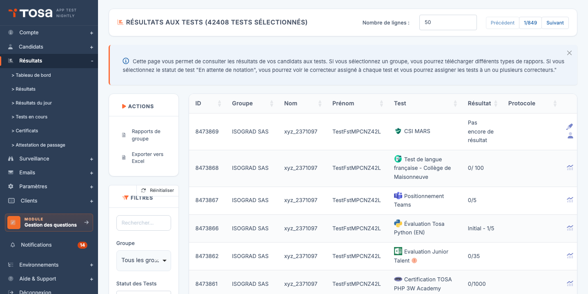
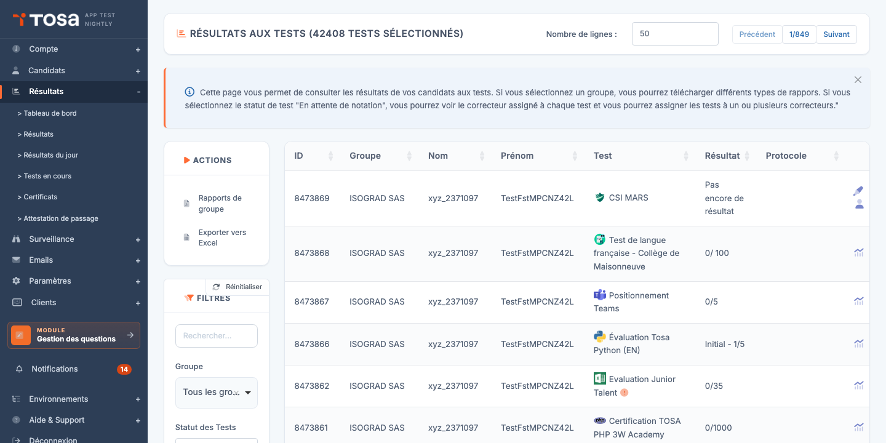
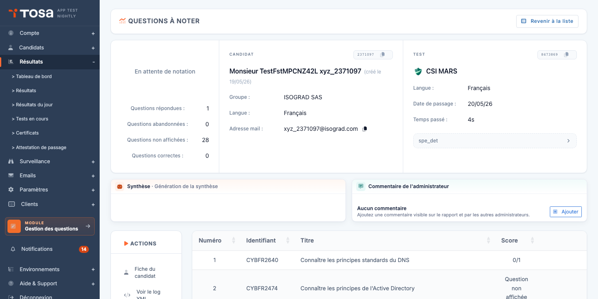
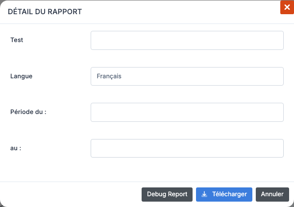

# Gestion des résultats

La page **Résultats aux tests** est le tableau de bord de l'activité de votre compte : tous les tests **passés**, **en cours** ou **à passer** par vos candidats y sont listés, avec leurs scores et l'accès aux rapports détaillés. C'est aussi depuis cette page que vous **téléchargez les rapports** et **certificats**, individuellement ou par lot, et que vous lancez l'envoi automatique aux candidats.

Accédez à cette page via le menu **Résultats**, ou directement à l'URL `/clientadmin/AdminResultsWithTable`.

Chaque ligne du tableau représente **un test inscrit à un candidat**. Les colonnes par défaut :

| Colonne | Contenu |
|---|---|
| **ID** | Identifiant interne de l'inscription. |
| **Groupe** | Le groupe auquel appartient le candidat. |
| **Nom** / **Prénom** | Identité du candidat. |
| **Test** | Nom du sujet et type de test (évaluation, certification, positionnement). |
| **Résultat** | Score obtenu (selon le statut). Si le test n'est pas terminé, affiche *« Pas encore de résultat »*. Pour les tests à correction manuelle en attente, cette colonne devient **Correcteur**. |
| **Protocole** | Indicateurs liés au passage : surveillance à distance, intégrité, etc. (selon les options du test). |

Les **boutons d'action en bout de ligne** dépendent de l'état du test (voir [Actions sur une ligne](#actions-sur-une-ligne) ci-dessous).

> 💡 **Sous-pages liées** — Le menu **Résultats** dans la barre latérale propose plusieurs vues spécialisées :
> - **Tableau de bord** — métriques agrégées (nombre de tests terminés, temps moyen, répartition des scores) pour un groupe ou une session.
> - **Résultats du jour** — version filtrée du tableau ne montrant que les passages du jour.
> - **Tests en cours** — tests démarrés mais pas encore terminés.
> - **Certificats** — vue dédiée aux certifications validées, avec téléchargement des diplômes.
> - **Attestation de passage** — génération d'attestations officielles de passage de test.

## Filtres et recherche {#filtres-et-recherche}

Le panneau **Filtres** à gauche du tableau permet de cibler une sous-population de tests :

- **Rechercher** — texte libre : nom, prénom, adresse email du candidat, nom du test, identifiant.
- **Statut de test** — restreint l'affichage à un état précis (voir [Statuts de test](#statuts-de-test)).
- **Type de test** — évaluation, certification, gratuit, positionnement, etc.
- **Groupe** — un seul groupe à la fois. Sélectionner un groupe **active les actions de rapport de groupe** (téléchargement de rapports en masse) — voir [Rapports de groupe](#rapports-de-groupe).
- **Session** — restreint aux tests rattachés à une session de passage donnée.
- **Inclure les groupes archivés** (commutateur) — par défaut, les candidats appartenant à des groupes archivés sont masqués. Activez pour les voir.

Le bouton **Réinitialiser** en haut du panneau remet tous les filtres à leur valeur par défaut.

## Statuts de test {#statuts-de-test}

Le filtre **Statut de test** propose plusieurs valeurs qui correspondent aux étapes de la vie d'un test :

- **À passer** — le candidat a été inscrit mais n'a pas encore démarré le test.
- **En cours** — le candidat a démarré le test et ne l'a pas terminé. Le test reste démarrable tant qu'il n'est pas marqué terminé.
- **Terminé** — le candidat a soumis ses réponses. Le score est calculé et le rapport disponible.
- **En attente de correction** — pour les sujets comportant des questions à correction manuelle (rédaction, code), le test est soumis mais nécessite l'intervention d'un correcteur.
- **Annulé** — l'inscription a été annulée avant que le candidat passe le test. Le crédit est restitué au compte.

> 💡 **« En attente de correction »** — Quand vous filtrez sur ce statut, la colonne **Score** est remplacée par **Correcteur** : c'est l'administrateur en charge de la correction. Voir [Noter un test](#noter-un-test) ci-dessous.

## Actions sur une ligne {#actions-sur-une-ligne}

Les boutons d'action visibles en bout de ligne dépendent du statut du test et des privilèges de votre compte :

- **Analyse** (icône loupe ou détails) — ouvre la page d'analyse détaillée du résultat : score par compétence, durée par question, courbe de difficulté.
- **Noter** (icône évaluation) — pour les tests en attente de correction, ouvre l'interface de notation question par question.
- **Attribuer à un correcteur** (icône silhouette) — affecte un administrateur de votre compte comme correcteur du test.
- **Télécharger le certificat** (icône diplôme) — disponible pour les certifications validées : génère le diplôme PDF.

## Rapports de groupe {#rapports-de-groupe}

Une fois un **groupe sélectionné** dans le filtre, plusieurs actions de masse deviennent disponibles dans le menu déroulant **Rapports de groupe** en haut du tableau :

- **Télécharger le rapport de groupe** — un seul PDF synthétisant les résultats de tous les candidats du groupe à un test donné (comparaison, classement, statistiques globales).
- **Télécharger le rapport de progression de groupe** — pour les groupes ayant passé **deux** tests sur le même sujet (test initial + test final), génère un rapport comparant l'évolution.
- **Télécharger tous les rapports individuels** — un ZIP contenant un PDF par candidat.
- **Télécharger tous les rapports de progression individuels** — un ZIP avec un rapport de progression par candidat.
- **Télécharger tous les certificats** — un ZIP avec un diplôme par candidat certifié du groupe.
- **Envoyer son rapport à chaque candidat** — déclenche l'envoi par email du rapport de chaque candidat à son adresse.
- **Envoyer le certificat à chaque candidat** — idem pour les certifications validées.
- **Télécharger le fichier de compétences** — un export Excel détaillé des niveaux de compétence par candidat (utile pour des analyses RH).

### Sélection du test et de la période

Quand vous cliquez sur l'une des actions ci-dessus, une fenêtre s'ouvre vous permettant de préciser :

- Le **test** concerné (si le groupe a passé plusieurs sujets différents).
- La **langue** du rapport.
- La **période** (date de début / fin) — restreint aux tests passés dans cet intervalle.

Validez, et le rapport est généré. Pour les opérations longues (rapports de masse), la plateforme affiche un message *« Votre demande a bien été prise en compte. Vous recevrez un email dans moins de 24h. »* et le fichier vous est expédié dès qu'il est prêt.

> ⚠️ **Groupe obligatoire** — Tant qu'aucun groupe n'est sélectionné, le bouton **Rapports** affiche un message d'alerte invitant à choisir un groupe et à vider le champ de recherche. Les rapports de masse ne peuvent pas être générés sur la totalité de votre compte d'un seul coup.

## Voir le détail d'un résultat {#voir-le-detail-d-un-resultat}

Le bouton **Analyse** (icône détail) sur la ligne d'un test terminé ouvre la **page d'analyse**, qui présente :

- Le **score global** et la **distribution par compétence** (graphique).
- La **durée totale** et la durée moyenne par question.
- Le **détail question par question** : la réponse du candidat, la bonne réponse, le temps passé.
- La possibilité de **télécharger le rapport PDF** ou le **certificat** (si applicable).

Pour les tests adaptatifs (où la difficulté s'ajuste aux réponses), l'analyse inclut aussi la **courbe de calibration** retraçant la progression du candidat.

## Noter un test {#noter-un-test}

Les tests qui contiennent des **questions à correction manuelle** (rédaction libre, code à analyser, etc.) arrivent dans le statut **En attente de correction** une fois soumis. C'est à un administrateur d'attribuer une note avant que le résultat final soit calculé.

### Attribuer un correcteur

1. Filtrez la liste sur le statut **En attente de correction**.
2. Cochez un ou plusieurs tests à attribuer.
3. Cliquez sur **Attribuer les tests à un ou plusieurs correcteurs**.

    > 💡 Si vous sélectionnez plusieurs correcteurs, les tests seront répartis de manière équilibrée entre eux.

4. Confirmez. Les tests sont assignés et la colonne **Correcteur** se met à jour avec le nom de l'administrateur affecté.

### Noter

1. Cliquez sur l'icône **Noter** en bout de ligne d'un test qui vous est affecté.
2. La plateforme ouvre l'interface de notation. Pour chaque question à correction manuelle, vous voyez la **réponse du candidat** et un **champ de note** à remplir, accompagné d'un champ commentaire facultatif.
3. Validez chaque question, puis enregistrez l'ensemble. Le score global est recalculé et le test passe au statut **Terminé**.

## Exporter vers Excel {#exporter-vers-excel}

Le bouton **Exporter vers Excel** dans la barre d'actions génère un fichier `.xlsx` listant tous les résultats **actuellement filtrés** à l'écran. L'export inclut, en plus des colonnes visibles, des informations supplémentaires comme l'**identifiant externe** (si configuré), l'**adresse email** du candidat et les **commentaires d'administration**.

Pratique pour :

- Faire un bilan trimestriel à plat dans Excel.
- Croiser les résultats avec d'autres données RH ou de formation.
- Archiver les résultats hors plateforme.

> 💡 **Quantité de données** — Si votre filtre couvre plus de quelques centaines de lignes, l'export peut prendre plusieurs secondes à se générer. La plateforme déclenche le téléchargement dès que le fichier est prêt.

## Surveillance à distance {#surveillance-a-distance}

Une ligne dont l'icône **caméra** est présente correspond à un test passé **sous surveillance à distance** (proctoring). Pour consulter les enregistrements (captures, vidéo, pièce d'identité) et valider ou invalider chaque passage, reportez-vous au chapitre [Surveillance des tests](/ai/proctoring/).
