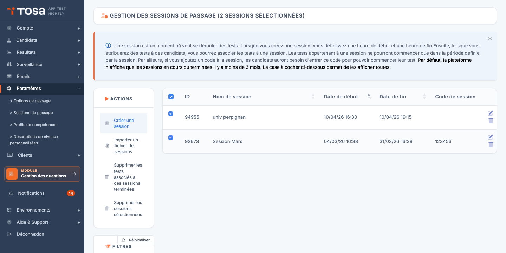
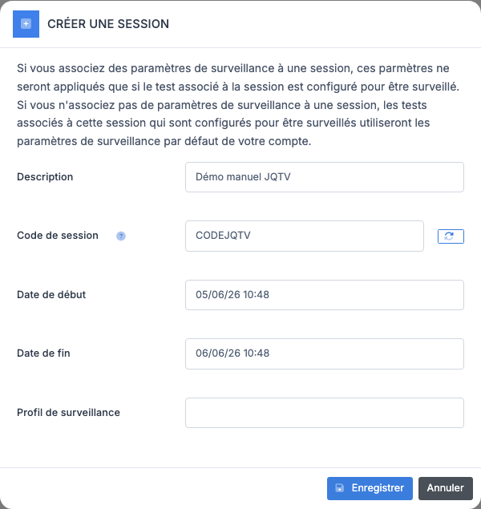
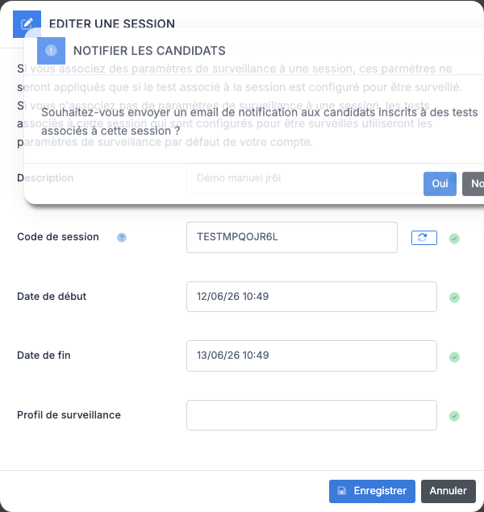
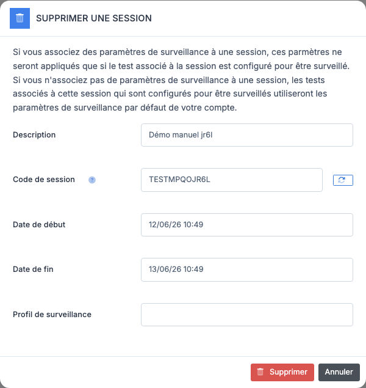
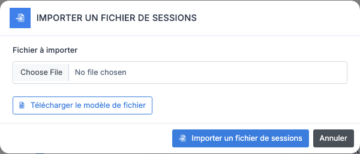

# Gestion des sessions de passage

Une **session de passage** est une fenêtre temporelle (date et heure de début, date et heure de fin) pendant laquelle vos candidats peuvent démarrer leur test. C'est l'outil principal pour **encadrer** un test : surveillé en présentiel, planifié sur un créneau précis, ou simplement protégé par un code partagé le jour J.

La page **Gestion des sessions de passage** liste toutes les sessions définies sur votre compte. Chaque ligne indique le **nom**, la **date de début**, la **date de fin** et le **code de session** (s'il existe).

> 💡 **Affichage par défaut** — La plateforme affiche par défaut les sessions **en cours** et celles **terminées il y a moins de 3 mois**. Les sessions plus anciennes restent dans la base mais sont masquées de la liste. Les options d'affichage en bas du panneau de filtres permettent d'inclure les sessions plus anciennes ou de masquer les sessions passées.

## À quoi sert une session {#a-quoi-sert-une-session}

Quand vous inscrivez un candidat à un test, vous pouvez l'**associer à une session**. Les conséquences :

- Le candidat ne peut **démarrer** le test que dans la fenêtre temporelle de la session. Avant la date de début, le test apparaît mais reste verrouillé ; après la date de fin, il n'est plus accessible.
- Si la session a un **code**, le candidat doit le saisir pour démarrer son test — c'est l'examinateur qui le communique au moment voulu, ce qui ajoute une couche de sécurité contre les démarrages prématurés.

Vous pouvez aussi **affecter un groupe entier** à une session en une seule action depuis la page **Gestion des candidats** (voir [Actions de groupe](/ai/candidates/#gerer-les-groupes)). C'est la façon habituelle d'organiser une journée d'examen pour une promotion ou une session de formation.

> 💡 **Sans session** — Une inscription **sans session** signifie que le candidat peut démarrer son test à tout moment dès qu'il a reçu son invitation. Les sessions ne sont donc utiles que si vous voulez **encadrer** le passage dans le temps.

## Créer une session {#creer-une-session}

### Procédure

1. Depuis la page **Gestion des sessions de passage**, cliquez sur **Créer une session** dans la barre d'actions.

    

2. Remplissez les champs :

    - **Description** — libellé qui apparaîtra dans la liste (colonne *Nom de session*) et dans le formulaire d'inscription d'un candidat. Choisissez un nom parlant (« Promotion 2026 — session du 14/03 »).
    - **Code de session** (facultatif) — mot de passe que les candidats devront saisir pour démarrer leur test. À communiquer **uniquement le jour de la session**. Le bouton de régénération à droite du champ propose un code aléatoire.
    - **Date de début** et **Date de fin** — fenêtre pendant laquelle les tests rattachés à cette session pourront être démarrés. Saisissez le format `JJ/MM/AA HH:MM`.
    - **Profil de surveillance** (facultatif) — sélectionnez un profil de surveillance pour appliquer ses réglages aux tests **surveillés** rattachés à cette session. Voir l'encadré ci-dessous.

3. Cliquez sur **Enregistrer**. La session apparaît immédiatement dans le tableau.

> 💡 **Profil de surveillance** — Ce réglage n'agit **que sur les tests configurés pour être surveillés**. Si le test associé à la session n'est pas configuré comme surveillé, le profil n'a aucun effet. À l'inverse, si vous laissez ce champ vide pour une session contenant des tests surveillés, ceux-ci utilisent le **profil de surveillance par défaut** de votre compte.

> ⚠️ **Dates cohérentes** — La plateforme vérifie que la date de fin est postérieure à la date de début et que le format est valide. Une saisie incorrecte affiche un message en haut du formulaire ; la session n'est pas créée tant que les champs ne sont pas valides.

## Modifier une session {#modifier-une-session}

1. Sur la ligne de la session, cliquez sur l'icône **Modifier** (crayon) en bout de ligne. La fenêtre de modification s'ouvre, pré-remplie avec les valeurs actuelles.

2. Ajustez les champs souhaités (nom, code, dates).

3. Cliquez sur **Enregistrer**.

### Notification des candidats inscrits

Si la session a déjà des candidats inscrits et que vous modifiez les dates, la plateforme propose **automatiquement** d'envoyer un email de notification aux candidats concernés :

- **Oui** — envoie un email à tous les candidats inscrits aux tests rattachés à cette session, les informant du nouveau créneau.
- **Non** — la session est modifiée silencieusement, sans email.

> 💡 **Quand notifier ?** — Notifiez systématiquement si vous **avancez** la date ou si vous **raccourcissez** la fenêtre — les candidats doivent en être informés. Pour un simple **report** de quelques minutes ou un ajustement mineur, vous pouvez choisir de ne pas envoyer d'email pour éviter de saturer les boîtes.

## Supprimer une session {#supprimer-une-session}

### Supprimer une seule session

1. Sur la ligne de la session, cliquez sur l'icône **Supprimer** (poubelle).

    

2. Confirmez. La session est supprimée immédiatement.

Les tests qui étaient associés à cette session restent inscrits aux candidats — ils deviennent simplement **sans session**, donc démarrables à tout moment. Si vous voulez aussi supprimer ces tests, voir [Supprimer les tests associés à des sessions terminées](#supprimer-tests-passes) ci-dessous.

### Supprimer plusieurs sessions à la fois

1. Cochez les cases en début de ligne pour sélectionner les sessions à supprimer.
2. Cliquez sur **Supprimer les sessions sélectionnées** dans la barre d'actions.
3. Confirmez. Toutes les sessions cochées sont supprimées en une opération.

> ⚠️ **Suppression définitive** — Comme partout sur la plateforme, la suppression est irréversible. Pour conserver l'historique d'une session passée sans la voir dans la liste, laissez-la simplement vieillir : au-delà de 3 mois après la date de fin, elle disparaît automatiquement de l'affichage par défaut.

## Importer plusieurs sessions {#importer-sessions}

L'import permet de créer plusieurs sessions en une seule opération à partir d'un fichier Excel — utile en début d'année pour saisir tout le calendrier des examens.

### Procédure

1. Depuis la barre d'actions, cliquez sur **Importer un fichier de sessions**.

    

2. Cliquez sur le lien **Télécharger le modèle** pour récupérer le fichier Excel attendu. Le modèle comporte une feuille `Import` avec les colonnes :

    | Colonne | Description |
    |---|---|
    | `des` | Nom de la session |
    | `psw` | Code de session (facultatif) |
    | `dat_sta_day`, `dat_sta_month`, `dat_sta_year`, `dat_sta_hour`, `dat_sta_min` | Date de début, décomposée en colonnes |
    | `dat_end_day`, `dat_end_month`, `dat_end_year`, `dat_end_hour`, `dat_end_min` | Date de fin, décomposée en colonnes |

3. Remplissez le modèle, une session par ligne.

4. Revenez sur la plateforme, cliquez sur **Choisir un fichier** dans la fenêtre d'import, sélectionnez votre Excel rempli, puis validez.

5. La plateforme affiche un rapport listant les sessions créées, mises à jour ou rejetées avec leur motif.

> 💡 **Mise à jour vs création** — Si une session du fichier porte le **même nom** qu'une session existante, ses dates et code sont **mis à jour** plutôt qu'un doublon créé. C'est commode pour ré-importer un fichier corrigé.

## Supprimer les tests associés à des sessions terminées {#supprimer-tests-passes}

Au fil du temps, votre compte peut accumuler des **tests non passés** rattachés à des sessions dont la date de fin est dépassée. La plateforme expose une action de masse pour les nettoyer en une fois.

1. Cliquez sur **Supprimer les tests associés à des sessions terminées** dans la barre d'actions.
2. Confirmez. Tous les tests **en attente** (jamais démarrés) dont la session est terminée sont désinscrits des candidats concernés.

> ⚠️ **Périmètre** — Cette action ne touche **pas** les tests **démarrés**, **terminés** ou **annulés**. Elle ne touche pas non plus les sessions elles-mêmes — seulement les inscriptions de tests en attente qui leur étaient rattachées. Les crédits consommés à l'inscription sont restitués au compte.

## Filtres et affichage {#filtres-et-affichage}

Le panneau **Filtres** à gauche de la liste propose plusieurs réglages pour cibler les sessions à afficher :

- **Rechercher** — texte libre. Filtre la liste sur le nom ou le code de session.
- **Ne pas afficher les sessions passées** — masque toutes les sessions dont la date de fin est antérieure à maintenant. Utile en cours d'année pour ne voir que les sessions à venir.
- **Afficher les sessions terminées depuis plus de 3 mois** — par défaut désactivé. Activez-le pour faire apparaître l'historique ancien (par exemple pour retrouver une session d'il y a 6 mois).

Le tableau est **triable** : cliquez sur l'en-tête de colonne pour basculer entre tri ascendant et descendant. Le tri par défaut est par nom de session.
