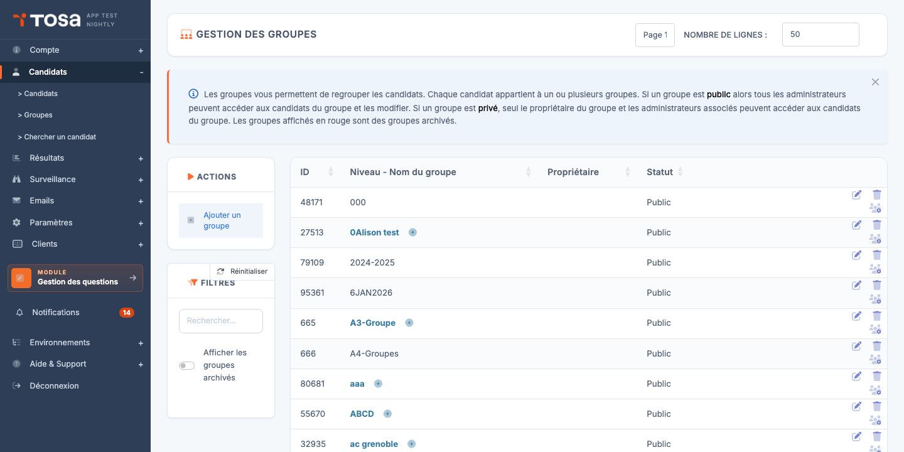

# Gérer les groupes

Les groupes vous permettent d'organiser votre population de candidats (par promotion, service, client, formation…) pour faciliter les actions en masse : inscriptions, invitations, suivi des résultats.

## Accéder aux groupes

Depuis le menu de navigation, cliquez sur **Groupes** (ou accédez à l'URL `/clientadmin/candidates/AdminGroupsWithTable`).

La page **Gestion des groupes** affiche l'ensemble de vos groupes sous forme hiérarchique. Un groupe peut contenir des sous-groupes — utile par exemple pour structurer "Promotion 2026 → Section A → Cours du soir".

## Créer un groupe

1. Cliquez sur **Ajouter un groupe** dans la barre d'actions.
2. Renseignez :

    - **Nom** du groupe.
    - **Groupe parent** (facultatif) — pour créer une hiérarchie.
    - **Couleur** ou tag (selon votre version) — pour repérer visuellement le groupe.

3. Validez.

## Ajouter un candidat à un groupe

Deux méthodes :

- **Depuis la fiche du candidat** : ouvrez la fiche, onglet **Groupes**, ajoutez le candidat aux groupes voulus.
- **Action de groupe** sur la liste des candidats : sélectionnez les candidats, puis **Ajouter à un groupe**.

## Actions de groupe

Une fois vos candidats organisés en groupes, le filtre **Groupe** de la page **Gestion des candidats** vous permet d'isoler une population et de lui appliquer une action en masse :

- Inscrire tout le groupe à un test.
- Envoyer une invitation à tout le groupe.
- Définir un mot de passe commun.
- Affecter le groupe à une session surveillée.
- Archiver le groupe (les candidats restent en base mais sont masqués par défaut).
- Supprimer les tests inscrits, ou supprimer les candidats du groupe.

!!! info "Archivage vs suppression"
    L'**archivage** est non destructif : il masque le groupe et ses candidats des listes par défaut, mais préserve l'historique des tests passés. La **suppression** est définitive — utilisez-la uniquement pour les candidats créés par erreur.
