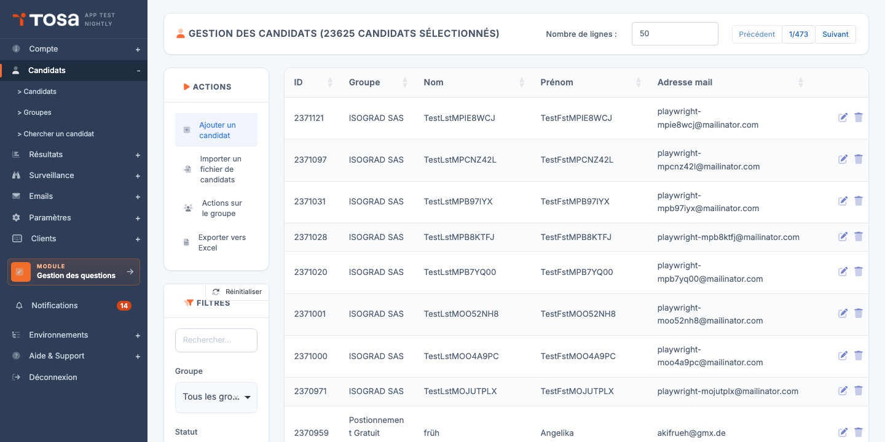

# Importer des candidats

L'import de candidats vous permet de créer plusieurs candidats — voire de les pré-inscrire à des tests — en une seule opération, à partir d'un fichier Excel.

## Procédure

1. Depuis la page **Gestion des candidats**, repérez le bouton **Importer un fichier de candidats** dans la barre d'actions.

    

2. Avant de préparer votre fichier, téléchargez le **modèle de fichier** depuis le lien proposé. Le modèle contient les en-têtes attendus et un exemple de ligne.

3. Remplissez le modèle avec vos candidats. Les colonnes principales :

    | Colonne | Obligatoire | Description |
    |---|---|---|
    | Prénom | Oui | Prénom du candidat. |
    | Nom | Oui | Nom du candidat. |
    | Email | Oui | Une adresse email unique par candidat. |
    | Pays | Non | Code pays (FR, BE, …) pour la langue par défaut. |
    | Groupe | Non | Nom d'un groupe auquel rattacher le candidat. Créé automatiquement s'il n'existe pas. |
    | Test | Non | Nom du sujet auquel inscrire le candidat directement à l'import. |

4. Cliquez sur **Importer un fichier de candidats**, sélectionnez votre fichier, et validez.

5. La plateforme affiche un rapport d'import : nombre de candidats créés, mis à jour, ou rejetés (avec le motif de rejet ligne par ligne).

!!! warning "Doublons d'email"
    Si un candidat existe déjà avec la même adresse email, ses informations sont **mises à jour** plutôt que recréées. Un nouvel enregistrement n'est jamais créé pour une adresse existante.

!!! tip "Import et invitations"
    L'import ne déclenche **pas** automatiquement l'envoi d'invitations. Pour envoyer les emails de connexion après import, reportez-vous à la section [Envoyer les invitations](envoyer-invitations.md).
