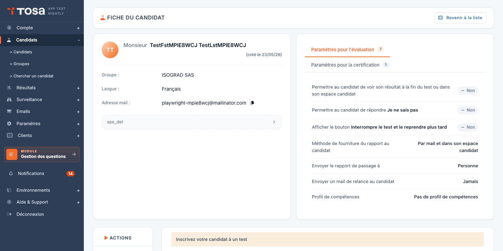

# Inscrire un candidat à un test

Une fois le candidat créé, vous devez l'inscrire à un ou plusieurs tests pour qu'il puisse les passer.

## Inscrire un candidat depuis sa fiche

1. Depuis la liste des candidats, cliquez sur l'icône **Modifier** de la ligne correspondante. Vous arrivez sur la page d'inscription aux tests du candidat.

    

2. Cliquez sur **Ajouter un test**.

    

3. Dans la fenêtre qui s'ouvre, choisissez le **sujet** (matière) à évaluer, puis paramétrez l'inscription :

    - **Type de test** — évaluation, certification, etc., selon les packs disponibles sur votre compte.
    - **Langue** — langue dans laquelle le test sera présenté au candidat.
    - **Date limite** (facultatif) — au-delà de cette date, le candidat ne pourra plus démarrer le test.
    - **Surveillance** (facultatif) — active la session surveillée si votre compte dispose de l'option.

4. Validez. Le test apparaît immédiatement dans le tableau d'inscriptions du candidat.

## Inscrire plusieurs candidats à la fois

Pour inscrire plusieurs candidats au même test, utilisez l'action de groupe :

1. Sur la page **Gestion des candidats**, sélectionnez les candidats à inscrire en cochant la case en début de ligne.
2. Dans le menu d'actions de groupe, choisissez **Inscrire les candidats à un test**.
3. Renseignez les paramètres du test ; ils s'appliquent à l'ensemble de la sélection.

!!! info "Crédits"
    Chaque inscription consomme un crédit du pack correspondant. Le solde restant est visible en haut de page. Pour racheter des crédits, contactez votre interlocuteur Isograd.
