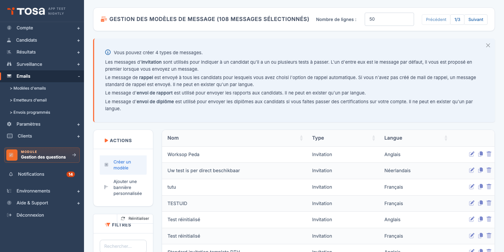
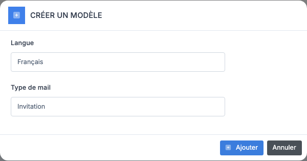
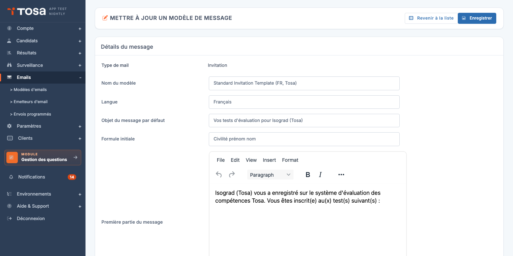
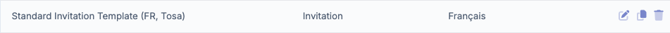
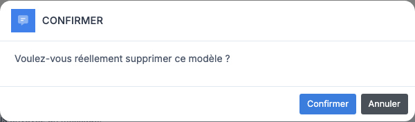
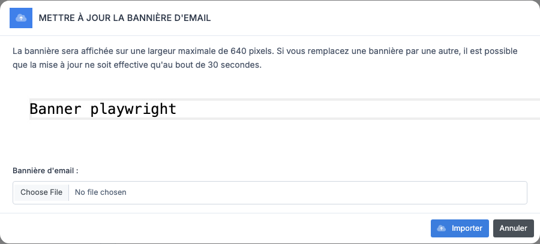
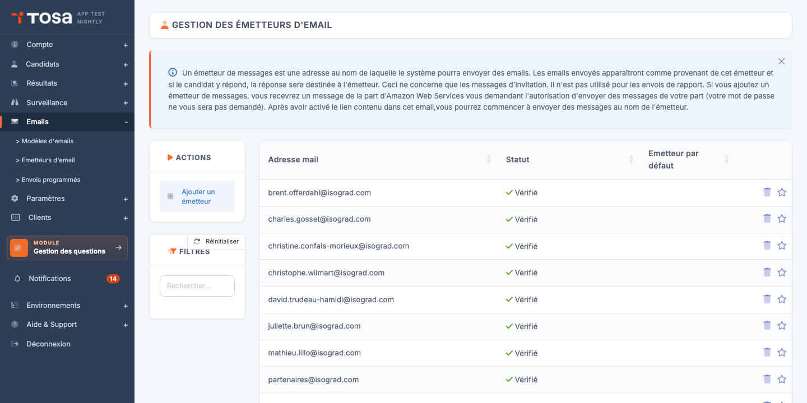
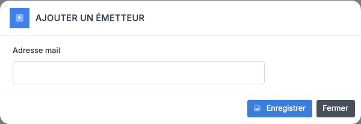
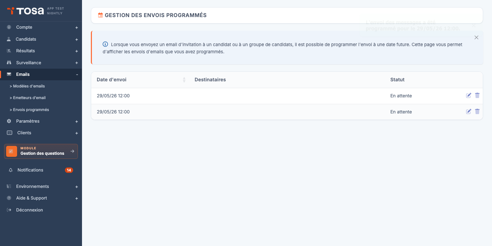
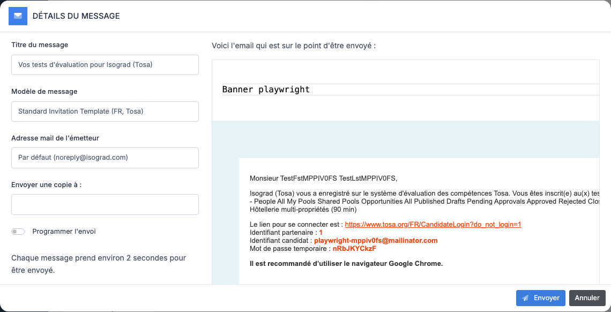

* TOC
{:toc}

# Gestion des emails

Ce chapitre couvre tout ce qui concerne les emails envoyés depuis votre compte aux candidats : les **modèles de message** que vous personnalisez, les **émetteurs** (adresses d'expédition vérifiées), les **envois programmés** et la **bannière personnalisée** qui s'affiche en en-tête de vos emails.

La page **Gestion des modèles de message** liste vos modèles d'email. Chaque ligne indique le **nom** du modèle, son **type** (Invitation, Relance, Envoi de rapport, Envoi de diplôme) et sa **langue**. Les boutons d'action principaux — **Créer un modèle** et **Ajouter une bannière personnalisée** — se trouvent en haut du tableau.

## Les quatre types de modèle

La plateforme reconnaît quatre types de messages, chacun ayant un déclencheur différent :

- **Invitation** — envoyé lorsque vous (ou un import) inscrivez un candidat à un test. C'est le message qui transmet au candidat ses identifiants ou son lien de connexion. Vous pouvez créer **plusieurs modèles d'invitation par langue** (par marque, par campagne, par client). L'un d'entre eux est désigné comme **modèle par défaut** et est proposé en premier dans la fenêtre d'envoi.
- **Relance** — envoyé automatiquement aux candidats qui n'ont pas terminé leur test, si l'option de relance automatique est activée pour leur inscription. Un seul modèle de relance par langue.
- **Envoi de rapport** — utilisé pour transmettre les rapports de résultats aux candidats. Un seul modèle par langue.
- **Envoi de diplôme** — utilisé pour envoyer les diplômes aux candidats lorsque vous faites passer des certifications. Un seul modèle par langue.

> 💡 **Modèles standard** — Si vous n'avez créé aucun modèle pour un type donné, la plateforme envoie un message standard intégré. Vous n'êtes donc jamais bloqué : créer des modèles permet de **personnaliser** le contenu, pas de l'**autoriser**.

## Créer un modèle d'email

### Procédure

1. Depuis la page **Gestion des modèles de message**, cliquez sur **Créer un modèle** dans la barre d'actions.

    

2. Choisissez le **type** de modèle dans la liste déroulante. Seuls les types **encore disponibles pour votre langue d'interface courante** sont proposés : par exemple, si vous avez déjà créé un modèle de Relance en français, le type "Relance" n'apparaîtra plus pour le français.

3. Validez. La plateforme crée le modèle et vous amène directement sur sa page d'édition.

    

### Champs du modèle

La page d'édition est organisée en deux cartes empilées : **Détails du message** (le formulaire, capture ci-dessus) puis **Visualisation du message** (aperçu en direct du mail tel qu'il sera reçu) en dessous.

Les champs principaux, communs à tous les types :

- **Nom du modèle** — libellé interne pour vous repérer dans la liste. N'apparaît pas dans l'email envoyé.
- **Langue** — langue d'envoi. Conditionne aussi la liste des modèles disponibles dans la fenêtre d'envoi (un modèle français n'est proposé qu'aux candidats français).
- **Objet du message par défaut** — sujet de l'email. Reste modifiable au moment de chaque envoi.
- **Formule initiale** — phrase d'introduction (par exemple *« Cher Monsieur Dupont »*) ajoutée automatiquement en tête de message. Le contenu disponible dépend de la langue.
- **Première partie du message** — corps principal du mail, édité dans un éditeur enrichi.

Pour les modèles d'**Invitation** uniquement, des champs supplémentaires sont affichés :

- **Seconde partie du message** — texte optionnel ajouté **après** les identifiants ou le lien de connexion.
- **Inclure la liste des tests à passer** — si activé, la plateforme insère automatiquement la liste des tests inscrits dans l'email.
- **Inclure les détails de connexion** — si activé, l'email contient le login et le mot de passe du candidat.
- **Inclure un lien de connexion valable 48h (à la place des identifiants)** — si activé, remplace login/mot de passe par un **lien à usage unique valable 48 heures**. Cette option prend le pas sur l'option précédente.
- **Partager ce modèle avec les autres administrateurs** — voir [Modèles privés et publics](#modèles-privés-et-publics) ci-dessous.

> 💡 **Aperçu en temps réel** — Le panneau de droite affiche l'email tel qu'il sera reçu, avec des données factices (un candidat fictif). L'aperçu se rafraîchit automatiquement quand vous modifiez un champ ; le bouton **Actualiser l'exemple** force un rafraîchissement.

### Balises dynamiques

Pour le modèle **Envoi de diplôme**, des **balises** (« merge tags ») sont disponibles pour insérer dynamiquement le nom du test, le sujet, la date, le score, ainsi qu'un bouton LinkedIn de partage :

| Balise | Valeur insérée |
|---|---|
| `[tst_des]` | Le nom du test |
| `[sbj_des]` | Le nom du sujet |
| `[com_dat]` | La date du test |
| `[hst_sco]` | Le score obtenu |
| `[linkedin]` | Bouton LinkedIn |
| `[social_url]` | Lien de partage sur les réseaux sociaux |

Les modèles d'Invitation utilisent eux des balises spécifiques aux identifiants et au lien de connexion, automatiquement injectées par les cases à cocher correspondantes — vous n'avez rien à insérer manuellement.

## Modèles privés et publics

Cette distinction concerne uniquement les modèles d'**Invitation**. Le commutateur **Partager ce modèle avec les autres administrateurs** détermine qui peut voir et utiliser votre modèle :

- **Modèle privé** (par défaut) — seul vous et les administrateurs disposant du privilège *Lecture/écriture de tous les modèles* le voient dans la liste. Les autres administrateurs de votre compte ne peuvent ni le sélectionner dans la fenêtre d'envoi, ni le modifier.
- **Modèle public** — visible et utilisable par tous les administrateurs de votre compte. Seul vous (ou un administrateur avec le privilège *Lecture/écriture de tous les modèles*) pouvez le **modifier**.

> 💡 **À quoi cela sert ?** — Cette distinction permet par exemple à un responsable formation de préparer son propre modèle d'invitation pour une campagne, sans le voir détourné ou modifié par d'autres administrateurs.

Les modèles de **Relance**, **Envoi de rapport** et **Envoi de diplôme** sont toujours partagés à l'échelle du compte — ils n'ont pas de commutateur public/privé.

## Dupliquer un modèle

La duplication est utile pour créer une variante d'un modèle existant (autre langue, autre ton, autre marque) sans repartir de zéro.

1. Sur la page **Gestion des modèles de message**, repérez le modèle à dupliquer dans le tableau. La duplication n'est disponible que pour les modèles d'**Invitation**.

    

2. Cliquez sur l'icône **Dupliquer** en bout de ligne.

3. La plateforme crée immédiatement une copie avec le **même nom, le même objet, le même contenu et les mêmes options**, et vous amène sur sa page d'édition.

4. Modifiez le nom (et la langue si nécessaire) pour distinguer la copie de l'original, puis enregistrez.

Le modèle dupliqué appartient à l'administrateur qui a cliqué — son statut public/privé est repris de l'original, mais vous restez libre de le changer.

## Supprimer un modèle

1. Dans la liste, cliquez sur l'icône **Supprimer** au bout de la ligne. Le modèle d'**Invitation par défaut** intégré à la plateforme n'a pas de bouton de suppression : il est protégé.

2. Une fenêtre de confirmation s'affiche.

    

3. Validez. Le modèle est supprimé. Les emails déjà envoyés ne sont **pas** affectés ; seuls les futurs envois ne pourront plus utiliser ce modèle.

## Ajouter une bannière personnalisée

La bannière est une image (logo, en-tête de marque) affichée **en haut de tous les emails** envoyés depuis votre compte, quel que soit le modèle.

### Procédure

1. Sur la page **Gestion des modèles de message**, cliquez sur **Ajouter une bannière personnalisée** dans la barre d'actions.

    

2. Sélectionnez un fichier image (JPG ou PNG). **Taille maximale : 1 Mo.**

3. Validez. La bannière est mise en place pour tous les modèles du compte.

> ⚠️ **Délai de mise à jour** — Si vous remplacez une bannière existante par une autre, le changement peut mettre **jusqu'à 30 secondes** à devenir effectif (à cause du cache CDN).

> 💡 **Largeur d'affichage** — La bannière est affichée sur **640 pixels de largeur maximale**. Préparez votre fichier dans ce gabarit pour un rendu net.

La bannière s'applique à **tous les types** de messages (Invitation, Relance, Envoi de rapport, Envoi de diplôme) : elle ne se règle pas par modèle.

## Émetteurs d'email

Un **émetteur** est l'adresse email à partir de laquelle la plateforme envoie vos messages d'invitation. Vos candidats verront cette adresse comme expéditeur ; s'ils répondent au mail, leur réponse arrivera directement à cette adresse.

> 💡 **Périmètre** — Les émetteurs sont **uniquement** utilisés pour les **invitations**. Les envois de rapport et de diplôme partent d'une adresse système et ne sont pas affectés par ce réglage.

### Pourquoi vérifier un émetteur ?

Pour pouvoir envoyer des emails à des dizaines de candidats au nom de votre adresse, la plateforme s'appuie sur Amazon Web Services (AWS SES). AWS exige une **autorisation explicite du titulaire** de l'adresse — c'est un mécanisme anti-spam : on ne peut pas envoyer en se prétendant être quelqu'un d'autre.

### Ajouter un émetteur

1. Accédez à la page **Gestion des émetteurs d'email** depuis le menu Emails.

    

2. Cliquez sur **Ajouter un émetteur**.

3. Saisissez l'adresse email à utiliser comme expéditeur, puis validez.

    

4. **Vous (ou le propriétaire de cette adresse) recevrez un email d'AWS** demandant l'autorisation d'envoyer des messages au nom de cette adresse. **Aucun mot de passe ne sera demandé.**

5. Cliquez sur le lien d'activation contenu dans cet email. Vous disposez de **24 heures** pour le faire — au-delà, il faudra renouveler la demande.

6. Une fois la confirmation effectuée, l'émetteur passe en statut **Vérifié** dans la liste. Il est alors prêt à être utilisé.

### Émetteur par défaut

Vous pouvez disposer de plusieurs émetteurs vérifiés (par exemple, un par marque ou par service). L'un d'entre eux est désigné comme **émetteur par défaut** — c'est lui qui est utilisé automatiquement quand aucun autre n'est précisé.

- Pour désigner un émetteur comme défaut, cliquez sur l'**étoile** au bout de la ligne. L'émetteur doit être vérifié pour pouvoir être défini comme défaut.
- L'étoile devient pleine quand l'émetteur est l'émetteur par défaut. Cliquez à nouveau pour le retirer comme défaut.

### Supprimer un émetteur

1. Cliquez sur l'icône **Supprimer** au bout de la ligne de l'émetteur.
2. Confirmez. L'émetteur est retiré ; la plateforme n'enverra plus d'emails à partir de cette adresse.

> ⚠️ **Adresse partagée** — Si une adresse est utilisée comme émetteur sur un autre compte de la plateforme, vous le verrez signalé. Sa suppression de votre compte ne désinscrit pas l'autre compte.

## Envois programmés

Lorsque vous envoyez un email d'invitation à un candidat ou à un groupe, la fenêtre d'envoi vous offre l'option **Programmer l'envoi** à une date future. Tous ces envois différés s'accumulent dans la **file d'envois programmés**, où vous pouvez les consulter, en modifier la date ou les annuler avant qu'ils ne partent.

### Consulter la file

Depuis le menu Emails, accédez à **Gestion des envois programmés**.

Chaque ligne indique :

- La **date d'envoi** prévue.
- Les **destinataires** — les cinq premières adresses sont affichées en clair, suivies d'un *« + X autre(s) »* si l'envoi concerne davantage de candidats.
- Le **statut** : **En attente** (l'envoi n'a pas encore eu lieu) ou **Envoyé** (l'envoi est parti).

### Modifier la date d'un envoi

Cliquez sur l'icône **Modifier la date d'envoi** en bout de ligne d'un envoi en attente. Une fenêtre permet de saisir une nouvelle date et heure. Validez : l'envoi reste programmé pour la nouvelle date.

### Annuler un envoi

Cliquez sur l'icône **Supprimer** en bout de ligne. L'envoi est retiré de la file et **ne partira pas**. Les emails déjà partis (statut **Envoyé**) ne peuvent pas être rappelés.

> 💡 **Durée d'envoi** — Comptez environ **2 secondes par message**. Un envoi à un groupe de 500 candidats prend donc environ 17 minutes à se diffuser. C'est pourquoi la programmation est utile : vous pouvez par exemple programmer un envoi de masse en dehors des heures ouvrées.

## Envoyer un email à un candidat

Une fois vos modèles configurés, l'envoi à un candidat se fait depuis sa fiche :

1. Ouvrez la fiche du candidat (depuis la liste **Gestion des candidats**, cliquez sur l'icône **Modifier**).
2. Cliquez sur le bouton **Envoyer l'email d'inscription**.
3. Dans la fenêtre qui s'ouvre :

    

    - Choisissez le **modèle d'email** parmi ceux disponibles pour la langue du candidat.
    - L'**objet** se pré-remplit depuis le modèle ; vous pouvez le modifier ponctuellement pour cet envoi.
    - Optionnellement, saisissez une **adresse en copie** dans le champ **Envoyer une copie à**.
    - Pour différer l'envoi, cochez **Programmer l'envoi** et saisissez la **date d'envoi** souhaitée. L'envoi rejoindra la [file des envois programmés](#envois-programmés).

4. Validez. Si l'envoi est immédiat, le candidat reçoit son email dans les secondes qui suivent.

Pour envoyer en masse à un groupe, sélectionnez les candidats dans la liste **Gestion des candidats**, puis utilisez l'action de groupe **Envoyer les emails d'inscription** — la même fenêtre s'ouvre, mais l'envoi s'applique à tous les candidats sélectionnés.

