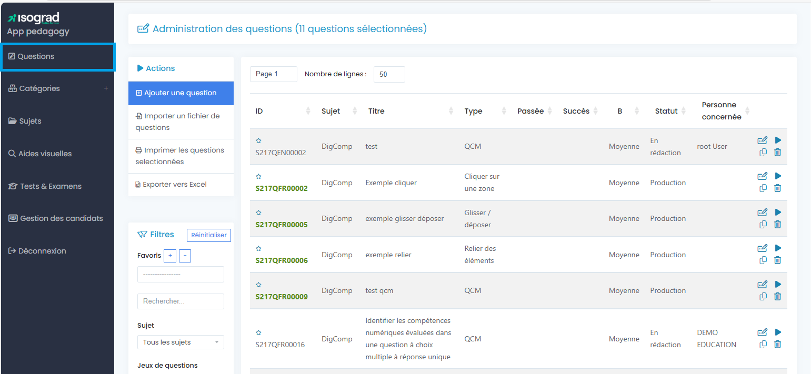
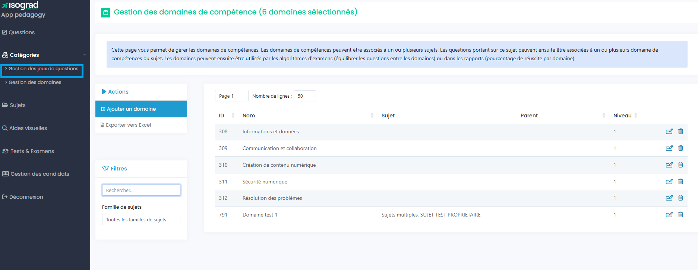
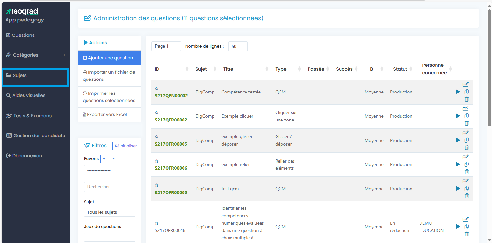
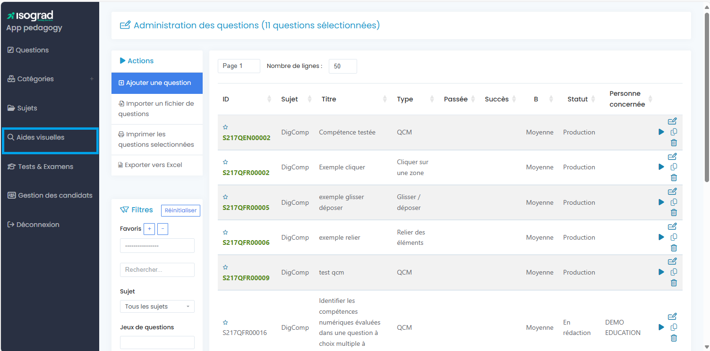
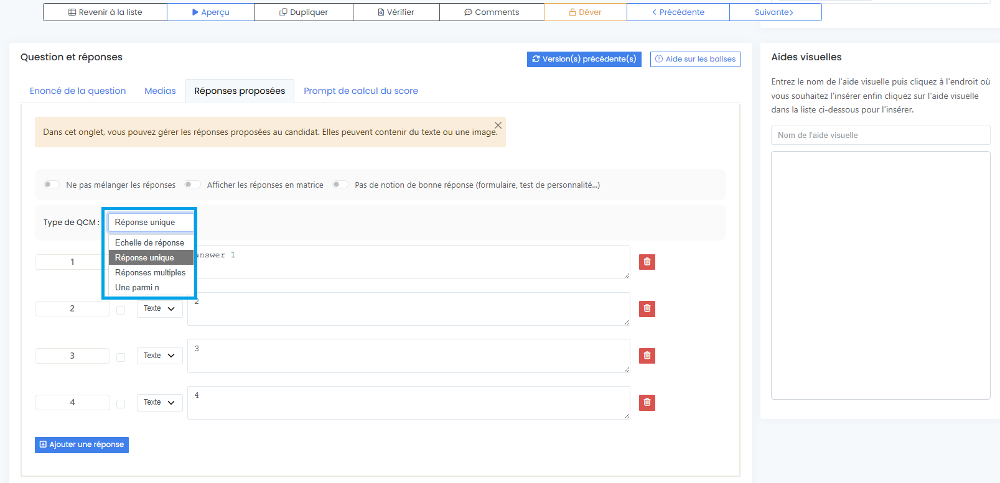

---
# Feel free to add content and custom Front Matter to this file.
# To modify the layout, see https://jekyllrb.com/docs/themes/#overriding-theme-defaults
layout: home
---

* TOC
{:toc}

# Introduction au manuel

Ce manuel a pour objectif de présenter l’ensemble des fonctionnalités de la plateforme de tests, afin de permettre aux clients et aux utilisateurs de gérer leurs évaluations en toute autonomie.

Il décrit de manière détaillée les différentes sections de la plateforme, notamment :

* la gestion des questions (création, édition, organisation et traduction) ;
* la création et la configuration des tests ou examens ;
* la consultation et l’analyse des résultats ;
* la gestion des candidats et le suivi des sessions ; 
* la gestion des administrateurs et la définition de leurs droits d’accès

Le manuel vise à accompagner les utilisateurs dans la prise en main complète de la plateforme, depuis la conception d’un test jusqu’à la consultation des résultats.
Il offre également des explications pratiques et illustrées pour faciliter l’utilisation quotidienne et garantir une utilisation efficace et indépendante de l’outil.

Les fonctionnalités accessibles peuvent varier selon les droits d’utilisation attribués à chaque utilisateur.

# Présentation générale de la plateforme

Voici une vue d'ensemble de la plateforme une fois connecté.e :

Depuis cette page, il est possible d’accéder aux principales rubriques de la plateforme :

* Compte : permet de consulter et de modifier les informations du profil, ainsi que de gérer les accès et les droits des administrateurs.

* Candidats : donne accès à la liste des candidats, à la création de nouveaux profils et à la gestion des inscriptions aux tests.

* Résultats : permet de consulter, filtrer et exporter les résultats des tests passés.

* Surveillance : offre la possibilité de suivre en temps réel le déroulement des sessions et de vérifier la conformité des passages.

* Emails : centralise la configuration et l’envoi des communications automatiques liées aux tests (invitations, relances, confirmations, etc.).

* Paramètres : regroupe les réglages généraux de la plateforme, notamment les préférences d’affichage, de langue et les droits d’accès.

* Aide & Support : donne accès à la documentation, aux guides d’utilisation et au support technique.

* Gestion des questions : permet de créer, modifier, traduire et organiser les questions intégrées dans la base de données des tests.

# Onglet « Gestion des questions »

## Menu « Questions » 

Ce menu permet de gérer l'intégralité de la base de questions. 

**Le process de gestion des questions est détaillé dans le chapitre
« Administration des questions ».**

## Menu « Catégories »

Ce menu permet :

-   La gestion des jeux de questions : ajouter, éditer ou supprimer un
    jeu de question.

-   La gestion des domaines : ajouter, éditer ou supprimer un domaine de compétences.

###  Gestion des jeux de questions

Les Jeux de question permettent de
regrouper les questions sont un même nom, et de les retrouver plus
facilement sur la plateforme. C'est un ensemble de questions qui peut
être utilisé pour filtrer les questions dans la page administration des
questions.

En cliquant sur « Gestion des Jeux de questions », on arrive sur une
page qui permet d'ajouter un jeu de questions, et de l'exporter vers
Excel. A partir de cette page vous pouvez aussi ajouter des jeux de
questions.

Ajouter un jeu de questions :

Pour ajouter un jeu de question, cliquer sur « Ajouter un jeu de
question ». Cela vous redirige vers la page « Mettre à jour un jeu de
questions ».

Plusieurs encadrés sont à remplir pour ajouter un jeu de question :

-   Le nom : comment sera définit le jeu de question.

-   Les sujets, séparés par un tiret : les différents sujets concernés
    par le jeu de question.

-   Archivé : cela est utile si vous souhaitez archiver votre jeu de
    question, si vous ne voulez plus voir le jeu de question.

-   Possibilité de mettre un commentaire : il est possible d'ajouter un
    commentaire, par rapport au jeu de question.

-   Cliquer sur « Attribuer ce jeu à des questions » : mène à une page
    qui permet d'enregistrer les modifications.

-   Description utilisée dans les rapports : Possibilité de mettre une
    description qui sera utilisée dans les rapports .

### Gestion des domaines

Pour gérer des domaines de compétence, cliquer sur « Gestion des
domaines ». Il permet de regrouper sous un même domaine de compétences,
une ou plusieurs questions qui portent sur un même sujet. Les domaines
sont utiles car ils apparaissent dans les rapports d'examen et
permettent de montrer le pourcentage de réussite par domaine. Les
domaines de compétence renvoient à un ensemble de connaissances, de
capacités et de savoir-faire spécifiques qui sont nécessaires pour
exercer une activité professionnelle ou accomplir une tâche.

Cliquer sur «  Gestion des domaines » mène vers une page nommée
« Gestion des domaines de compétences ». Dans la partie à gauche vous
avez la possibilité d'ajouter un domaine et d'exporter vers Excel.

Dans la partie centrale de la page, vous avez la possibilité d'agir sur
les différents domaines. Pour cela, cliquer sur l'icône « Editer » à
droite, pour modifier le domaine.

Vous pouvez modifier le domaine via la page qui s'affiche, et qui
présente quatre parties :

-   Description : possibilité de choisir la langue de description, le
    nom et la description textuelle. Cela permet de définir à quoi
    renvoie le nom de ce domaine.

-   Caractéristiques générales : cette partie donne la possibilité de
    choisir le nombre de niveaux qu'il y aura par domaines.

-   Description des niveaux : Possibilité de définir dans la langue de
    son choix, les niveaux de compétence. Cela permet de définir à quoi
    renvoie chaque niveau de compétence. Pour savoir où se situe le
    candidat.

-   Recommandations pour progresser dans la langue de son choix : Cela
    permet d'expliquer les recommandations qui permettent de passer au
    niveau supérieur. C'est utile pour la progression du candidat.
-   Associer les sujets

## Menu «  Tests & Examens »

Ce menu permet la création et la gestion des tests et des examens. 

La création et la gestion des tests et des examens sera détaillé dans le chapitre "Création de tests et d'examens".

## Menu « Sujets »

Ce menu permet de créer un nouveau sujet ou encore d'éditer ou supprimer ceux déjà existants. 

## Gestion des aides visuelles 

Une aide visuelle est une image ou un document inséré dans une question ou une réponse afin d'aider le candidat à visualiser un élément de référence (bouton, fonctionnalité, texte ou autre). Les aides visuelles sont associées à un sujet et ne sont disponibles que pour le sujet concerné.

Pour créer une aide visuelle il faut cliquer
sur Ajouter une aide visuelle. Une fenêtre s'ouvre dans laquelle vous avez la possibilité de choisir le sujet dans
lequel apparaîtra l'aide visuelle, la langue et le type d'aide visuelle
que vous souhaitez (document de référence, image affichée dans le texte ou image affiche par un clic, sous une loupe). Ainsi que de nommer votre aide visuelle. De plus,
vous pouvez aussi enregistrer et modifier le fichier en question.

Voici une capture d'écran de la page qui répertorie les différentes
aides visuelles. Cette page vous permet de gérer les aides visuelles.
Vous pouvez par exemple les modifier en cliquant sur l'icône « Editer »
à droite.

Voici deux exemples d'aides visuelles encadrés en bleu. Le premier est
un menu accessible via une loupe, le second est un bouton du ruban
Excel.

## Menu « Gestion des Candidats » 

Ce menu permet :
* la gestion des candidats : inscriptions aux tests,
gestion des groupes, gestion des sessions, profils par compétences,
envois d'emails, consultation des résultats, etc.
* l'accès à la gestion des résultats : tableau de bord et résultats 

**Le process de gestion et d'administration des candidats est détaillé dans le chapitre « Gestion des candidats ».**

## Menu « Aide et Support » 

Ce menu permet l'accès au manuel d'utilisation de la plateforme, les paramètres de l'API et le contact du support technique Isograd. 

## Bouton « Déconnexion » 

Permet à l'administrateur de se déconnecter de la plateforme.

# Administration des questions

## Présentation de la page d'accueil

### Les actions

Ce menu permet les actions suivantes :

-   Ajouter une nouvelle question: cliquez sur **"Ajouter une question"** puis complétez les éléments
suivants :

-   Sélectionner le sujet

-   Sélectionner la langue

-   Sélectionner le type de réponse (typologie de questions)

-   Importer un fichier de questions (type QCM) automatiquement sur la plateforme depuis un fichier Excel

-   Imprimer (visualiser en format PDF) l'ensemble des questions sélectionnées

-   Exporter vos questions vers un fichier Excel

### Les filtres

Options de filtres disponibles pour permettre une gestion plus fluide
des questions :

-   Par sujet

-   Par jeu de question

-   Par langue

-   Par type de réponse

-   Par domaine de compétence (si des domaines ont été créés pour le sujet sur la plateforme)

-   Par personne responsable (personne devant intervenir sur la question)

-   Par statut de la question (en rédaction, à vérifier, en production, etc.)

Ce bandeau permet également d’enregistrer des favoris. Pour cela, filtrez les questions afin d’afficher la liste souhaitée, cliquez sur le bouton **+**, puis attribuez un nom à cette liste. Pour retirer un sujet, il suffit de le sélectionner dans la liste déroulante et de cliquer sur le bouton moins (-). 
 

### La liste des questions

Informations du tableau des questions :

-   Identifiant de la question (identification qui apparaîtra dans le
    rapport de compétences si cette option est sélectionnée par l'administrateur)

-   Sujet

-   Titre de la question (le titre de la question correspond
    généralement à la compétence testée car elle apparaît dans le
    rapport de compétences)

-   Type (typologie de question)

-   Passée (nombre de fois où la question a été passée par des
    candidats) Succès (taux de succès des candidats à cette question)

-   Niveau de difficulté de la question (Facile, Moyen, Difficile \> niveau défini par le créateur de la question)

-   Statut de la question

-   Personne concernée (personne devant intervenir sur la question)

### Boutons des actions possibles sur les questions

#### Dupliquer une question

Dupliquer une question permet de « cloner » une question ; cela fait
gagner du temps si les questions sont de mêmes typologies par exemple.
Pour dupliquer une question, il suffit de se positionner sur la question
qu'on souhaite dupliquer dans la liste des questions de la page
d'accueil

Cliquer sur « Dupliquer ». La fenêtre de dialogue « Dupliquer une
question » apparaît. Choisir le sujet et la langue puis cliquer sur «
Dupliquer ». La question dupliquée s'ouvre alors sur une page d'édition
qu'il faut corriger avant d'enregistrer.

Il est aussi possible de dupliquer une question via le ruban en haut de
l'écran en mode Edition :

#### Supprimer une question

Pour supprimer une question, il suffit de se positionner sur cette
dernière dans la liste des questions de la page

d'accueil. Quatre boutons d'action apparaissent :

Cliquer sur « Supprimer ». La page d'édition de la question s'ouvre et
dans le menu latéral à droite, cliquer de nouveau sur le bouton «
supprimer » pour confirmer la suppression.

#### Voir la question en Mode Aperçu 

**Les QCM**

Il existe trois types de QCM possibles :

* QCM texte à réponse unique, où le candidat sélectionne une seule réponse correcte ;

* QCM à réponses multiples, où le candidat doit indiquer l’ensemble des réponses correctes ;

* QCM « une parmi n », où le candidat doit choisir une seule bonne réponse parmi plusieurs réponses correctes pour valider la question.

**Echelle de réponse** : Le candidat doit répondre à toutes les
affirmations pour que sa réponse soit considérée juste ou fausse.

 

**Les cliquer sur zone(s)**

Il est possible de créer des questions comportant :

* une seule zone à cliquer,

* plusieurs zones correctes, dont le candidat doit sélectionner une seule pour valider la question,

* plusieurs zones attendues, que le candidat doit toutes cliquer pour valider la question.

**Glisser-déposer**

Le candidat doit faire glisser les éléments (texte ou images) vers leur emplacement correct dans la zone de droite.

**Relier les éléments**

Le candidat doit relier les éléments (texte ou images) de gauche avec ceux de droite.

**Zone de texte et notation manuelle**

Le candidat doit saisir sa réponse dans l'encadré prévu à cet effet. La question est notée et/ou commentée par une personne physique après le passage du test.

**Zone(s) de texte avec correction automatique**

Le candidat doit saisir sa ou ses réponses dans l'encadré ou les encadrés prévus à cet effet. Le texte soumis peut être vérifié et évalué de manière automatique ou par l'intelligence artificielle.

**Enregistrements évalué par l'IA**

Le candidat doit répondre à une question en enregistrant un audio. Cette question sert à tester les compétences du candidat à l'oral.

Le candidat peut enregistrer plusieurs audios qu'il peut réécouter avant de sélectionner celui qu'il souhaite soumettre. L'audio soumis est vérifié et évalué par l'intelligence artificielle.

**Texte à trous avec listes**

Le candidat doit cliquer sur la flèche de l'encadré pour ouvrir la liste qui comporte les propositions de réponse, et en choisir une.

**Trier**

Le candidat doit faire glisser les différentes propositions de réponse, pour les disposer dans l'ordre demandé.

#### Éditer une question

Le formulaire d'une question, appelé « mode édition », permet de créer ou de modifier une question. Il est composé de plusieurs parties.

##### Caractéristiques générales

-   Le bouton "Générer un titre" crée un titré généré par l'IA. Si vous ne souhaitez pas générer le titre de la question par l'IA ,vous pouvez le saisir vous-même.
    **Attention à la formulation car le titre apparaît sur les rapports des candidats.**

-   Le champs «  Temps alloué est par défaut défini sur -1. Si vous souhaitez allouer un temps maximal pour la question, veuillez remplir le champs ( en secondes).

-   La difficulté de la question peut se renseigner : Facile, Moyenne ou Difficile. Si vous ne souhaitez pas donner un niveau de difficulté à la question, veuillez renseigner N/A.

-   Vous pouvez renseigner l'inventeur de la question ( utile pour les mises à jour par exemple).

-   Attribuez un score maximal à la question.

##### Question et réponses

Certains champs sont communs à toutes les typologies de questions :

 **Énoncé de la question :** renseignez l'énoncé de votre question,
    les consignes, l'étude de cas, etc. Une traduction générée par l'IA
    de l\'anglais vers le français ou du français vers l\'anglais est
    disponible en appuyant sur le bouton \"Traduire\".

**Médias** : plusieurs types d'illustrations et de fichiers peuvent être ajoutés à
une question :
-   Une image d'illustration

-   Une image de l'environnement du logiciel ou qui présente un exemple
    pour la question

-   Le visuel de la catégorie (par exemple pour les questions de langue,
    on ajoutera un visuel indiquant la catégorie, exemple : orthographe,
    grammaire, conjugaison, etc.)

-   Un texte

-   Une vidéo

-   Un fichier audio généré par l'IA

**N'oubliez pas d'enregistrer la saisie avec le bouton « Enregistrer »
avant de passer en mode Aperçu par exemple, sinon la saisie sera
perdue.**

**L'exemple ci-dessous est un qcm à réponse unique.**  

**NB** : Pour une résolution optimale, **les images doivent avoir une
résolution 1080 x 500.** 

##### Explications concernant la solution

Ce champ n'est pas obligatoire et doit être renseigné uniquement si une
solution doit être présentée au candidat (pendant ou après le test). Le
tutoriel peut être renseigné par une personne physique ou généré par l'IA. Il est aussi possible de donner des précisions en utilisant l'onglet Indication. 

#### Informations de revue

Cette zone permet le suivi de la question lorsque plusieurs personnes
interviennent sur la question. On y retrouve le statut de la question,
les différents intervenants, et un champs permettant à ces derniers
d'échanger des commentaires sur la question.

Il est aussi possible d’ajouter un fichier de commentaire.

## Éléments propres au mode Édition pour chaque type de question

**QCM**

* Réponses proposées : permet de définir le type de QCM, le nombre de réponses, ainsi que leur format (texte ou image) ;

* Prompt de calcul : permet de déterminer la méthode de calcul du score de la question et de la générer automatiquement à l’aide de l’IA.

**Echelle de réponse**

Vrai/ Faux

* Prompt de calcul : permet de déterminer la méthode de calcul du score de la question et de la générer automatiquement à l’aide de l’IA.

**Cliquer sur zone**

Dans l’onglet Éditeur graphique, s’ajoute l’image de fond et se définissent la ou les zones correctes.

**Glisser-déposer**

Dans l'onglet Zones de dépose vous ajoutez l'image de fond et vous définissez les zones de dépôt.

L’onglet Éléments à faire glisser permet de choisir le type d’éléments à déplacer (texte ou images), de les définir et d’indiquer l’emplacement correct de chacun.

**Relier**

Dans les onglets Colonne de gauche et Colonne de droite vous définissez les éléments à relier (et leur type) et leur destination correcte. 

**Notation manuelle**

L'onglet Détails de soumissions permet de définir la type de réponse attendue par le candidat (saisie de texte, soumission de fichier ou enregistrement audio). 

L’onglet Grille d’évaluation permet d’ajouter des critères et d’attribuer un nombre de points par critère. Ces éléments sont visibles par les correcteurs qui les utilisent pour évaluer la question et attribuer une note,  une fois le test passé.

**Zone(s) de texte avec correction automatique**

Dans l’onglet Zones de saisie, vous définissez le type de correction pour chaque zone (automatique ou réalisée par l’IA), le type de champ, le format des réponses attendues (texte, nombre, e-mail), le prompt d’analyse IA le cas échéant, ainsi que d’autres critères tels que la taille de la zone de saisie ou le nombre minimal et maximal de mots etc.

**Enregistrement évalué par l'IA**

**Texte à trous avec listes**
L'onglet Editeur de sélecteur permet d'ajouter les différentes propositions de réponse qui seront visibles par le candidat. L'option correcte est indiquée par la case bleue.

**Trier**
L'onglet Description YML permet d'ajouter et modifier les informations des propositions de réponse, et de définir l'ordre correct des différentes propositions de réponse.

# Création des tests

Dans le **menu principal**, cliquez sur **Tests and Examens** pour arriver à la page de gestion de tous vos tests. 

En appuyant sur **Créer un test**, une fenêtre s'ouvre pour **choisir la
langue du test** (français ou anglais).

## Caractéristiques générales du test

La première section des paramètres inclut :

- Si vous voulez que votre test soit actif ou inactif

-   L'Algorithme des questions :

        -   Séquentiel ordonné

        -   Séquentiel au hasard

        -   Séquentiel au hasard avec jeu de questions

        -   Questions par domaine

-   Sélection de questions : en appuyant sur **Choisir** une nouvelle
    fenêtre s'ouvre pour sélectionner les questions du test.

Faire glisser les questions vers la colonne de droite pour les ajouter
au test. Il est possible aussi de changer l'ordre des questions
depuis la colonne de gauche en les faisant glisser.

Pour voir les questions disponibles, il faut sélectionner un sujet. Une
recherche par mot clé, par compétence, par identifiant de question ou
par degré de difficulté est possible. Les questions présentent trois
degrés de difficulté : Facile, Moyenne, Difficile.

Il est possible de mélanger **plusieurs sujets** et de **visualiser la
question** en cliquant sur l'œil qui se trouve à droite de la question.
La prévisualisation de question est possible aussi sur la page
principale de création de test, une fois les questions enregistrées.

Glissez les questions vers la colonne de droite pour les ajouter au test
et appuyez sur **Enregistrer.**

- Type de résultat : depuis la liste déroulante vous choisissez le type de rapport de compétences 

### Options de passage du test

 Navigation entre les questions : le candidat peut naviguer entre les questions, revenir en arrière sur une question ou sauter une question (l'option est possible uniquement si le test ne comporte pas de question de manipulation).

 Afficher la liste des questions : après la page d'introduction du test, il est possible d'afficher la liste des questions qui vont être posées.

 Afficher le bouton « Ecouter le texte » : en activant cette option, le candidat pourra écouter l'énoncé de la question.

### Nom et description du test

Ajouter le nom du test et une description qui sera visible pour les
administrateurs du compte, en français et/ou en anglais. Le nom du test
apparaîtra dans la liste de vos tests pour l'inscription du candidat,
dans les invitations envoyées au candidat par email pour leur connexion
au test, ainsi que dans les rapports de compétences.

### Gestion du temps

Vous pouvez définir la durée du test en minutes. Un chronomètre
s'affichera sur la page du candidat. Si vous ne souhaitez pas définir de
durée pour le test, laissez le champs vide.

### Messages de début et de fin de test

Ces messages seront visibles par le candidat. En appuyant sur
**Editer**, un éditeur permettant la personnalisation du message du
début s'ouvre.

Le message de début s'affiche avant que le candidat ne commence son
test. Vous pouvez donc y renseigner toute information qui vous semble
pertinente.

Le Message de fin s'affiche une fois le test passé.

-   N'oubliez pas d'enregistrer les paramètres de votre test.

-   Vous pouvez essayer votre test pour voir s'il vous convient en appuyant sur le bouton Enregistrer et essayer votre test. 
-  Il est possible d'exporter tous les commentaires laissés pour ce test par les candidats qui l'ont passé. 

# Naviguer sur la plateforme

Le menu principal de la plateforme donne accès aux cinq onglets qui vous permettent de gérer votre compte.

## Compte

### Détails

Vous trouverez ci-dessous toutes les informations concernant votre
compte et votre profil administrateur

Vous pouvez intégrer le logo de votre organisation, celui-ci apparaîtra
sur les rapports de test.

### Administrateurs

Dans cette page, vous pouvez créer de nouveaux administrateurs de compte ou gérer les comptes des administrateurs existants (éditer, modifier les droits, supprimer, désactiver ou envoyer les identifiants).

#### Créer un administrateur

Il existe 4 types d'administrateurs sur la plateforme.

##### Type d'administrateurs

En fonction du
rôle de chacun vous pouvez lui attribuer des privilèges qui lui donnent
accès à des fonctionnalités spécifiques.

### Consommation de crédits

### Factures

### Alerte crédit

## Candidats

Après avoir créé vos tests, vous pourrez procéder à l\'ajout de vos candidats. Il existe deux options pour ajouter des candidats à la plateforme.

##### Ajout individuel 

Sur le menu principal, vous avez l'option "Candidats". Pour ajouter un seul candidat, cliquez sur "Ajouter un candidat".

Renseignez les informations et l'adresse e-mail du candidat.

L'identifiant du candidat sera son adresse e-mail. Deux candidats ne peuvent pas être enregistrés avec la même adresse e-mail.

Chaque candidat appartient à au moins un groupe. Le groupe par défaut est le groupe principal. Un candidat peut appartenir à plusieurs groupes à la fois.

##### Ajout d'un groupe de candidats

 

*L'importation d'un fichier Excel contenant les détails de vos candidats vous permet de télécharger rapidement jusqu'à 500 à la fois pour un groupe défini.*

Cliquez sur **importer un fichier de candidats**.

Dans la fenêtre importer in fichier de candidats, procédez comme suit :

-   Cliquez sur télécharger le modèle de fichier et télécharger le sur
    votre ordinateur.

-   Complétez le modèle Excel en suivant l'exemple de la première ligne
    et enregistrez le fichier.

-   Sous fichier à importer, cliquez sur choisir un fichier, accédez à
    l'emplacement de votre fichier et sélectionnez-le. Vous devriez
    maintenant vois le nom du fichier que vous avez importé.

-   Sous sélectionner un groupe, choisissez le groupe approprié dans le
    menu déroulant.

-   Une fois que vous avez choisi le groupe, cliquez sur la flèche bleue
    pointant vers la droite. Cela déplacera le groupe sélectionné dans
    le(s) **Groupe(s) du candidat.**

-   Maintenant, cliquez sur **importer**.

Lors du téléchargement du fichier Excel, chacun des candidats recevra un
mot de passe aléatoire. **Remarque :** Vous pourrez créer un mot de
passe pour tout les candidats en cliquant sur actions sur le groupe,
puis sur **attribuer un mot de passe** temporaire à tous les candidats
du groupe.

##### Inscrire un/des candidat(s) à un test

Pour inscrire les candidats à un test, cliquez sur **Candidats** dans le
menu principal. À droite de l'adresse e-mail du candidat, cliquez sur
l'icône **Éditer**

Le fichier du candidat est ouvert. Si le candidat a passé un test ou à
des tests en attente, ils apparaîtront ici.

Vous serez également redirigé vers cette page après avoir créé un
candidat.

Cliquez sur **Inscrire à un test**

Choisissez la langue, le sujet, le type de test et la session (le cas
échéant) pour le candidat. Vous pourrez rechercher un test particulier à
l'aide du champ **Recherche par saisie**.

Cliquez sur **Inscrire** ou **Inscrire et fermer** si vous souhaitez
attribuer un seul test à un candidat.

Si le mauvais test est attribué à un candidat ou à un groupe de
candidats, ou s'il est nécessaire de supprimer un test qui n'a pas été
démarré (en attente), l'administrateur peut effectuer cette tâche.

Pour supprimer un test en attente, cliquez sur l'icône **Supprimer** et
le test sera automatiquement supprimé.

Si vous supprimez un test en attente, le(s) crédit(s) de test est(sont)
automatiquement retourné(s) sur votre compte.

##### Fonctionnalité Anti-Triche (mode plein écran)
Lorsque ce mode est activé, les candidats ne peuvent pas accéder à
d'autres applications logicielles ou ressources Internet pendant la
durée de leur 

Si un candidat quitte le mode plein écran ou tente d'ouvrir un nouvel
onglet, le système l'invitera à revenir à la page du test.

S'il ne se remet pas en mode plein écran sur son test dans les 10
secondes qui suivent, il sera automatiquement déconnecté de son test.

##### Envoi d'invitation aux tests

Vous avez la possibilité d'envoyer directement depuis la plateforme des
e-mails pour informer vos candidats des tests disponibles sur leur
espace,

Commencez par sélectionner **Candidats** dans le menu principal.
Ensuite, dans la liste des candidats, cliquez sur l'icône **Éditer**

Une fois que vous avez ajouté un test, cliquez sur **Envoyer les tests
au candidat**

Une nouvelle fenêtre s'ouvrira. Sélectionnez le modèle d'e-mail et
l'adresse de l'émetteur (s'il est ajouté). Vous pouvez également choisir
un administrateur qui recevra une copie de l'e-mail :

Une fois que vous avez cliqué sur **Envoyer**, l'e-mail d'invitation
sera envoyé et le candidat pourra accéder au(x) test(s).

##### Actions sur le groupe

Les actions sur le groupe vous permettent d'effectuer des tâches pour
tous les candidats d'un même groupe, comme par exemple :

-   Définir un mot de passe

-   Inscrire au même test

-   Envoyer des e-mails d'invitation

-   Supprimer des tests non-passés

-   Définir et mettre à jour des options d'évaluation

Les deux tâches principales effectuées au niveau du groupe sont
l'inscription du groupe à un test et l'envoi d'e-mails d'inscription.

##### Inscrire un groupe à un test

Utilisez l'action **Inscrire tous les candidats du groupe à un test**
pour gagner du temps et vous assurer que tous les candidats d'un groupe
sont inscrits au même test.

Accédez à cette option en sélectionnant **Candidats** dans le menu
principal, puis sélectionnez **Actions sur le groupe** et **Inscrire
tous les candidats du groupe à un test.**

Vous sélectionnerez ensuite la langue, le sujet, le type de test et la
session. Cliquez ensuite sur **Inscrire** ou **Inscrire et fermer.**

##### Envoi d'e-mails d'invitation à un groupe

Une fois que vous avez inscrit le groupe à un test, il est temps
d'envoyer l'e-mail d'invitation. Pour cela, vous pouvez utiliser
l'option **Envoyer les e-mails d'inscription à tous les candidats du
groupe.**

Sélectionnez **Envoyer des** **e-mails** **d'inscription à tous les
candidats du groupe** et la fenêtre **Détails du message** s'ouvre.
Renseignez les informations demandées (adresse e-mail de l'expéditeur,
titre du message et modèle d'e-mail), puis cliquez sur **Envoyer**.

Une fois que vous avez cliqué sur **Envoyer**, l'e-mail d'invitation
sera envoyé et les candidats pourront accéder au(x) test(s).

##### Autres actions

Les actions de groupe vous permettent de :

-   **Définir un mot de passe pour tous les candidats du groupe**

-   **Supprimer les tests non passés.** Si vous supprimez les tests à
    passer, vous serez alors recrédités automatiquement

-   **Définir des options d'évaluation pour l'ensemble des candidats du
    groupe.** Cela vous permet de personnaliser les options d'évaluation
    pour un groupe défini

## Résultats

La plateforme vous fournit un aperçu complet des résultats aux tests.

Les résultats sont disponibles pour un seul candidat ou pour un groupe
de candidats

Pour y accéder, cliquez sur **Résultats** dans le menu principal.

Vous pouvez effectuer des recherches dans les données et filtrer par :

-   Groupe

-   Statut du test (terminé, en attente de notation ou commencé)

-   Sessions

-   Période

Tous les résultats peuvent être exportés dans un fichier Excel.

### Resultats individuel

Pour consulter les résultats d'un candidat, entrez son nom ou son
adresse e-mail dans la barre de recherche.

Une fois les résultats du candidat chargés, cliquez sur l'icône
**Analyse**.

La page **Déroulement du test** s'ouvrira et l'analyse générale du test
du candidat sera présentée,

Pour un aperçu et une analyse plus approfondis, cliquez sur **Détails du
test** et sélectionnez **Compétences** dans le menu déroulant. Vous
pouvez télécharger un PDF avec le détail du test en cliquant sur
**Obtenir le** **rapport en PDF**.

Un administrateur peut voir les réponses des candidats. Déplacez votre
curseur sur un résultat de test, cliquez sur **Analyse**, puis **Détails
du test** et **Voir les réponses**

Vous pourrez voir les résultats et le temps passé sur chaque question.
Ces données peuvent être exportées sous forme de fichier Excel.

En cliquant sur l'icône **Affichage**, vous pourrez voir la question, la
réponse du candidat, et la bonne réponse attendue.

## Emails

## Paramètres

### Option de passage 

Les **Options de passage** permettent aux administrateurs de définir
et/ou de mettre à jour les paramètres par défaut sur la plateforme.

### Paramètres pour évaluation 

**Les paramètres pour évaluation** vous permettent de choisir si les
candidats peuvent laisser un commentaire après chaque question, s'ils
peuvent répondre aux questions avec « Je ne sais pas » ou si vous
souhaitez recevoir un e-mail avec le rapport à la fin de chaque test.
Ces options peuvent être définies spécifiquement pour chaque candidat.

Une fois que vous avez personnalisé vos paramètres, cliquez sur le
bouton **Enregistrer** .

Paramètres généraux

Les autres paramètres qui peuvent être modifiés sont liés au temps. Vous
pouvez afficher les dates et heures au format américain ou européen, et
sélectionner votre fuseau horaire. Vous pouvez également définir le
temps supplémentaire alloué pour les personnes en situation d'handicap.\
\
Sachant que vous devrez également définir le temps supplémentaire dans
la fiche du candidat, il est recommandé de définir ici la valeur globale
sur 100%.

Une fois que vous avez personnalisé vos paramètres, cliquez sur le
bouton **Enregistrer** .

### Sessions de passage 

Une session de passage est une période de temps pendant laquelle des
tests doivent être passés. Les tests liés à une session ne seront pas
accessibles en dehors de la session de test programmée.

La création d'une session vous permettra de définir une heure de début
et de fin. Ensuite, lorsque vous inscrivez un candidat à un test, vous
pourrez lier le test à une session définie.

Pour créer une session de test, cliquez sur **Paramètres**, puis sur
**Sessions** **de passage,** puis sur le bouton rouge **Créer une
session**.

Dans la fenêtre **Créer une session**, vous pouvez ajouter une
description/un titre pour votre session ainsi qu'un code de session, les
dates de début et de fin, ainsi que l'heure de début et de fin.

L'ajout d'un code de session est recommandé afin que les candidats ne
puissent pas accéder au test en dehors de l'heure prévue. Le code de
session n'est jamais envoyé par e-mail, il convient de le fournir au(x)
candidat(s) en amont du test.

Profils

Les **Profils** vous permettent de définir les résultats attendus pour
des métiers spécifiques.

Vous pouvez définir les niveaux de compétence attendus pour des
compétences spécifiques, ce qui vous permet d'identifier rapidement des
candidats qualifiés.

Les profils peuvent également être utilisés pour mettre en évidence les
connaissances et les compétences pour les promotions d'emploi internes.

Dans le menu principal, sélectionnez **Paramètres**, puis cliquez sur
**Profils** puis cliquez sur le bouton rouge **Ajouter un profil**.

Pour modifier le niveau attendu des sous-compétences d'un test, placez
votre curseur sur le profil et cliquez sur l'icône **Modifier les
niveaux de compétence** .

\

Descriptions de niveaux personnalisés

Vous pouvez modifier la description du niveau sur chaque test
d'évaluation, en fonction de la famille de sujets du test.

Pour accéder à cette fonctionnalité, sélectionnez le menu Paramètres,
cliquez sur **Descriptions de niveaux personnalisées**, puis sur **Créer
une description de niveau.\
**

Dans la fenêtre **Ajouter une description personnalisée**, sélectionnez
la famille de sujets, puis cliquez sur **Enregistrer**.

Dans la fenêtre **Gestion des** **descriptions de niveaux
personnalisées**, vous pouvez saisir des messages pour chaque niveau de
compétence.

Une fois que vous avez terminé les messages pour chaque niveau, cliquez
sur **Enregistrer**. Ces commentaires apparaîtront sur les rapports des
candidats, en fonction du niveau de compétence du candidat.

## Aide et support

L'onglet **Aide & Support** contient toutes les informations techniques
sur la plateforme et les tests.

Pour y accéder, sélectionnez **Aide** **& Support** dans le menu
principal.

Vous y trouverez les éléments suivants :

-   Coordonnées du support technique

-   Vérification du navigateur Internet

-   Tests de configuration technique

-   Manuel technique

Configuration technique

Il est conseillé de vérifier le navigateur de l'ordinateur (s) avant
d'exécuter des tests. Pour trouver la version de votre navigateur,
cliquez **sur Identifier la version de mon navigateur.**

**\
**

Test de vérification

Une fois que vous avez cliqué sur **Vérifier,** vous aurez la
possibilité de faire un test. En fonction de votre sélection, un
mini-test d'évaluation sera lancé. Il est conseillé de compléter ce test
dans le cadre de la vérification technique.\

Le court test de trois questions simule un environnement d'évaluation.
Chacune des questions correspond aux différents types de questions que
les candidats rencontreront. Ces questions ne nécessitent pas de
connaissance spécifique.

Veuillez suivre les instructions et répondre aux questions. Si cela
n'est pas fait, ou si la configuration ne correspond pas à nos
exigences, notre plateforme ne permettra pas au candidat de passer
leur(s) test(s).

En cas de difficultés techniques, veuillez contacter le support
d'Isograd à **<support@isograd.com>.**

Si vous avez des questions concernant le contenu de ce manuel ou
d'autres questions techniques, veuillez nous contacter également à
**support@isograd.com**

