

* TOC
{:toc}

# Table des matières

## Premier pas sur la plateforme ISOGRAD
### Connexion à la plateforme
### Naviguer sur la plateforme

## Gestion de votre compte
### Détails
### Administrateurs
### Consommation de crédits
### Facture
### Alerte crédit

## Gestion des candidats
### Candidats
### Groupes

## Surveilance
### Surveillance

## Emails
### Modèles d'emails
### Emetteurs d'emails
### Envoi programmés

## Gestion des parametres
### Options de passage
### session de passage
### Profil de compétences
### Descriptions de niveaux personnalisées

## Aide et support

# Connexion à la plateforme Isograd

Pour accéder à votre compte, allez sur  , passez la souris sur le  bouton **Connexion** dans le coin supérieur droit de la page pour afficher les options déroulantes.  Sélectionnez **Administrateur ** et entrez votre adresse e-mail et votre mot de passe, puis cliquez sur **Connexion**.

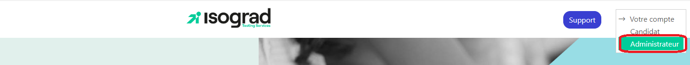

Si vous ne vous souvenez plus de votre mot de passe, cliquez sur **Mot de passe** **oublié**. Un lien de réinitialisation de mot de passe vous sera automatiquement envoyé par e-mail.

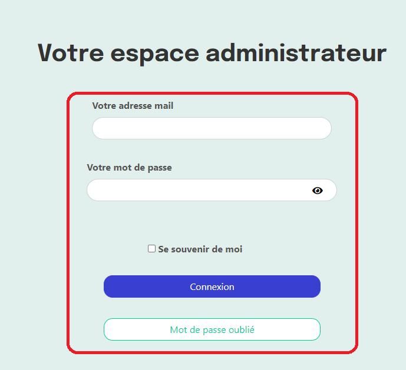

Naviguer sur la  plateforme Isograd

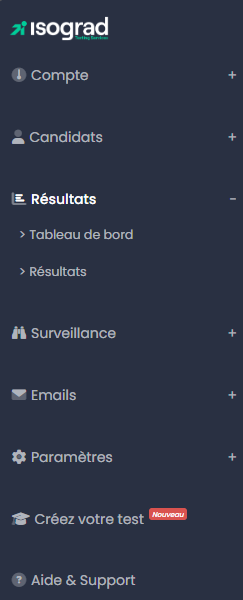

Gestion de votre compte

****

Détails

Vous trouverez ci-dessous toutes les informations concernant votre compte et votre profil administrateur.

Vous pouvez intégrer le logo de votre organisation, celui-ci apparaîtra sur les rapports de test.

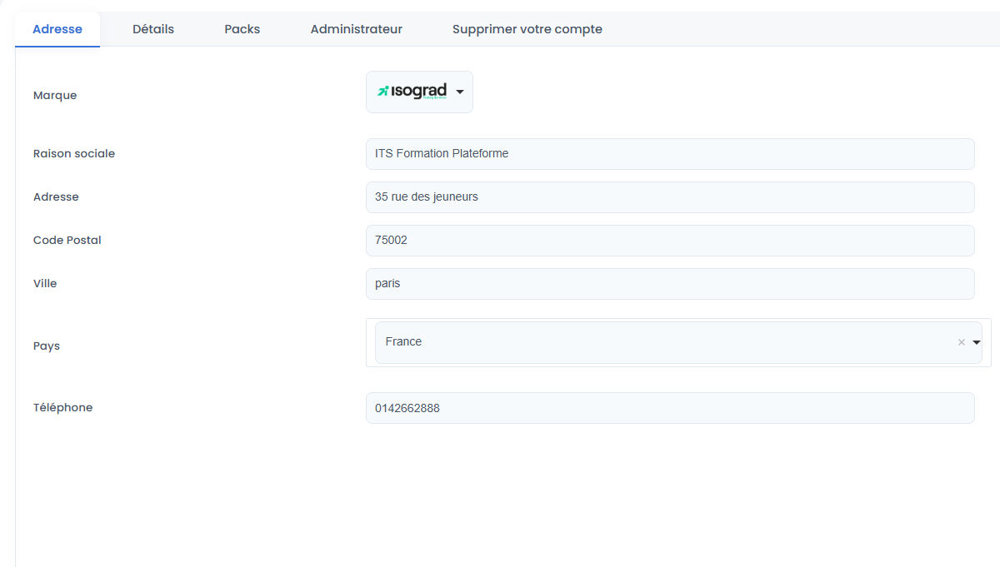

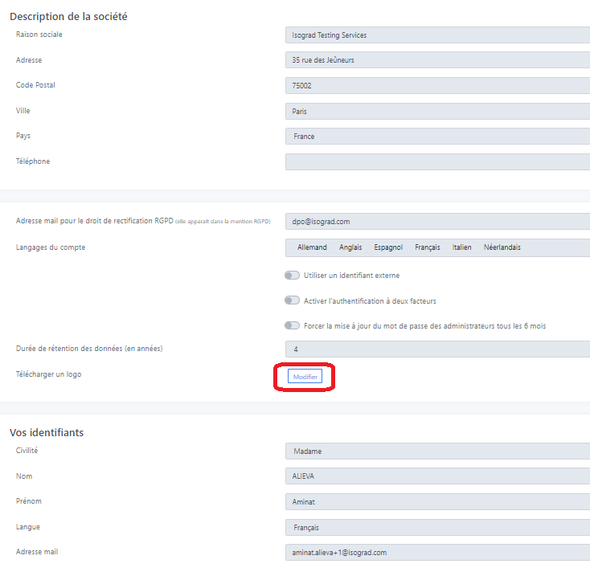

Administrateurs

Les administrateurs gèrent les groupes. Chaque groupe nécessite un administrateur.

# Ajout d’un administrateur

Pour accéder aux outils **de gestion des administrateurs**, cliquez sur** Compte** dans le menu principal. Vous serez ensuite redirigé vers la  page **Gestion des administrateurs**.  Cliquez sur **Administrateurs**.

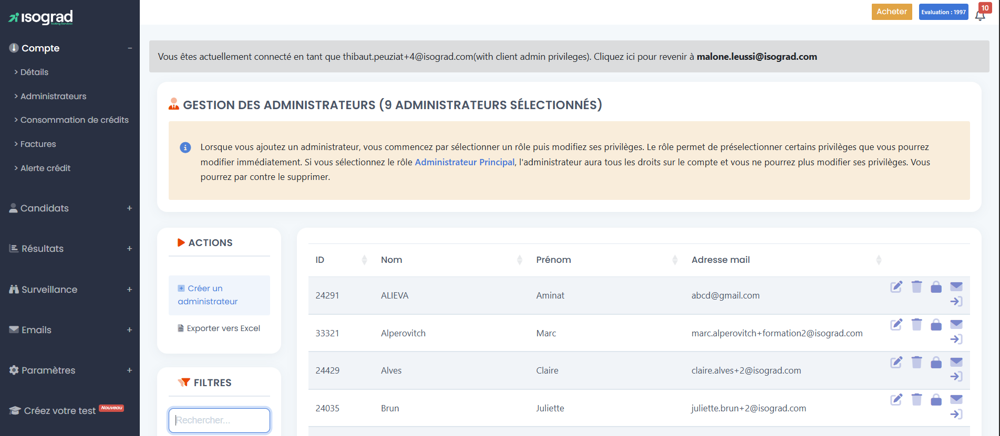

La page Gestion des administrateurs de votre compte apparaîtra et vous pourrez afficher tous les administrateurs qui ont été créés.

Types d’administrateurs

Il existe 2 types d’administrateurs sur la plateforms

**Administrateur ****principal****:** Cet administrateur dispose des droits d’administration complets  et peut afficher et modifier tout ce qui se trouve sur le compte.

**Administrateur**** de groupe :** Cet administrateur ne peut accéder  et modifier que les candidats au sein du ou des groupes qu’il a été chargé de gérer, ainsi que les candidats des groupes publics.

# Modification des administrateurs

Les administrateurs de compte peuvent modifier les droits des administrateurs existants en cliquant sur l’icône Éditer sur la ligne de l’administrateur voulu.

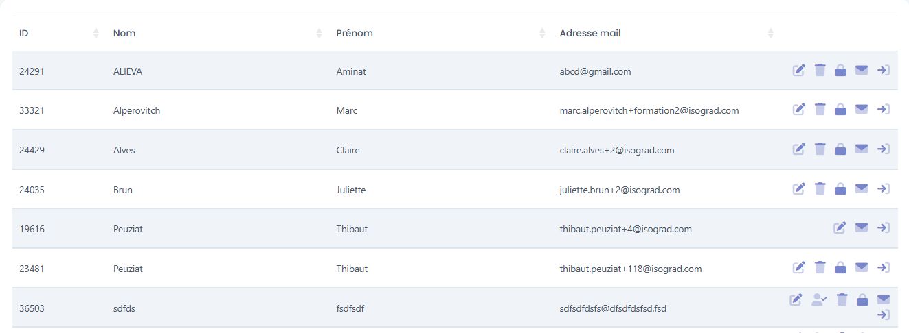

Vous pouvez également **supprimer **un administrateur ou lui **réinitialiser** le mot de passe.

Vous avez aussi la possibilité de de modifier les privilèges sur certains actions du compte de vos administrateur, tel que la gestion des candidat, gestion des resultats etc

Aussi, vous pouvez attribuer des privilèges à certains administrateurs sur votre compte. Vous pouvez modifier les priviliège de des administrateur en cliquant sur l’icon **privilèges **

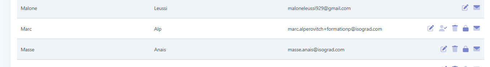

Vous aurez donc la possibilité d’attribuer ou supprimer certains privilèges à vos administrateur

Consommation de crédits

La page **Consommation de crédits**  vous permet de suivre l’utilisation totale des crédits ainsi que l’utilisation des crédits par groupe.

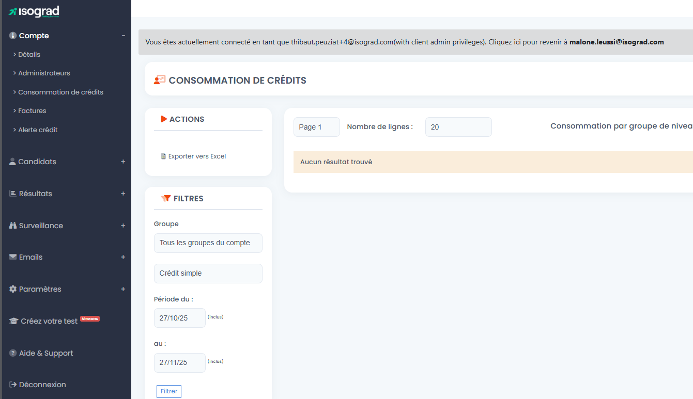

À partir de la page **Compte**, cliquez sur **Consommation de crédits**

Sélectionnez la période pendant laquelle vous souhaitez examiner l’utilisation des crédits et cliquez sur **Filtrer**. Vous verrez alors tous les groupes qui font partie de votre compte. Vous pouvez trier ces données par groupe, type de crédit ou nombre de crédits utilisés.

Pour consulter les détails spécifiques sur la consommation de groupe, vous devrez sélectionner le bon groupe. Pour sélectionner le groupe, passez le curseur de votre souris sur un groupe et cliquez sur **Détails**.

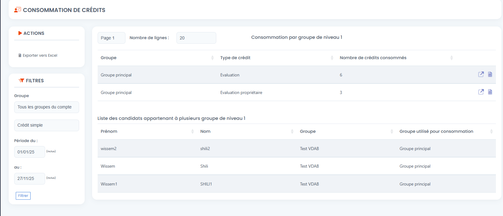

Factures

Si vous avez effectué des achats en ligne pour des crédits d’évaluation Isograd, vous pouvez consulter votre (vos) facture(s) en ligne.

Sur la page **Compte **, cliquez sur **Mes factures.**

Ici, vous verrez la (les) date(s) de transaction, la (les) description(s) du produit (s) et le montant de chaque facture.

Vous pouvez imprimer une facture pour tout achat en ligne en passant votre souris sur la transaction et en cliquant sur **Télécharger**. La facture sera générée, puis vous pourrez la télécharger.

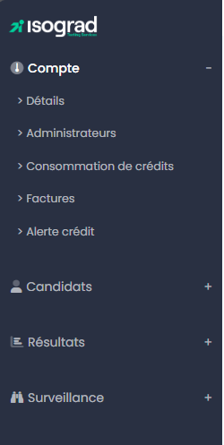

Cliquer sur **Éditer** vous permet de modifier le nom et le statut d’un groupe, ainsi que de l’archiver.

Cliquez sur **Supprimer** pour supprimer définitivement un groupe. Lorsqu’un groupe est supprimé, tous  ses candidats sont envoyés au **groupe principal**.

Cliquez sur **ajouter/supprimer des candidats** pour  rapidement gérer les candidats rattachés à vos groups

Alerte crédit

La page **Alerte**** crédit** vous permet de créer jusqu’à deux alertes de crédit et de suivre facilement votre consommation de crédits.

Cliquez sur **Compte** dans le menu principal pour accéder à la page ** Votre ****compte**, puis cliquez sur **Alerte ****c****rédit**.

**L’****Alerte d’expiration**** **vous permet de recevoir automatiquement un e-mail un mois avant la date d’expiration de vos crédits.

**L’****A****lerte** **de nombre de crédits** vous permet de définir un seuil (crédits minimums restants). Lorsque le seuil défini est atteint, un e-mail vous est envoyé.

**L’alerte de consommation mensuelle** vous permet de recevoir votre niveau de consommation de crédits chaque mois.

Gestion des candidats

Candidats

Ajout de candidats

Maintenant que vous avez défini tous vos paramètres de test, il est temps de commencer à ajouter des candidats. Il existe deux options pour ajouter des candidats à la plateforme : individuellement ou par groupe.

Pour ce faire, vous devez sélectionner **Candidats** dans le menu principal.

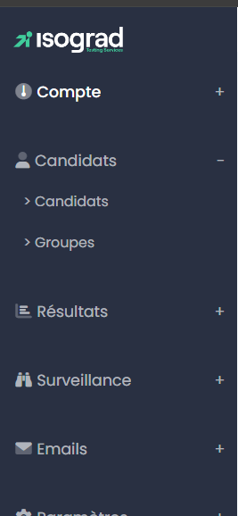

# Ajout d’un groupe de candidats

L’importation d’un fichier Excel contenant les détails de vos candidats vous permet de télécharger rapidement jusqu’à 500 candidats à la fois pour un groupe défini.

Cliquez sur Importer un fichier de candidats.

Dans la** **fenêtre **Importer un fichier de candidats**, procédez comme suit :

Cliquez sur **Télécharger le modèle de fichier** et téléchargez le sur votre ordinateur.

Completez le modèle Excel en suivant l’exemple de la première ligne et enregistrez le fichier.

Sous **Fichier à importer**,  cliquez sur **Choisir** **un fichier**, accédez à l’emplacement de votre fichier et sélectionnez-le. Vous devriez maintenant voir le nom du fichier que vous avez importé.

Sous **Sélectionner un groupe**, choisissez le(s) groupe(s)  approprié(s) dans le menu déroulant.

Une fois que vous avez choisi le groupe, cliquez sur la flèche bleue pointant vers la droite. Cela déplacera le groupe sélectionné dans le(s) **Groupe(s) du candidat.**

Maintenant, cliquez sur **Importer.**

- Lors du téléchargement du fichier Excel, chacun des candidats recevra un mot de passe aléatoire.  (Remarque: Vous pourrez créer un mot de passe pour tous les candidats en cliquant sur **Actions sur le groupe**, puis  sur **Attribuer un mot de passe temporaire à tous les candidats du groupe).**
Ajout d’un seul candidat

Pour ajouter un seul candidat, cliquez sur **Ajouter un candidat.**

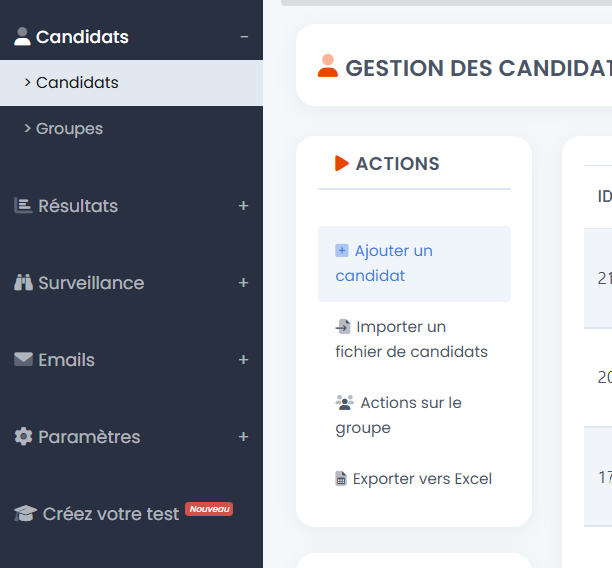

Remplissez les informations requises dans l’onglet **Ajouter un candidat** .

Chaque candidat appartient à au moins un groupe. Le groupe par défaut est le groupe principal.  Un candidat peut appartenir à plusieurs groupes à la fois.

L’identifiant du candidat sera son adresse e-mail. Deux candidats ne peuvent pas être enregistré avec la même adresse e-mail.

Le mot de passe d’un candidat peut être généré par la plateforme ou vous pouvez choisir d’un créer un. Une fois que vous avez rempli les informations, cliquez sur **Enregistrer** pour soumettre les informations.

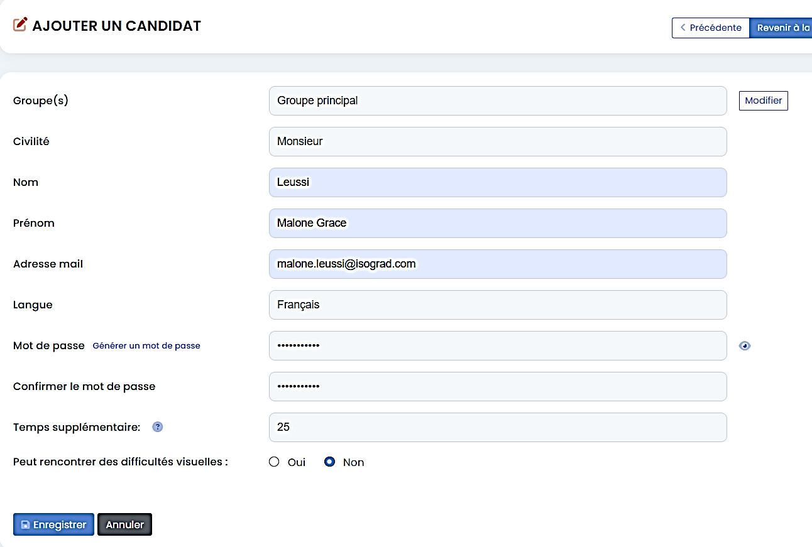

- **
**
Si nécessaire, vous pouvez ajouter du temps supplémentaire pour un candidat choisi. La valeur du temps supplémentaire est exprimée en pourcentage. Vous pouvez aussi indiquer si le candidat a des problèmes visuels.

# Inscription du/des candidat(s) à un test

Pour inscrire les candidats à un test, cliquez sur **Candidats** dans le menu principal. À droite de l’adresse e-mail du candidat, cliquez sur l’icône **Éditer**.

Le fichier du candidat est ouvert. Si le candidat a passé un test ou a des tests en attente, ils apparaîtront ici.

Vous serez également redirigé vers cette page après avoir créé un candidat.

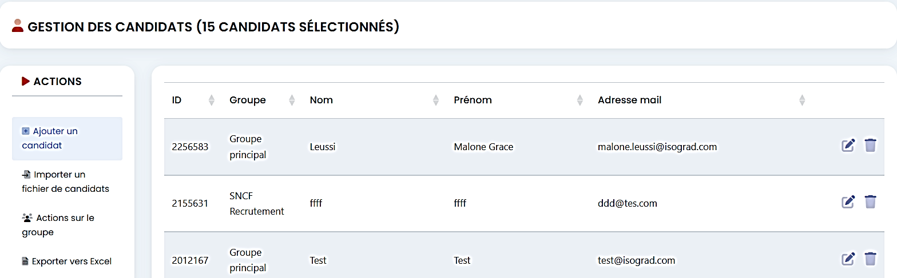

Cliquez sur **Inscrire à un test** et  choisissez la langue, le sujet, le type de test et la session (le cas échéant) pour le candidat.  Vous pourrez rechercher un test particulier à l’aide du  champ **Recherche par saisie**.

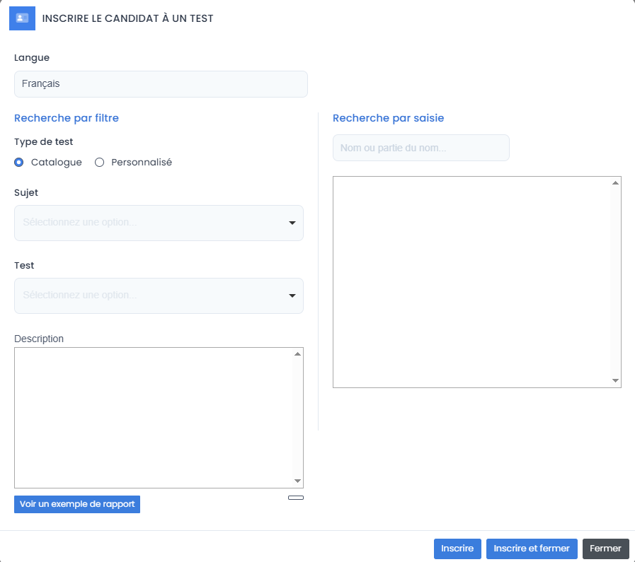

Si le mauvais test est attribué à un candidat ou à un groupe de candidats, ou s’il est nécessaire de supprimer un test qui n’a pas été démarré (en attente), l’administrateur peut effectuer cette tâche.

Pour supprimer un test en attente, cliquez sur l’icône **Supprimer ** et le test sera automatiquement supprimé.

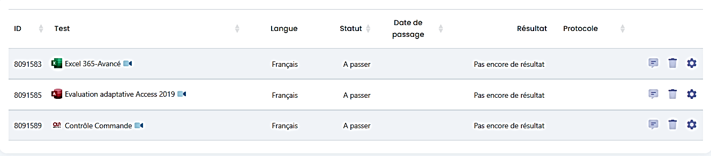

Si vous supprimez un test en attente, le(s) crédit(s) de test  est(sont) automatiquement retourné(s) sur votre compte.

Envoi d’invitations aux tests

Vous avez la possibilité d’envoyer directement depuis la plateforme des e-mails pour informer vos candidats des tests disponibles sur leur espace,

Commencez par sélectionner **Candidats** dans le menu principal. Ensuite, dans la liste des candidats, cliquez sur l’icône **Éditer**.

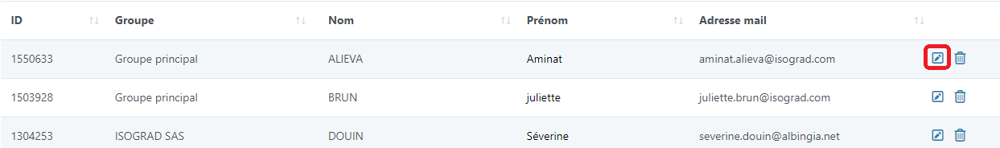

Une fois que vous avez ajouté un test, cliquez sur **Envoyer les tests au candidat**

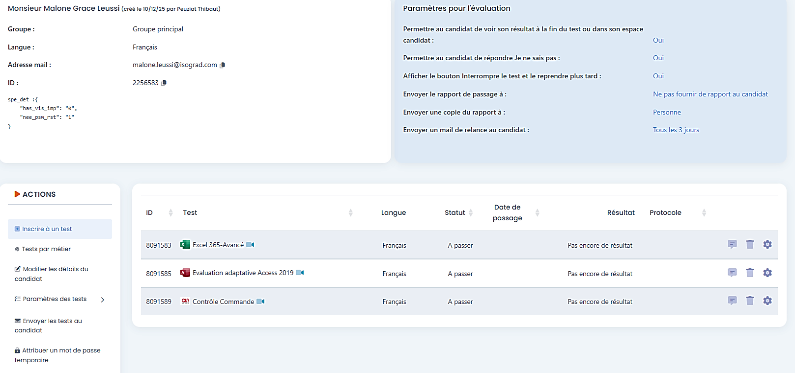

Une nouvelle fenêtre s’ouvrira. Sélectionnez le modèle d’e-mail et l’adresse de l’émetteur (s’il est ajouté). Vous pouvez également choisir un administrateur qui recevra une copie de l’e-mail :

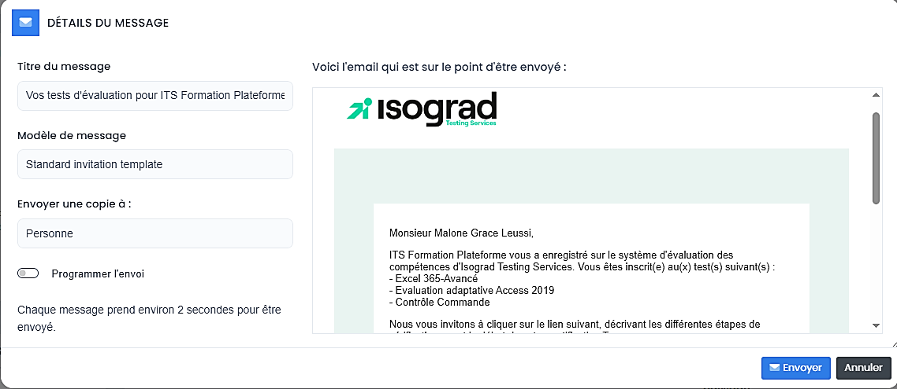

Une fois que vous avez cliqué sur **Envoyer**, l’e-mail d’invitation sera envoyé et le candidat pourra accéder au(x) test(s).

Actions sur le groupe

Les actions sur le groupe vous permettent d’effectuer des tâches pour tous les candidats d’un même groupe, comme par exemple :

Définir un mot de passe

Inscrire au même test

Envoyer des e-mails d’invitation

Supprimer des tests non-passés

Définir et mettre à jour des options d’évaluation

Les deux tâches principales effectuées au niveau du groupe sont l’inscription du groupe à un test et l’envoi d’e-mails d’inscription.

Inscrire un groupe à un test

Utilisez l’action **Inscrire tous les candidats du groupe à un test** pour gagner du temps et vous assurer que tous les candidats d’un groupe sont inscrits au même test.

Accédez à cette option en sélectionnant **Candidats** dans le menu principal, puis sélectionnez **Actions sur le groupe ** et **Inscrire tous les candidats du groupe à un test. **

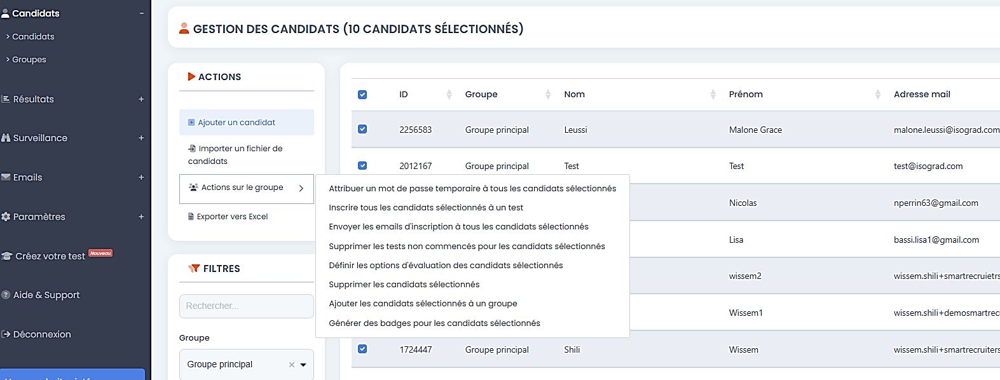

Vous sélectionnerez ensuite la langue, le sujet, le type de test et la session. Cliquez ensuite sur **Inscrire** ou **Inscrire et fermer.****
**

# Envoi d’e-mails d’invitation à un groupe

Une fois que vous avez inscrit le groupe à un test, il est temps d’envoyer l’e-mail d’invitation. Pour cela, vous pouvez utiliser l’option **Envoyer les e-mails d’inscription à tous les candidats du groupe.**

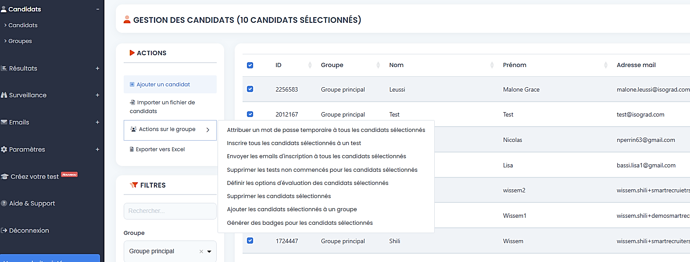

Sélectionnez **Envoyer des** **e-mails** **d’inscription à tous les candidats du groupe** et la fenêtre **Détails du message** s’ouvre. Renseignez les informations demandées (adresse e-mail de l’expéditeur, titre du message et modèle d’e-mail), puis cliquez sur **Envoyer**.

Une fois que vous avez cliqué sur **Envoyer**, l’e-mail d’invitation sera envoyé et les candidats pourront accéder au(x) test(s).

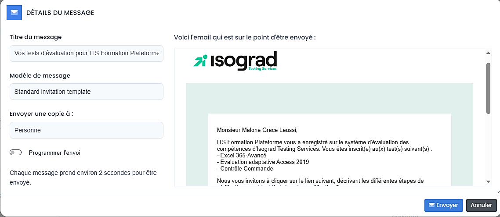

Autres actions

Les actions de groupe vous permettent de :

## **Définir un mot de passe pour tous les candidats du groupe**

**Supprimer les tests non passés.**  Si vous supprimez les tests à passer, vous serez alors recrédités automatiquement

**Définir des options d’évaluation pour l’ensemble des candidats du groupe.**  Cela vous permet de personnaliser les options d’évaluation pour un groupe défini

Groupes

Créez des groupes de candidats. Chaque candidat peut appartenir à un ou plusieurs groupes.

**Remarque :** le **groupe principal** ne peut pas être supprimé.

Le  menu **Groupes** vous aide à organiser vos candidats. Les groupes permettent également de facilement inscrire vos candidats à leurs tests et de générer des rapports de groupe.

Il y a trois niveaux de groupe : les groupes du niveau 1, les groupes de niveau 2 (sous-groupes) et les groupes niveau 3 (les sous-sous-groupes).

Ajout d’un nouveau groupe

Cliquez sur le  bouton **Ajouter un groupe** sur la  page **Gestion des groupes**.

La zone **Ajouter un groupe** s’ouvre.  Rentrez les informations requises, puis cliquez sur **Ajouter**.

Si un groupe est défini comme** Public,** tous les administrateurs auront accès à ce groupe.

Si un groupe est défini comme** Privé,** seuls l’administrateur du groupe et l’administrateur du compte auront accès à ce groupe.

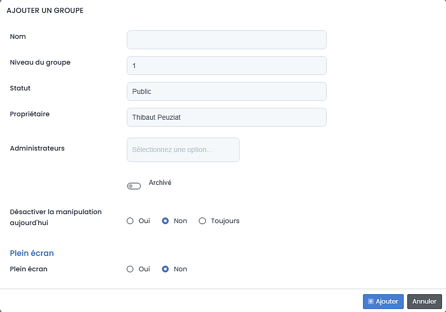

Modification des groupes

Dans la page de **Gestion des groupes**, faites glisser votre curseur sur le groupe de votre choix pour afficher les icônes **Éditer** et **Supprimer**.

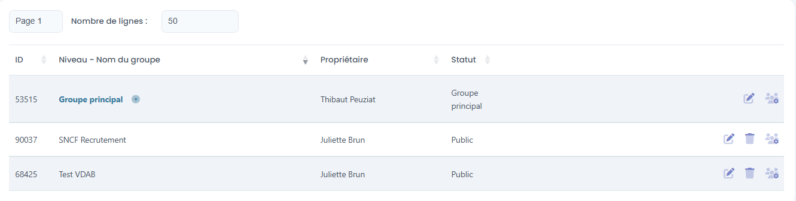

Cliquer sur **Éditer** vous permet de modifier le nom et le statut d’un groupe, ainsi que de l’archiver.

Cliquez sur **Supprimer** pour supprimer définitivement un groupe. Lorsqu’un groupe est supprimé, tous  ses candidats sont envoyés au **groupe principal**.

Cliquez sur **ajouter/supprimer des candidats** pour  rapidement gérer les candidats rattachés à vos groupes.

**Mode plein écran**** (Fonction****nalité**** Anti-****Triche****):**

Lorsque ce mode est activé, les candidats ne peuvent pas accéder à d’autres applications logicielles ou ressources Internet pendant la durée de leur test.

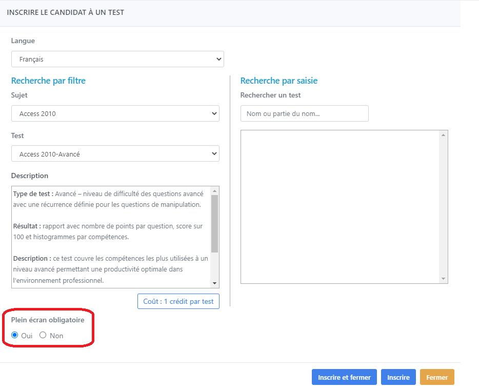

Si un candidat quitte le mode plein écran ou tente d’ouvrir un nouvel onglet, le système l’invitera à revenir à la page du test.

S’il ne se remet pas en mode plein écran sur son test dans les 10 secondes qui suivent, il sera automatiquement déconnecté de son test.

S’il ne se reconnecte pas dans un  délai de 60 secondes, une icône  rouge (X) apparaîtra à côté de son résultat  de test dans l’onglet **Résultats**. Cliquez sur l’icône rouge (X) pour obtenir le détail de l’heure et de la durée de la sortie du plein écran.

Gestion des résultats

Résultats

La plateforme vous fournit un aperçu complet des résultats aux tests.

Les résultats sont disponibles pour un seul candidat ou pour un groupe de candidats

Pour y accéder, cliquez sur **Résultats **dans le menu principal.

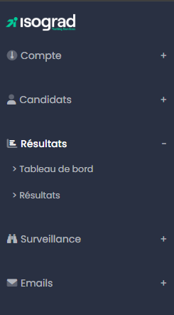

Vous pouvez effectuer des recherches dans les données et filtrer par :

Groupe

Statut du test (terminé, en attente de notation ou commencé)

Sessions

Période

Tous les résultats peuvent être exportés dans un fichier Excel.

Tableau de bord

Vous pouvez filtrer les résultats par groupe, par test et sur une période donnée.

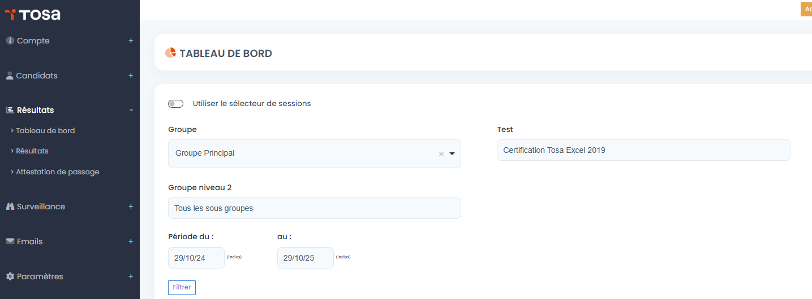

Le tableau de bord vous permet de connaitre

Total des tests complétés

Statut des tests

Temps moyen

La répartition des scores

Top des candidats

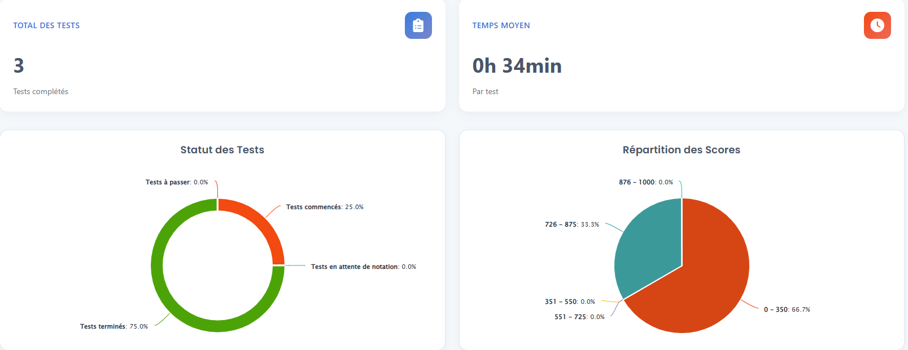

Résultats

Résultats individuels

Pour consulter les résultats d’un candidat, entrez son nom ou son adresse e-mail dans la barre de recherche.

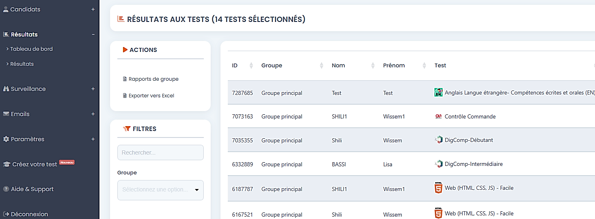

Une fois les résultats du candidat chargés, cliquez sur l’icône **Analyse**  .

La page **Déroulement ****du test**  s’ouvrira et l’analyse générale du test du candidat sera présentée,

Pour un aperçu et une analyse plus approfondis, cliquez sur **Détails du test** et sélectionnez **Compétences**** ** dans le menu déroulant.  Vous pouvez télécharger un PDF avec le détail du test en cliquant sur **Obtenir le** **rapport en**** PDF**.

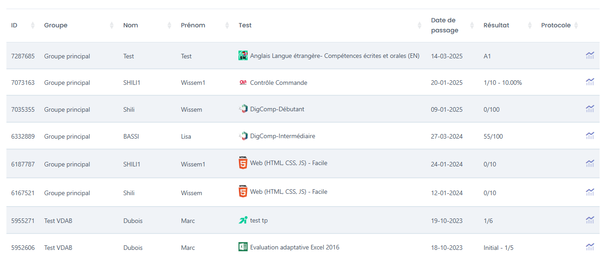

Un administrateur peut voir les réponses des candidats. Déplacez votre curseur sur un résultat de test, cliquez  sur **Analyse**, puis **Détails du test** et **Voir les réponses**

Vous pourrez voir les résultats et le temps passé sur chaque question. Ces données peuvent être exportées sous forme de fichier Excel.

En cliquant sur  l’icône **Affichage**, vous pourrez voir la question, la réponse  du candidat, et la bonne réponse attendue.

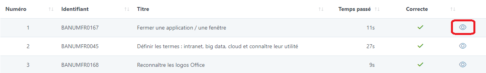

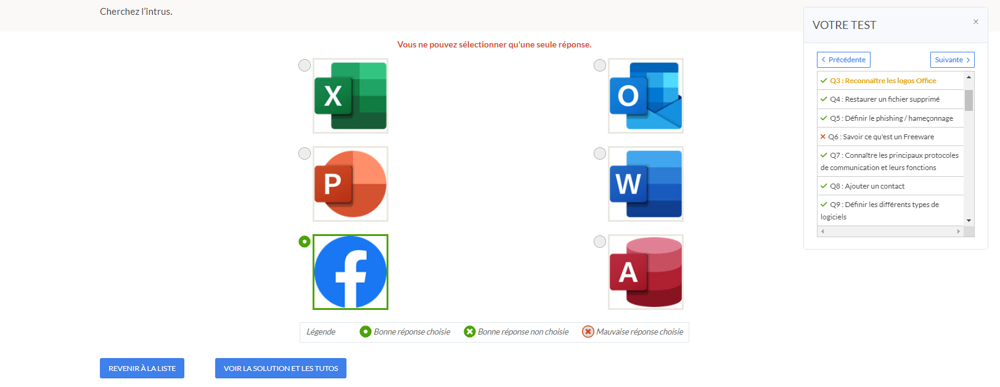

Rapports

# Résultats individuels – Évaluations adaptatives

Pour consulter les résultats d’un candidat, entrez son nom ou son adresse e-mail dans la barre de recherche.

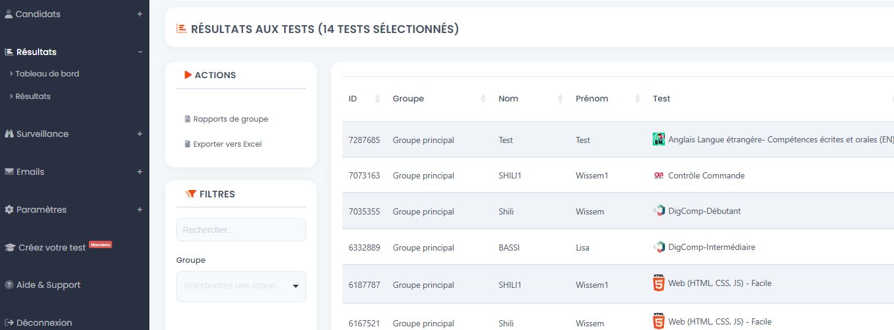

Une fois les résultats du candidat chargés, cliquez sur l’icône** Analyse** .

La page **Déroulement du test**  s’ouvre et l’analyse générale du test du candidat s’affiche, qui comprend notamment :

Niveau global de compétences

Réponses aux questions dans l’ordre numérique

Réponses aux questions par ordre de niveau de difficulté

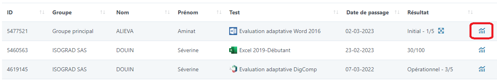

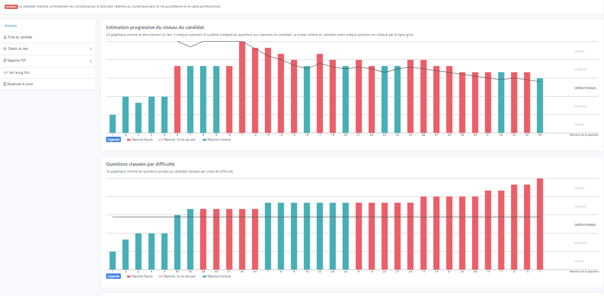

Pour un aperçu et une analyse plus approfondis, cliquez sur **Détails du test** et sélectionnez **Compétences ** dans le menu déroulant.

Vous pouvez télécharger un PDF avec le détail du test en cliquant sur **Obtenir le rapport en PDF.**

Chaque test comporte plusieurs domaines, et l’analyse des compétences  montre le niveau de compétence dans chacun d’eux, ainsi qu’une description de chaque domaine et des points à améliorer.

Les candidats les administrateurs peuvent voir le classement global des candidats par rapport à tous les candidats sur la plateforme qui ont passé le même test

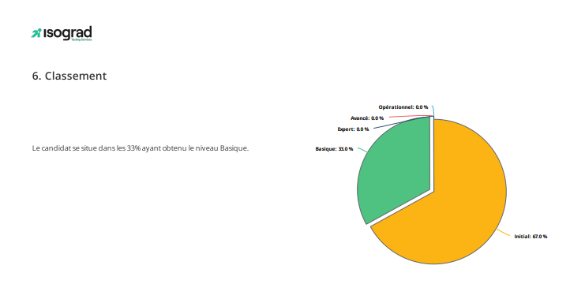

Résultats individuels – évaluations de niveau défini

Pour consulter les résultats d’un candidat, entrez son nom ou son adresse e-mail dans la barre de recherche.

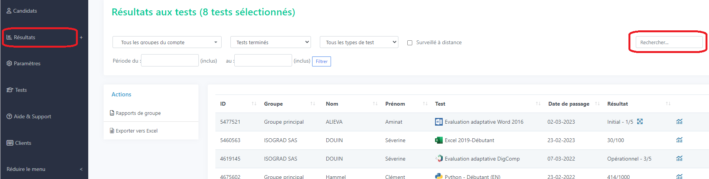

Une fois les résultats du candidat chargés, cliquez sur l’icône** Analyse** .

La page **Déroulement du test**  s’ouvre et l’analyse générale du test du candidat s’affiche :

Niveau global de compétences sur 100

Réponses aux questions dans l’ordre numérique

Pour un aperçu et une analyse plus approfondis, cliquez sur **Détails du test** et sélectionnez **Compétences ** dans le menu déroulant.

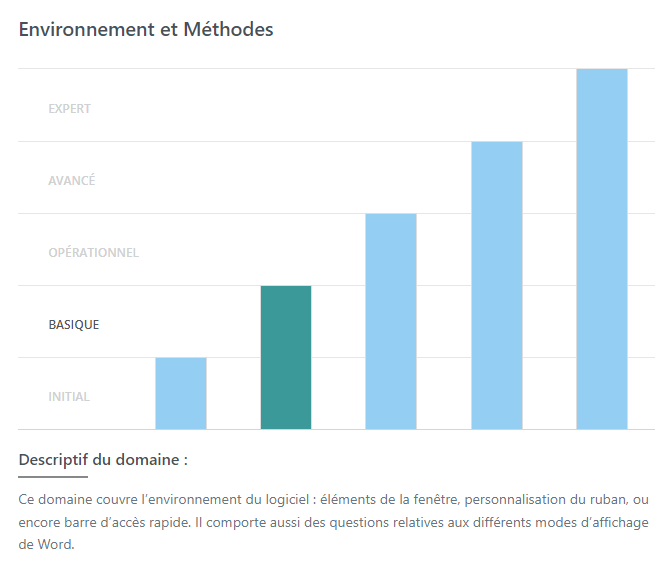

Vous pouvez télécharger un PDF avec le détail du test en cliquant sur **Obtenir le rapport ****en ****PDF**.

Rapports de groupe

Les rapports de groupe permettent d’avoir un aperçu du niveau global des candidats d’un groupe donné

Les rapports de groupe sont accessibles à partir de Résultats dans le menu principal.

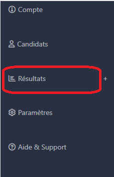

L’administrateur doit sélectionner le groupe souhaité dans le menu déroulant.

Une fois qu’un groupe est sélectionné, cliquez sur** ****Rapports de groupe** :

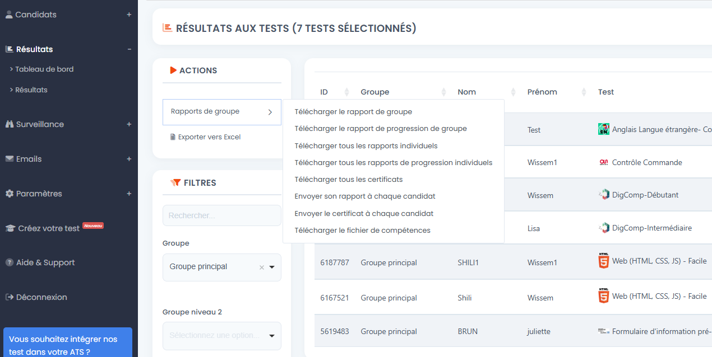

Sélectionnez **Télécharger le rapport de groupe**. Dans  la  fenêtre **Détails du rapport**, sélectionnez le test et la plage de dates que vous souhaitez afficher.

Une fois le formulaire rempli, cliquez sur **Télécharger**. Le rapport sera ensuite traité et vous pourrez le télécharger sous forme de fichier PDF.

À partir de l’onglet **Rapports de groupe **, vous avez accès à plusieurs types de rapports :

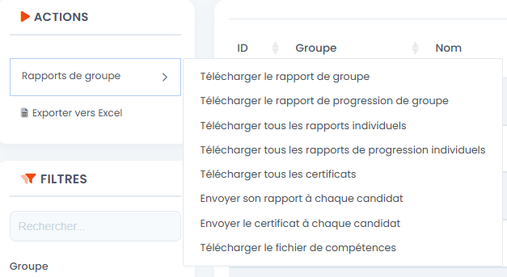

**Télécharger tous les rapports individuels **: cette option permet aux administrateurs d’obtenir tous les rapports des membres du groupe plutôt que de télécharger chaque rapport individuel. Ces rapports vous seront envoyés par mail dans les 24 heures.

**Envoyer des rapports à chaque candidat :** permet aux administrateurs d’envoyer des rapports d’évaluation à tous les candidats d’un groupe.

**Télécharger ****le fichier de**** ****compétences** : fournit aux administrateurs un fichier Excel des niveaux des sous-domaines pour plusieurs candidats d’un groupe spécifique.

Rapports de progression

Les **rapports de progression** montreront les progrès réalisés par un candidat, d’une évaluation à une autre évaluation sur le même sujet.

## **Rapport de progression du groupe**

Cliquez sur **Télécharger** le rapport de progression de groupe  dans  le menu **Rapports de groupe**, puis téléchargez le rapport de progression de groupe.

Sélectionnez les deux tests que vous souhaitez comparer, ainsi que la plage de dates pour chaque test. ** Remarque :** les deux  périodes ne doivent pas se chevaucher.

- Le rapport montrera les résultats aux deux tests et mettra en avant les progrès réalisés entre ces deux tests.

## **Rapports de progression individuels**

Pour consulter les rapports de progression individuels, accédez aux détails du candidat en cliquant sur **Résultats** dans le menu principal.

Une fois les résultats du candidat chargés, cliquez sur l’icône** Analyse** .

Sélectionnez ensuite  l’onglet ** Rapport d****e progression** dans la fiche du candidat.

Surveillance

Surveillance

Lors d’un examen de  certification Tosa, si un candidat quitte le mode plein écran, un incident est créé avec un statut « **En attente de détail** » pour lequel vous devrez fournir une explication afin que le passage soit validé.

Pour ce faire, cliquez sur **Surveillance,** puis sur** Surveillance**.

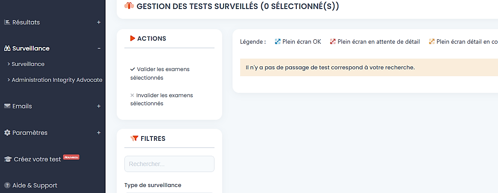

La fenêtre **Sortie du mode plein écran** s’ouvre. Le test en attente sera marqué avec une croix rouge pour que vous puissiez décrire l’origine du ou des problèmes. Pour ce faire, cliquez sur l’icône de ** la loupe ** et entrez la ou les raisons de l’interruption.

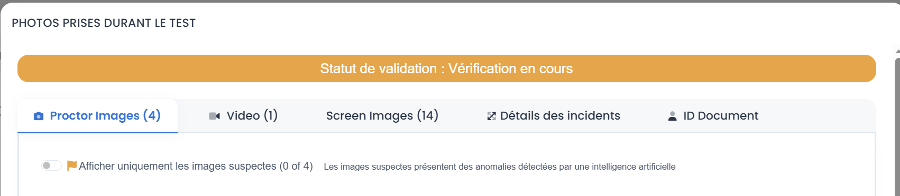

Le statut de certification passera de « En attente de détail» à « Validé » une fois l’erreur examinée et validée

Emails

Modèles d’e-mails

Pour informer les candidats qu’un test leur a été attribué, plusieurs options d’envoi d’e-mails vous sont fournies.

Pour configurer vos options de messagerie, il est recommandé de commencer par configurer vos modèles d’e-mail.

Pour accéder aux modèles d’e-mail, cliquez sur **Emails** dans le menu principal. La  fenêtre **Gestion des modèles de message **s’affiche.  Cliquez sur **Modèles d’e-mails **pour examiner et gérer vos modèles.

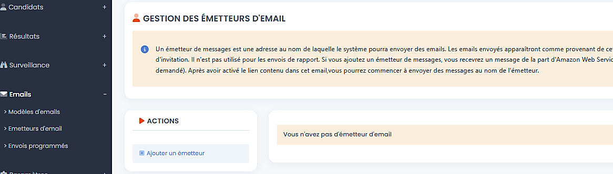

Un modèle d’e-mail d’invitation standard est disponible sur votre compte. Vous pouvez modifier ou dupliquer ce modèle standard.

Vous pouvez également créer vos propres modèles d’e-mails pour différentes situations (invitation aux tests, envoie du diplôme etc), ainsi que des relances par e-mail qui seront automatiquement envoyés à vos candidats.

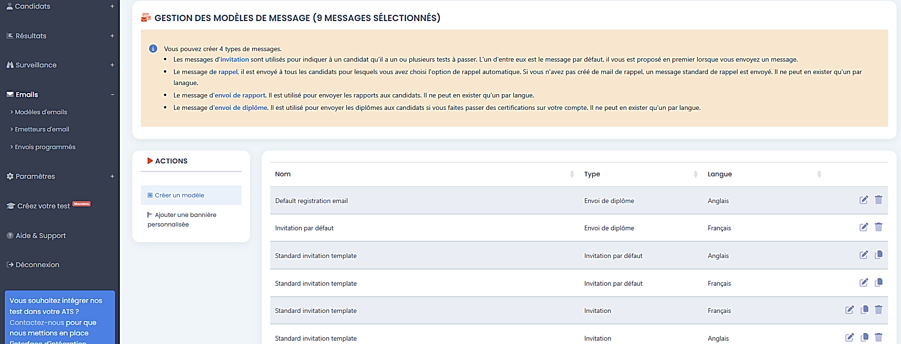

La fenêtre **Mettre à jour un modèle d’e-mail** s’ouvre. Dans cette zone, vous pourrez personnaliser le modèle existant.

Vous pouvez modifier le nom du modèle, la ligne d’objet par défaut et la première phrase/formule de salutation.

Dans les zones « Première partie du message » et « Deuxième partie du message », vous pouvez rédiger un message de votre choix pour inviter les candidats aux tests.

Vous pouvez également inclure le(s) test(s) programmé(s) et l’identifiant/mot de passe du candidat en cochant les cases situées entre la première et la deuxième partie du message.

Une fois que vous avez modifié les détails du modèle, cliquez sur le bouton **Enregistrer** pour sauvegarder vos modifications.

Pour consulter le modèle terminé, cliquez sur le bouton** Actualiser l’exemple.**

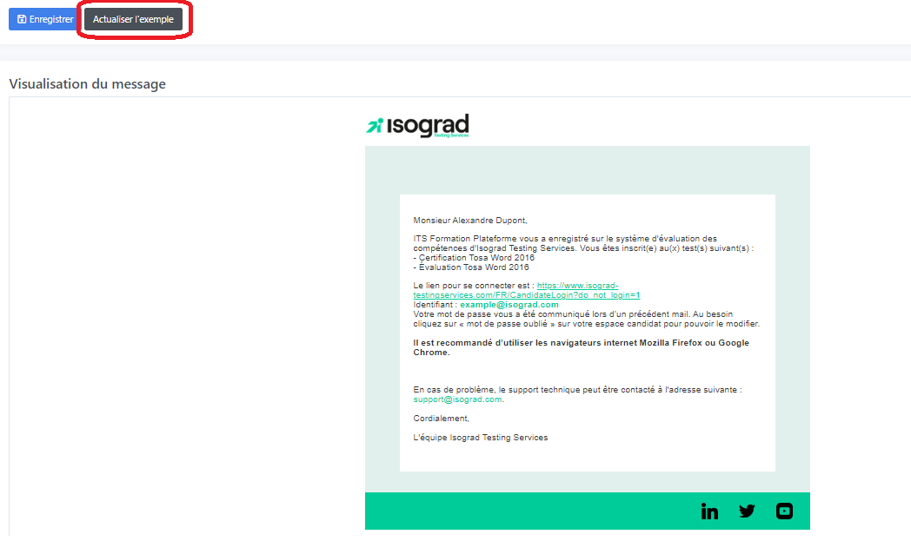

Ces paramètres s’appliquent à tous les types d’e-mails (inscription, rapport de résultat, rappel, diplôme).

Vous pouvez également personnaliser l’en-tête de vos e-mails en incluant votre propre bannière. Pour ce faire, vous pouvez cliquer sur ***E-mail***, puis ***Ajouter une bannière personnalisée.***

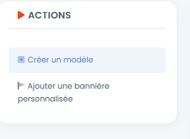

Émetteurs d’e-mails

Un émetteur est une adresse e-mail que le système utilisera pour envoyer des e-mails au lieu de l’adresse e-mail par défaut **registration@isograd.com**. Cette option permet d’envoyer des e-mails à partir d’une adresse e-mail de votre domaine.

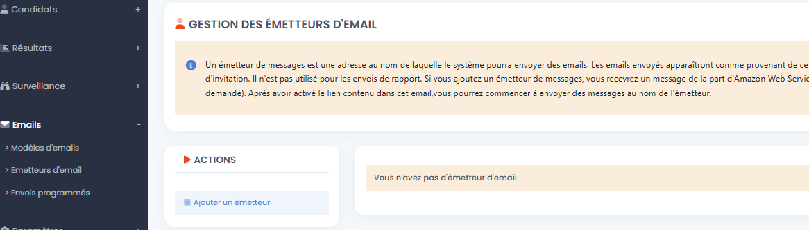

Pour créer un expéditeur, cliquez sur **Paramètres**, puis  sur **E-mail** et **Émetteurs d’e-mails**.

Pour créer un nouvel émetteur, cliquez sur **Ajouter un émetteur.**

Entrez l’adresse e-mail de l’émetteur dans la zone Adresse e-mail et cliquez sur **Enregistrer**.

Vous recevrez un  e-mail d’**Amazon** **Web Services** vous demandant d’accorder le droit d’envoyer des e-mails en votre nom.

L’adresse e-mail doit être **vérifiée**. Si elle est **En attente**, il vous suffira d’accepter  les Conditions d’utilisation d’Amazon Web Services.  Le processus de validation peut prendre jusqu’à 30 minutes.

Envois programmés

Dans cet onglet, vous retrouverez tous vos envois d’invitation au test d’évaluation programmé ainsi que le statuts de celui-ci. Vous pourrez modifier vos mail programmé ou les supprimé.

Pour accéder aux modèles d’e-mail, cliquez sur **Emails** dans le menu principal. La  fenêtre **Gestion des ****envois**** ****programmé****s**** **s’affiche. Vous verez tout vos mail programmés.

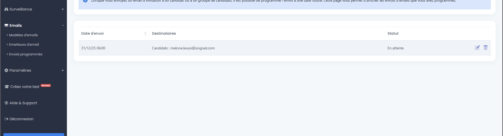

Vous pourrez modifier les dates programmé en cliquant sur l’icon editer

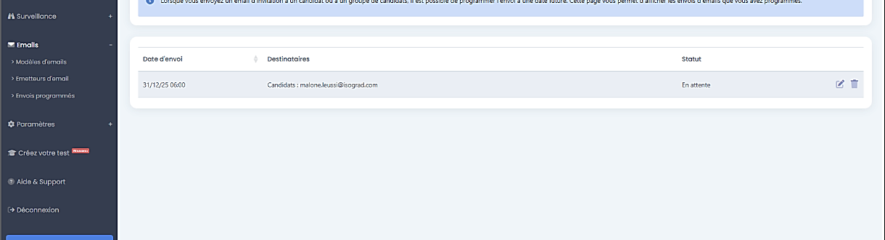

**
**

Gestions des parametres

Options de passage

Paramètres généraux

Les **Options par défaut** permettent aux administrateurs de définir et/ou de mettre à jour les** **paramètres par défaut sur la plateforme. Vous pouvez accéder aux **Options par défaut** via **Paramètres**.

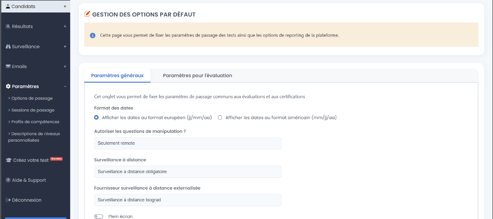

Vous pouvez afficher les dates et heures au format américain ou européen, et sélectionner votre fuseau horaire. Vous pouvez également définir le temps supplémentaire aloué pour les personnes en situation d’handicap. 

Sachant que vous devrez également définir le temps supplémentaire dans la fiche du candidat, il est recommandé de définir ici la valeur globale sur 100%.

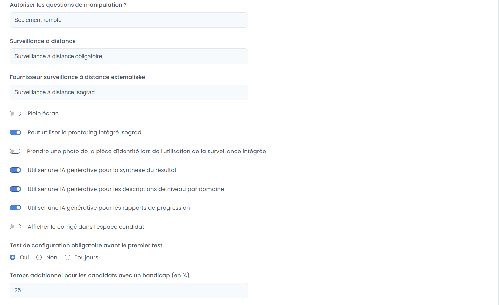

Vous pouvez afficher les dates et heures au format américain ou européen, et sélectionner votre fuseau horaire. Vous pouvez également définir le temps supplémentaire aloué pour les personnes en situation d’handicap. 

Sachant que vous devrez également définir le temps supplémentaire dans la fiche du candidat, il est recommandé de définir ici la valeur globale sur 100%.

Paramètres pour évaluation :

**Les paramètres pour évaluation **vous permettent de choisir si les candidats peuvent laisser  un commentaire après chaque question, s’ils peuvent répondre aux questions avec « Je ne sais pas » ou si vous souhaitez recevoir un e-mail avec le rapport à la fin de chaque test. Ces options peuvent être définies spécifiquement pour chaque candidat.

Une fois que vous avez personnalisé vos paramètres, cliquez sur le bouton **Enregistrer** .

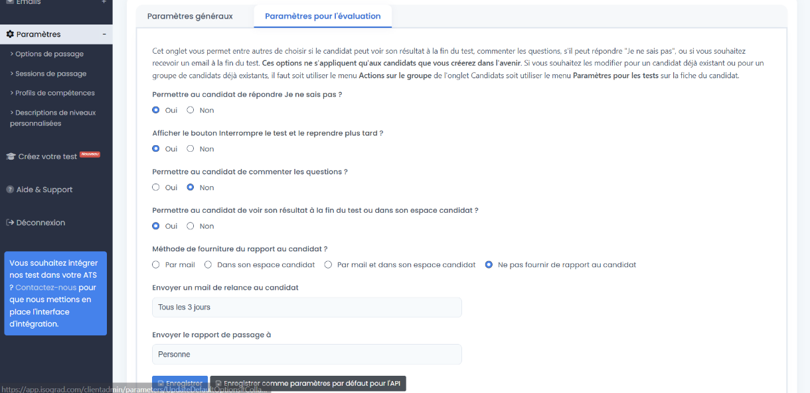

Session de passage

Une session de passage est une période de temps pendant laquelle des tests doivent être passés. Les tests liés à une session ne seront pas accessibles en dehors de la session de test programmée.

La création d’une session vous permettra de définir une heure de début et de fin. Ensuite, lorsque vous inscrivez un candidat à un test, vous pourrez lier le test à une session définie.

Pour créer une session de test, cliquez sur **Paramètres**, puis sur **Sessions** **de passage,** puis sur le  bouton rouge** Créer une session**.

Dans la fenêtre **Créer une session**, vous pouvez ajouter une description/un titre pour votre session ainsi qu’un code de session, les dates de début et de fin, ainsi que l’heure de début et de fin. L’ajout d’un code de session est recommandé afin que les candidats ne puissent pas accéder au test en dehors de l’heure prévue. Le code de session n’est jamais envoyé par e-mail, il convient de le fournir au(x) candidat(s) en amont du test.

Profil de compétences

Les **Profils**** de compétences** vous permettent de définir les résultats attendus pour des métiers spécifiques.

Vous pouvez définir les niveaux de compétence attendus pour des compétences spécifiques, ce qui vous permet d’identifier rapidement des candidats qualifiés.

Les profils peuvent également être utilisés pour mettre en évidence les connaissances et les compétences pour les promotions d’emploi internes.

Dans le menu principal, sélectionnez** Paramètres**, puis cliquez sur **Profils**** de compétences** puis cliquez sur  le bouton rouge** Ajouter un profil**.

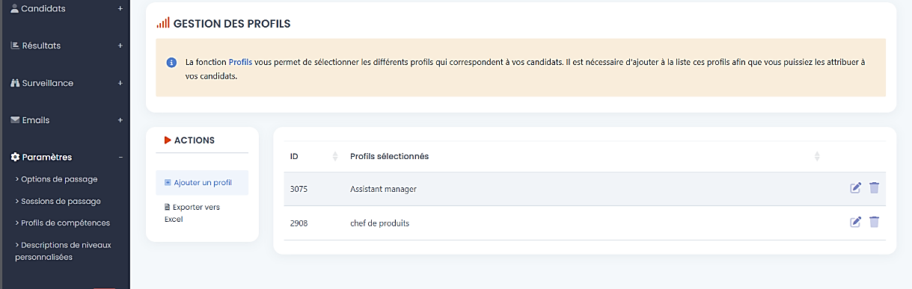

Pour modifier le niveau attendu des sous-compétences d’un test, placez votre curseur sur le profil et cliquez sur l’icône **Editer**** les compétence** .

Sélectionnez le résultat ou le poste attendu, le logiciel ou la compétence et la langue.

Utilisez les boutons **Plus (+**) ou **Moins (-)**  pour augmenter ou diminuer le niveau requis pour chacune des quatre à cinq compétences principales du sujet choisi. Cliquez ensuite sur **Enregistrer** pour confirmer vos modifications.

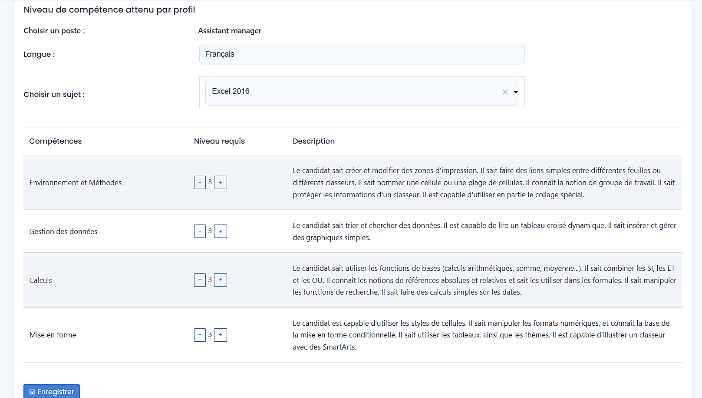

Descriptions de niveaux personnalisées

Vous pouvez modifier la description du niveau sur chaque test d’évaluation, en fonction de la famille de sujets du test.

Pour accéder à cette fonctionnalité, sélectionnez le menu Paramètres, cliquez sur **Descriptions de niveaux personnalisées**, puis sur **Créer une description de niveau.**

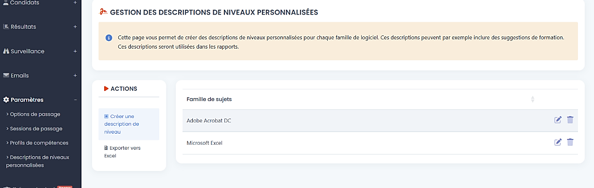

Dans la fenêtre **Gestion des** **descriptions de niveaux personnalisées**,  vous pouvez saisir des messages pour chaque niveau de compétence.

Une fois que vous avez terminé les messages pour chaque niveau, cliquez sur **Enregistrer**. Ces commentaires apparaîtront sur les rapports des candidats, en fonction du niveau de compétence du candidat.

Voici un exemple de** description personnalisée du niveau** sur le rapport d’évaluation d’un candidat :

Support

Aide & support

L’onglet** Aide & Support** contient toutes les informations techniques  sur la plateforme et les tests.

Pour y accéder, sélectionnez **Aide** **& Support** dans le menu principal.

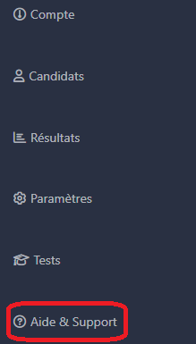

Vous y trouverez les éléments suivants :

Coordonnées du support technique

Vérification du navigateur Internet

Tests de configuration technique

Manuel technique

Configuration technique

Il est conseillé de vérifier le navigateur de l’ordinateur (s) avant d’exécuter des tests. Pour trouver la version de votre navigateur, cliquez **sur ****Identifier la version de mon navigateur.****
**

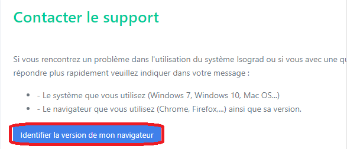

Test de vérification

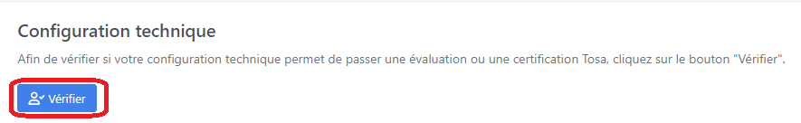

Une fois que vous avez cliqué sur **Vérifier,** vous aurez la possibilité de faire un test. En fonction de votre sélection, un mini-test d’évaluation sera lancé. Il est conseillé de compléter ce test dans le cadre de la vérification technique.

Le court test de trois questions simule un environnement d’évaluation. Chacune des questions correspond aux différents types de questions que  les candidats rencontreront. Ces questions ne nécessitent pas de connaissance spécifique.

Veuillez suivre les instructions et répondre aux questions. Si cela n’est pas fait, ou si la configuration ne correspond pas à nos exigences, notre plateforme ne permettra pas au candidat de passer leur(s) test(s).

Paramètres de l’API

Si vous utilisez des API, nous mettons à votre disposition des solutions pour faciliter l’intégration de vos API avec la plateforme. Vous pourrez générer les paramètres d’authentification pour l’API, afficher les identifiants de test et vous aurez également un document détaillant l’utilisation et l’intégration de l’API.

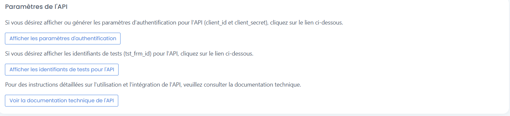

En cas de difficultés techniques, veuillez contacter le support d’Isograd à **.**

Si vous avez des questions concernant le contenu de ce manuel ou d’autres questions techniques, veuillez nous contacter également à **support@isograd.com**

