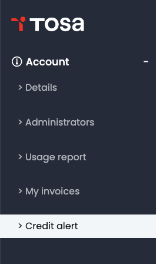
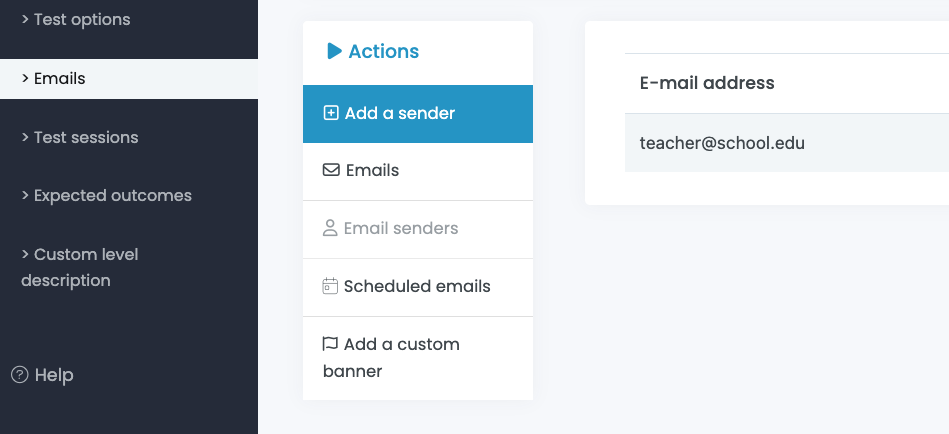

{width="9.123611111111112in"
height="13.3in"}{width="3.751388888888889in"
height="1.7666666666666666in"}

Table of Contents

# FIRST STEPS ON THE TOSA PLATFORM {#first-steps-on-the-tosa-platform .TOC-Heading .unnumbered}

Logging into the Tosa Platform3

Navigate the Tosa Platform4

#  {#section .TOC-Heading .unnumbered}

**MANAGING YOUR ACCOUNT**

Details6

Administrators7-8

Credit Alert9

Credit Consumption10

Invoices11

**MANAGING THE PARAMETERS**

Email Templates13-16

Email Senders16-17

Scheduled Emails18

Adding a Custom Banner18

Creating Test Sessions19-21

General Settings22-23

Assessment Settings23

Certification Settings24

Expected Outcomes24-26

Custom Level Description27-28

**MANAGING CANDIDATES**

Adding Groups30-32

Editing Groups32-32

Adding Multiple Candidates34-35

Adding a Single Candidate36-37

Registering Candidate(s) for a Test38-40

Sending an Individual Test Invitation41

Group Actions - Registering all Candidates in a Group to a Test44-45

Group Actions - Sending an Invitation Email to a Group46

Group Actions -- Other Group Actions47

**MANAGING RESULTS**

Results -- Individual Results49-54

Results -- Group Reports55-58

Certificate of Attendance59-60

Incidents61-62

**SUPPORT**

Help64

Technical Configuration65

Configuration Test66

# First steps on the Tosa Platform {#first-steps-on-the-tosa-platform-1 .unnumbered}

Logging into the Tosa Platform

To access your account, go to [www.tosa.org](http://www.tosa.org), click
on Your Account -- then choose Administrator from the popup menu.

{width="5.983333333333333in"
height="0.675in"}{width="6.189583333333333in"
height="2.8895833333333334in"}Enter your email address and your
password, then click on **Log In**.

If you do not know what your password is, click on the **Lost password**
link. A password change link will be automatically emailed to you.

Navigate the Tosa Platform

{width="6.045138888888889in"
height="5.2868055555555555in"}The main menu allows you to access to the
five submenus on the Tosa platform, which allows you to manage your Tosa
account.

# Managing your account {#managing-your-account .unnumbered}

Details

{width="2.1582567804024495in"
height="3.1778029308836397in"}

*You will find below all the information regarding your account and your
administrator profile.*

You can upload le logo or your School/Company by clicking on **Change**
(Logo Upload). This will enable it to appear on your students' test
results reports.

{width="6.660552274715661in"
height="4.786111111111111in"}

Administrators

{width="1.8194444444444444in"
height="3.1464074803149606in"}

######## The administrators manage groups. Each group requires one administrator. {#the-administrators-manage-groups.-each-group-requires-one-administrator. .Italics-Body .unnumbered}

########  {#section-1 .Italics-Body .unnumbered}

Adding an administrator

To access the **Administrators management** tools, click **Account** on
the main menu. Then click on Click on **Administrators** in the submenu.

The **Administrators management** page opens. You can add an
administrator by clicking **Add and administrator**. You can also view
all of the administrators that have been created.

{width="6.3in"
height="1.7333333333333334in"}

Types of administrators

{width="4.9527777777777775in"
height="1.0208333333333333in"}There are 3 types of administrators on the
platform:

-   **Account manager:** The account manager has complete administrative
    rights and can view and modify anything on your account.

-   **Group manager:** The group manager is only able to access and
    modify students within the group(s) they have been assigned to
    manage, along with the students from public groups.

-   **Result consultation:** The result consultation administrator is
    only able access the results of the students from the group(s) they
    have access to, along with the students from public groups.

Modifying administrators

Account managers can modify the status of existing administrators by
dragging by hovering the cursor over the administrator you want modify
and clicking on the **Edit** icon.

{width="6.646527777777778in"
height="0.9701388888888889in"}

You can also **delete** an administrator by clicking on the little bin
icon, and reset an administrator's password by clicking on the little
lock icon.

Credit alert

{width="1.8472222222222223in"
height="3.134679571303587in"}

The **Credit alert** page allows you to create up to two credit alerts
and easily track your credit consumption.

Click on **Account** in the main menu to access the **Your Account**
page, then click on **Credit alert**.

The **Expiration date alert** allows you to automatically receive an
email one month before your credits' expiration date.

The **Low credit** **alert** allows you to set a threshold (minimum
credits remaining) to receive an alert by email.

{width="2.2590758967629045in"
height="2.597544838145232in"}

{width="1.8123359580052494in"
height="3.057638888888889in"}Usage Report (credit consumption)

######## The **Usage report** page allows you to track total credit usage as well as usage by group. {#the-usage-report-page-allows-you-to-track-total-credit-usage-as-well-as-usage-by-group. .Italics-Body .unnumbered}

From the **Account** page, click on **Usage Report**.

Select the timeframe you want to review usage and click **Filter**. You
will then see all groups that are part of your account. You can sort
this data by Group, Credit Type, or Number of Credits Used.

To review the specific details on a specific group's consumption click
on the **Details** icon on the right hand side.

{width="7.063888888888889in"
height="3.0166666666666666in"}

Invoices

######## If you have made online purchases for Tosa assessment or certification credits online, this is where you will be able to view and/or download your invoice(s). {#if-you-have-made-online-purchases-for-tosa-assessment-or-certification-credits-online-this-is-where-you-will-be-able-to-view-andor-download-your-invoices. .Italics-Body .unnumbered}

From the **Account** page, click on **My invoices.**

{width="1.86875in"
height="3.1954188538932633in"}

Here you will see the transaction date(s), product description(s), and
the amount for each invoice.

{width="6.434271653543307in"
height="1.3979221347331583in"}

You can download an invoice for any online purchase by clicking on
**Download**.

# Managing the parameters {#managing-the-parameters .unnumbered}

Emails

To notify students that they have been assigned a test, you are provided
email options.

To setup your email options it is recommended that you start by setting
up your email templates.

{width="7.197222222222222in"
height="2.890972222222222in"}To access the email templates, click
**Parameters** on the main menu. Then click on **Emails.** The **E-mail
model management** screen will appear by default.

If the email templates are not showing, click on **Emails** under the
**Actions** submenu, then you will be able to review and manage your
templates.

A **standard invitation template** is provided on your account. You can
modify or duplicate the standard template.You can also create your own
email templates, as well as email reminders that will automatically be
sent to your students by clicking on the **Add a template** button.

{width="6.530555555555556in"
height="2.745833333333333in"}

If you need to modify an existing email template, drag your cursor over
the template and click on the **Edit** icon.

{width="6.295010936132983in"
height="2.8394160104986876in"}

The **Update an E-mail model** window opens. This is where you will be
able to customize your template.

You are able modify the **template name**, the **default subject** line,
and the **first sentence** (greetings).

In the "First part of message" and the "Second part of message" boxes
you can draft specific messaging for the template.

You are also able to include the scheduled test(s) and the student\'s
login ID/password. The check boxes for these options should always be
checked.

To review the completed template, click the **Refresh sample e-mail**
button.

{width="7.661111111111111in"
height="7.354861111111111in"}

Once you have modified the template details click the **Save** button to
save your changes. These settings apply to all email types
(registration, result report, reminder, diploma).

{width="6.249305555555556in"
height="4.861805555555556in"}

Email senders

{width="5.924305555555556in"
height="2.7118055555555554in"}A sender is an email address that the
system will use to send emails instead of the default email address
**noreply@isograd.com**. This option allows email to be sent from an
email address from your domain.

To create a sender, click on **Parameters**, then **Emails**, **Email
senders** and **Add a sender.**

Input the email address of the sender in the email address box and click
**Save.**

{width="3.40625in"
height="1.35918416447944in"}

The email address owner will receive an email from **Amazon Web
Services** asking them to grant the right to send emails on their
behalf.

{width="5.643055555555556in"
height="2.573611111111111in"}The email address must be verified by the
recipient by clicking the link provided in the email from Amazon Web
Services. It will show **Pending** until verified and the process can
take up to 45 minutes after the link has been clicked and the rights
granted.

Scheduled emails

This is where you will see your scheduled emails. This option is set
when you are about to send a test email invitation to your student(s)
(see **Candidate** menu)

{width="4.020718503937008in"
height="1.8938178040244968in"}

Adding a custom banner

You can personalize your emails by including your own banner or logo. To
accomplish that, click on ***Email templates***, then **Add a custom
banner** option. Follow the import image instructions to upload.

This will replace our Tosa default logo with your own.

{width="1.6230774278215223in"
height="2.612759186351706in"}{width="4.733220691163605in"
height="1.886819772528434in"}

Creating test sessions

######## A test session is a specific time period during which tests are required to be taken. Tests linked to a session will not be accessible outside of the scheduled testing session. {#a-test-session-is-a-specific-time-period-during-which-tests-are-required-to-be-taken.-tests-linked-to-a-session-will-not-be-accessible-outside-of-the-scheduled-testing-session. .Italics-Body .unnumbered}

Creating a session will allow you to set a start and end times. Then,
when you register a student for a test, you will be able to link the
test to an established test session.

To create a test session, click **Parameters,** then **Test sessions,**
and then the **Add a session** button.

{width="6.913695319335083in"
height="2.837711067366579in"}

In the **Add a session** window, you can add a description/title for
your session as well as a Session code, the start date and end dates,
and the start and end times.

{width="3.665450568678915in"
height="2.292020997375328in"}

Adding a session code is recommend so that students are not able to
start a test until the code is provided. Session codes are never sent by
email, but the code is provided to the student(s) by the proctor when
they are ready to begin their test.

Adding multiple test sessions

To create multiple test sessions at once, click **Parameters,** then
**Test sessions,** and then the **Add multiple sessions** button.

{width="6.3in"
height="1.8909722222222223in"}

The **Add multiple sessions** window will allow you to download the
Excel file template via the **Download Excel file template** button, to
fill it out, save it on your computer and to upload it back to the
platform via the **Choose File** button.

{width="6.3in"
height="2.9611111111111112in"}

You will be able to delete the pending tests from expired sessions by
clicking the **Delete all pending tests from expired sessions** button,
this will allow you to get the credits back to your credit bank.

{width="6.421739938757655in"
height="1.4994903762029745in"}

Use the filters to search a session using keywords.

Toggle the **Do not display past sessions** button if you want to hide
expired sessions without deleting them.

You can also toggle the **Display sessions closed more than 3 months
ago** Button if needed.

{width="1.1201727909011374in"
height="2.0680107174103237in"}

Test options

The **Test options** menu will allow you to define and/or update your
testing environment's default options. Access the **Test options**
through the **Parameters** menu.

{width="1.6736111111111112in"
height="2.7421467629046368in"}

**General settings**

The **Manage default options** page will allow you to set the default
settings for your account.

{width="6.308333333333334in"
height="4.370833333333334in"}

(1) **Use generative Artificial intelligence for result summary**:

Enabling this option will allow you to get a more precise result summary
on your students' report(s).

(2) **Use generative Artificial Intelligence for domain level
    description**:

Enabling this option will allow you to get a more precise analysis on
each assessed domain & skill.

(3) **Use generative Artificial Intelligence for progress reports:**

Enabling this option will allow you to get a more precise analysis
between two tests on the same subject (between two assessments or
between an assessment and a certification.

(4) **Display answers on candidate's home page (assessments only)**:

Enabling this option will allow for your students, after completion of
an assessment, to see the questions and their answers.

(5) **Mandatory configuration test before first assessment**:

Enable this option if you want your students to take a (one-time) short
3-question configuration test when they log into their account for the
first time.

This test's goal is to familiarize your students with the platform as
well as to see if their computer and network environment is compatible
with the tests. We strongly recommend enabling this option.

Set your **Time zone** and make sure the dates appear in American or
European format. You are also able to **Add additional** time for
students with exceptionality. As you will be able to adjust the
additional time value individually in the **Candidate's record**, it is
recommended to set the global value to 100%.

Once you have customized your settings, click the **Save** button.

Assessment settings

Set your assessment settings via the **Parameters** menu, then click on
**Test options** and **Assessment settings**

{width="5.583129921259842in"
height="3.813827646544182in"}

-   **Allow candidates to respond with \"I don\'t know\"**

-   **Display a "Stop test and continue later" (pause) button**

-   **Allow candidates to comment on each question**

-   **Allow candidates to view their results** (at the end of a test)

-   **Result report delivery method to candidate**

These options can be set at the Account, Group or student (candidate)
level.

Once you have customized your settings, click the **Save** button.

Certification settings

The **Certification settings** allow you to send the diploma to a
student, as well as determine who receives a copy of the certification
report including another administrator if you choose to do so. These
options can be set at the Account, Group or Candidate level.

{width="2.8630872703412074in"
height="2.346376859142607in"}

Once you have customized your settings, click the **Save** button.

Expected Outcomes

Expected Outcomes allow you to set expected outcomes for
training/education course outcomes.

You may set the expected levels of proficiency for specific digital
skills, that you want your students to attain by a course conclusion for
example.

Using Expected Outcomes for training or educational classes allows for
pre-course assessment ensuring that individuals are in the right course,
and to create learning and development roadmaps. Applying Expect
Outcomes to testing enables you to validate if a student has achieved
the learning outcomes from the course.

Expected Outcomes can be set on each of the four or five main skill
domains that students are assessed on.

{width="6.4118055555555555in"
height="3.375in"}From the main menu select **Parameters** then page
click on **Expected outcomes** and then click the blue **Add a profile**
button.

To add a profile, click on the blue **Add a profile** button.

The **Add a profile window** opens. Enter the description of the profile
in the text field and click **Save**.

{width="6.302771216097987in"
height="2.579099956255468in"}

Once done, click on the **Edit skill levels** icon to open the **Manage
jobs skills** page.

{width="6.289202755905512in"
height="1.489760498687664in"}

Select the expected outcome/role, language, software or digital skill.

Use the **Plus (+)** or **Minus (-)** buttons to modify the requirement
level of each one of the main skills of the chosen subject. Then, click
**Save** to confirm your changes.

The numerical level coorelates with the levels outlined in the Skills
Framework for your chosen application/exam.

{width="6.440277777777778in"
height="3.5902777777777777in"}

Custom level description

######## You can modify the level description on each assessment test, according to the test subject family. {#you-can-modify-the-level-description-on-each-assessment-test-according-to-the-test-subject-family. .Italics-Body .unnumbered}

To access this feature, select the **Parameters** menu, click on
**Custom level description**, and click on the red **Create level
description** button.

{width="6.4118055555555555in"
height="2.5606146106736656in"}

In the **Add A Custom Level Description** window select the software
family and then click **Save.**

{width="3.1770833333333335in"
height="1.2743055555555556in"}

In the **Custom Level Description Management** window, you can input
specific messaging for each level of proficiency. This is helpful in
mapping outcomes to job placement or a learning and development roadmap.

{width="3.5305555555555554in"
height="2.606103455818023in"}

Once you have completed the messages for each level, click **Save**.
These comments will appear on student reports, based on the student's
level of proficiency.

{width="4.902777777777778in"
height="1.5333333333333334in"}Here is an example of a Custom Level
Description on a student's assessment

# Managing candidates {#managing-candidates .unnumbered}

Groups

{width="1.8472222222222223in"
height="3.0150699912510937in"}

*Create groups of students. Each student can belong to one or more
groups.*

**Note:** the default **Main group** cannot be deleted.

The **Groups** Menu helps you organize your students. It also allows you
to register students in bulk and generate various reports.

There are three levels of groups: Level 1 are main groups; level 2 are
subgroups and level 3 are subgroups to the level 2 subgroups.

{width="7.0784722222222225in"
height="3.296527777777778in"}

Adding a new group

New main group (level 1):

-   Click on the **Add a group** button on the **Group management**
    page.

-   The **ADD A GROUP** box will open.

-   Fill in the group's name

-   If a group is set as **Public,** all administrators have access to
    it.

-   If a group is set to **Private,** only the group's administrator
    along with all account administrators will have access to it.

-   Choose the **Group level "1"** as it is a main group.

-   Choose the group's administrator.

-   Click on the **Add** button.

{width="3.7895833333333333in"
height="1.8909722222222223in"}

New subgroup (level 2 or 3):

{width="3.9297353455818023in"
height="2.2187062554680663in"}

-   Click on the **Add a group** button on the **Group management**
    page.

-   The **ADD A GROUP** box will open.

-   Fill in the group's name.

-   If a group is set as **Public,** all administrators have access to
    it.

-   If a group is set to **Private,** only the group's administrator
    along with all account administrators will have access to it.

-   Choose the **Group level "2" or "3"** as it is a subgroup.

-   Choose the level 1 (and 2 if you are creating a level 3 group) group
    that your group will be a subgroup of.

-   Choose the group's administrator.

-   Click on the **Add** button.

Editing groups

{width="6.511792432195976in"
height="2.122047244094488in"}From the **Group management** page, drag
your cursor over the group of your choice to show the **Edit** and
**Delete** icons.

Clicking on the **Delete** icon permanently deletes a group. When a
group is deleted, all of its students are sent to the default **Main
group**.

{width="6.3in"
height="2.884027777777778in"}

Clicking **Edit** allows you to modify the name and the status of the
group, as well as archive it. Archiving a group will hide it from the
**Group Management page**. This is recommended for old groups that are
no longer relevant. It will allow you to avoid deleting the groups.

{width="6.3in" height="1.40625in"}

Toggle the Display archived groups switch in the **Group Management
page** to make the archived groups visible (in red).

**Adding or removing student(s) (candidates) from a group:**

Still from the **Group** Menu, it is possible to add or remove students
from a group.

Click on the **"Add / Remove candidate from this group"** icon

{width="6.1885192475940505in"
height="2.0299912510936133in"}

From the scroll-down menu, you will be able to search a student from the
group (**View Candidates in this Group**) or outside of it (**View
Candidates not in this Group**). Add or remove the chosen student with
the **+** or **--** buttons.

Use the text field to perform a specific student search.

{width="6.216494969378828in"
height="1.7285378390201225in"}

Adding candidates

Now that you have all of your testing parameters set, it is time to
start adding students. There are two options to add students to the
platform: multiple students can be bulk loaded, or added individually.

To start the process for either bulk or individual students you need to
select **Candidates** from the main menu.

{width="1.598540026246719in"
height="2.409342738407699in"}

Adding multiple candidates at once

######## Importing an Excel file that contains your students' details allows you to quickly upload up to 500 students at one time for a defined group. {#importing-an-excel-file-that-contains-your-students-details-allows-you-to-quickly-upload-up-to-500-students-at-one-time-for-a-defined-group. .Italics-Body .unnumbered}

{width="6.934722222222222in"
height="2.311111111111111in"}Click on **Import a candidate file**.

In the **Add Multiple Candidates** window do the following:

1.  Click **Download Excel file template** and download the Excel file
    to your computer.

2.  **In the downloaded Excel file:** Input the following mandatory
    fields: your students' **Last Name**, **First Name**, **Gender**
    (Mrs., Mr., or Not Provided), **Language**, and **E-mail** into the
    Excel template. You can add the optional following fields: student
    **External ID**, **Status** and **Password** (if you need to create
    a different password than the one automatically assigned by the
    system). Save the Excel file onto your computer.

3.  Under **File to import**, click **Choose File** and navigate to the
    location of your saved file and select it. You should now see the
    name of the file you have imported.

4.  Under **Select a group**, chose the correct group(s) or/and
    subgroup(s) from the dropdown menu.

5.  Once you have the correct group(s) selected, click the right-facing
    arrow. This will move the selected group into the **Candidate's
    group(s)** box.

6.  {width="5.86875in"
    height="3.3652777777777776in"}{width="5.86875in"
    height="3.3652777777777776in"}Now click **Upload**

Adding a single candidate

{width="2.7083333333333335in"
height="3.1625in"}To add a single student, click on **Add a candidate.**
Fill in the required information

{width="5.401388888888889in"
height="4.014583333333333in"}Fill in the required information in the
**Add a candidate** form.

Each student must belong to at least one group (default is Main group)
and they may belong to several groups as well.

The student's login will be their email address, and as such, two
students cannot use the same email address.

A student's password can be generated by the platform, or you can choose
a custom password. Once you have completed the form click **Save** to
submit. In all the cases, the students must choose their own password
when they connect for the first time.

If needed, you can add extra time for a chosen student. The **Additional
time** value is in a percentage of the standard test time.

In certain cases, you can allow your students to pause their
certification exams. This is only available for certification exams
taken in-house, and for students who require it (students with
exceptionality).

Registering candidate(s) to a test

To register students to a test, click on **Candidates** on the main
menu.

{width="1.8333333333333333in"
height="3.4305555555555554in"}

{width="7.107638888888889in"
height="2.2534722222222223in"}To the right of the student's email
address, click on the **Edit** icon.

The student record page will display. If the student has taken a test or
has pending tests they will appear here. You will also be redirected to
this page after creating a student.

{width="5.88125in"
height="3.375in"}Click on **Register to a test** and choose the
following:

(1) **Language** of the test

(2) **Subject** (Excel, Word, Google Docs...)

(3) **Test** version and type (assessment, certification...)

(4) **Session** (if applicable)

A test session is a specific date and time range when your students will
be able to log into the platform to take their test.

(5) **Requires Full Screen**

Use this option if you want to make sure your student remains in full
screen mode until completion of the test.

You will be able to search for a particular test by using the **Search
by input** field.

Click **Register** if you are registering a student for multiple tests,
then continue to register for any additional tests. Click **Register and
close** if you want to assign a single test to a student.

{width="4.218055555555556in"
height="3.979861111111111in"}

If the wrong test is assigned to a student or a group of students, or if
there is a need to delete a test that has not been started (Pending) the
administrator can perform such task.

To delete a pending test, click the **Delete** icon and the test will be
automatically deleted.

{width="6.34424978127734in"
height="1.0104166666666667in"}

If you delete a pending test, the test credit is automatically returned
to your account.

Sending an individual test invitation

Once a test or multiple tests have been assigned to an individual
student, a test invitation email must be sent out.

Start by selecting **Candidates** from the main menu. Then choose your
student in the list or by inputting their name or email address in the
**Search field** of the **Filters**.

click on the **Edit** icon.

{width="6.523148512685914in"
height="2.202260498687664in"}

Once you have added a test, click on **Send a test invitation e-mail to
candidate**.

{width="6.9in" height="3.3125in"}

The **Message Details** window opens. Edit your email subject, choose
your email template, sender email address (if you have entered one). You
can send a copy of the sending to another administrator or to yourself.

{width="6.189583333333333in"
height="3.326388888888889in"}

You can schedule the sending of the email if you need the email to be
sent at a later date.

Once you click **Send**, the invitation email is sent, and the student
can access the test(s).

Group actions

{width="3.478468941382327in"
height="3.577571084864392in"}

In order to activate the **Group Actions** button, you will have to
select a group or sub-group, then you will see a small arrow appearing
in the button.

Group Actions allow you to perform tasks for all the students from a
specific group. The tasks that can be performed include:

-   Setting temporary passwords for the entire group

-   Registering a group for the same test

-   Ability to send registration emails

-   Delete pending tests (the credits will be added back to your credit
    bank)

-   Setting and defining assessment options for the group

-   Setting certification options for the group

-   Deleting multiple students

The two main tasks performed at the group level are registering the
group for a test and sending registration emails.

Registering all candidates in a group to a test

Use the ***Register all candidates in the group to a test*** option to
save time and ensure that all students in the selected group are
assigned to the same test(s).

Access the **Register all candidates in the group to a test** option by
selecting **Candidates** from the main menu, then choose your group and
select **Group actions**.

{width="4.180555555555555in"
height="3.2341699475065617in"}

The **Register Candidates to a Test** window will open. You will then
select the language, the subject, the test, and the session. Then click
on **Register** or **Register and close.**

Click on **Register to a test** and choose the following:

(1) **Language** of the test

(2) **Subject** (Excel, Word, Google Docs...)

(3) **Test** version and type (assessment, certification...)

(4) **Session** (if applicable): A test session is a specific date and
    time range when your students will be able to log into the platform
    to take their test.

(5) **Requires Full Screen**: Use this option if you want to make sure
    your student remains in full screen mode until completion of their
    assessment(s).

{width="6.3in"
height="5.909722222222222in"}

You will also be able to search for a test using keywords by using the
**Search by input** field.

Click **Register** if you are registering a student for multiple tests,
then continue to register for any additional tests. Click **Register and
close** if you want to assign a single test to a student.

Sending an invitation email to a group

{width="4.620138888888889in"
height="3.573611111111111in"}Once you have assigned a test to a group,
it's time to send an invitation email. Assuming all members of the group
will be taking the same test(s), you can use **Send registration emails
to all candidates in the group**.

{width="5.4875in"
height="2.9194444444444443in"}The **Message Details** window opens. Edit
your email subject, choose your email template, sender email address (if
you have entered one). You can send a copy of the email to another
administrator or to yourself. When you are ready, click **Send**.

Once you click send, the invitation email will be sent to each student,
providing them the link, their credentials and the test(s) that you have
assigned them.

If you do not want to send your invitation email to your group right
away, you can have the system send it at a later date by selecting
**Schedule sending**.

Other group actions

**Group actions** also allow you to:

**(1) Set a temporary password for all candidates in the group.** This
will allow you to set a unique password that all students can use to log
into the platform. Once logged into their account for the first time,
the students will have to create their own password.

**(2) Delete non started tests.** If you delete the groups' pending
tests, all credits will be returned to your credit bank.

**(3) Set assessment/certification options for group candidates.**
Allows you to customize the assessment/certification options for a
defined group.

{width="5.061805555555556in"
height="3.9145833333333333in"}**(4) Delete Selected candidates.** Choose
this option if you want to delete the groups' selected students.

# Managing results {#managing-results .unnumbered}

Results

The platform provides you with full insight into the tests' results.

Results are available for both individuals and groups.

{width="3.2284722222222224in"
height="4.533333333333333in"}To access the results data, Click on
**Results** in the main menu.

You can search within the data and filter by:

####### (1) Group/subgroup

####### (2) Test status (All, completed, pending, grade pending, started)

####### (3) Test type (assessments or certifications)

####### (4) Session

####### (5) Remote proctored or not

####### (6) Date range

Click **Filter** to validate your choices.

All results can be exported into an Excel file.

Individual Results

{width="6.920138888888889in"
height="2.165277777777778in"}To review a specific student\'s results:

Form the **Results** menu, input their name or email into the search
field.

{width="6.830555555555556in"
height="1.1333333333333333in"}Once the student's results have loaded,
click on the **Analysis** icon.

The Test analysis screen will open, showing student's skill level and
summary

{width="6.493920603674541in"
height="2.2666666666666666in"}

For deeper insight and analysis, click on **Test details** and a scroll
down menu will appear with the following options:

{width="2.7990529308836396in"
height="2.0388888888888888in"}

(1) **General analysis**: See the test's questions difficulty level in a
    chart.

{width="6.3in"
height="2.342361111111111in"}

(2) **View Answers**: (assessments only) see the question list, time
    spent per question and your student's answers.

{width="6.567153324584427in"
height="2.6175951443569554in"}

This data can be exported as an Excel file.

View the question's content by clicking on the little eye Icon.

{width="6.523305993000875in"
height="0.5069367891513561in"}

Navigate through all questions using the floating **Test questions**
window. Exit the questions interface by clicking on the small (x) next
to **Test questions**.

{width="6.102403762029747in"
height="3.0498556430446193in"}

(3) **Skill levels**: (assessments only) See the test's domains
    description ans skills assessed along with the student's level of
    proficiency and a sum up of the areas of improvements.

{width="6.320336832895888in"
height="3.0626323272090987in"}

\(4\) **Ranking**: Pie chart showing a breakdown of your students' level

{width="6.3in"
height="4.163888888888889in"}

Reports & Diploma

{width="5.878209755030621in"
height="3.5319794400699913in"}

Clicking on **Reports & Diploma** will open a window with 3 choices:

-   **(1) Get PDF report**: After choosing the report's language, the
    system will make the test's report available for download.

{width="6.3in"
height="1.5208333333333333in"}

-   **(2) Download diploma**: Once a student's Tosa certification has
    been validated by Isograd, an administrator can download the
    diploma. If the diploma is not yet validated, the option will not be
    available.

-   **(3) Progress report**: Generate a progress report by comparing
    your student's test to another one on the same subject. This can be
    an assessment or a certification.

{width="6.3in"
height="2.4430555555555555in"}

#######  {#section-2 .unnumbered}

Group Reports

**Group Reports** allow administrators to get more insights about their
groups and students.

{width="3.7243055555555555in"
height="2.113888888888889in"}Group reports are accessed from the
**Results** menu.

The administrator must select a set group from the group dropdown menu.

Once a group is selected, click on **Group reports** and the **Group
reports** menu will appear.

{width="5.42457239720035in"
height="3.8265791776027998in"}

{width="3.263888888888889e-2in"
height="3.263888888888889e-2in"}{width="3.263888888888889e-2in"
height="3.263888888888889e-2in"}

{width="3.263888888888889e-2in"
height="3.263888888888889e-2in"}{width="3.263888888888889e-2in"
height="3.263888888888889e-2in"}

{width="3.263888888888889e-2in"
height="3.263888888888889e-2in"}{width="3.263888888888889e-2in"
height="3.263888888888889e-2in"}

{width="3.263888888888889e-2in"
height="3.263888888888889e-2in"}{width="3.263888888888889e-2in"
height="3.263888888888889e-2in"}

{width="3.263888888888889e-2in"
height="3.263888888888889e-2in"}{width="3.263888888888889e-2in"
height="3.263888888888889e-2in"}

-   **(1) Download group report**: This will allow you to download a
    group report

In the **Report Details** window, select the test and the date range you
want to view and click on **Download**. The group report PDF contains
information such as charts showing the distribution of your student's
results per level as well as the ranking of the group.

{width="6.3in"
height="2.7430555555555554in"}

-   **(2) Download group progression report**: Click on this option to
    see the progression of a group. From an assessment to another, or
    from an assessment to a certification. Select the tests and the date
    range you want to view and click on **Download**.

{width="6.3in"
height="3.816666666666667in"}

-   **(3) Download all individual reports**: This option allows
    administrators to get all reports for group members versus
    downloading each individual report. These reports will be sent to
    you by email within 24 hours.

Select the test and the date range you want to get the reports from and
click on **Download**.

{width="6.3in"
height="2.7319444444444443in"}

(4) **Download all individual progression reports:** Select the two
    tests you want to compare the date range for each student. **Note:**
    the two time periods [must not overlap.]{.underline} Each report
    will show the results from both tests and provide the comparison of
    the two tests against each other.

{width="6.3in"
height="3.841666666666667in"}

-   **(5) Send report to each candidate:** Allows you to send assessment
    reports to all the students of a group. Select the test and click
    **Send**.

{width="4.736111111111111in"
height="1.9583333333333333in"}

-   **(6) Download skills report file:** With this option, you will be
    able to download an Excel file containing the selected group's
    students test result along with the skill level in each domain
    assessed. Select the test and click **Save**. You will then be able
    to download the file to your computer.

{width="4.75in"
height="1.9249267279090114in"}

{width="5.73076990376203in"
height="2.544817366579178in"}

Certificate of attendance

{width="4.134027777777778in"
height="5.301388888888889in"}You will be able to download certificates
of attendance from the **Certificate of attendance** submenu under
**Results** in the main menu.

Use the **Filters** submenu to search for your students. You can search
by keyword (student name), group, session and date range. Click on the
**Filter** button.

Click on Generate certificate and the Certificate Generation window
opens.

{width="6.3in"
height="2.6944444444444446in"}

Choose the type of certificate you want to generate (individual or
all-in-one) and select whether or not you want the score to be
displayed. Click on **Generate**.

Incidents

{width="1.9645833333333333in"
height="3.7395833333333335in"}

During a Tosa certification exam, if a student exits full-screen browser
mode, a record is created with a "**Details Pending**" status for which
you will have to provide an explanation so that the student can receive
their diploma.

To do so, click on **Results**, then click **Incidents**.

{width="6.531944444444444in"
height="2.8680555555555554in"}The **Fullscreen error** window will open.
The pending status test will be marked for you to describe the origin of
the issue(s). To do so, click on the **Magnifying glass** icon, and
input the reason(s) for the interruption.

{width="4.984616141732284in"
height="3.2339195100612423in"}

The certification status will switch from "Details validation pending"
to "Cleared" once a member of the **Validation Team** has reviewed and
validated the error.

#  {#section-3 .Title .unnumbered}

# Support {#support .unnumbered}

#   {#section-4 .Title .unnumbered}

Help

{width="2.263888888888889in"
height="3.5416666666666665in"}

The **Help** Section of the platform contains all technical information
on the platform and on the tests.

To access the **Help** Menu, select **Help** from the main menu.

In this Help section, you will be able to find the following:

-   Technical support contact details

-   Your current Internet browser version

-   Technical Configuration mini test and link

-   Tosa Platform manual

Technical configuration

{width="6.627777777777778in"
height="1.8166666666666667in"}The **Find my browser version's button**
will display your browser's current version.

Technical Configuration mini test

{width="4.704861111111111in"
height="1.4548611111111112in"}Run a 3 questions test to check your
computer, browser and network's compatibility with the Tosa platform.
Click the **Verify** button

Once you have clicked **Verify,** you will be provided the option to
test either an assessment or certification.

{width="3.4735192475940506in"
height="2.0932239720034995in"}

A short, three-question test that emulates either an assessment or a
certification will launch. Each of the questions corresponds to
different question types that students will encounter. These questions
do not require any specific knowledge of any application.

Please follow the instructions and answer the questions.

You can also generate a one-time link that can be copy and pasted in an
email, allowing for the check of the technical configuration on another
computer. Sending this link to a student is a good way to ensure their
system will be running the test(s) smoothly.

If any technical issues arise, do not hesitate to contact **Isograd
Support Team** at <support@isograd.com>.

{width="8.409027777777778in"
height="12.260416666666666in"}
